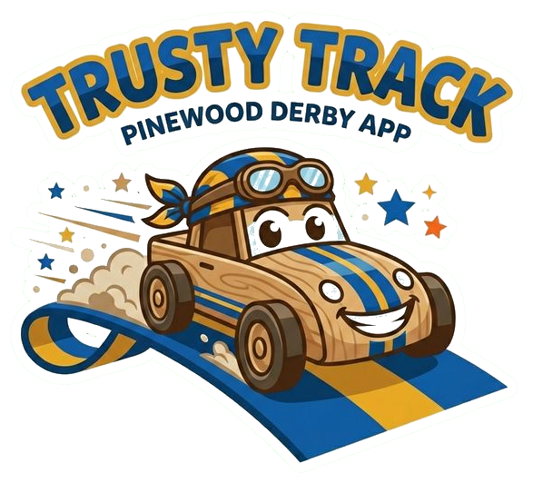

<p align="center">
  
</p>

# Trusty Track

**Trusty Track** is race management software for Cub Scout Pinewood Derby events. It runs in a web browser and handles everything from racer registration through final standings — so you can focus on the race, not the paperwork.

---

## What It Does

### Before Race Day

- **Set up your race** — name, date, location, and racing groups (dens).
- **Register racers** individually or by bulk-importing a CSV from your pack's roster.
- **Assign car numbers** automatically or manually, with flexible numbering strategies (global, per-den, or fully manual).

### On Race Day

- **Check in racers** — verify each car passed inspection and optionally capture racer and car photos.
- **Schedule heats automatically** using a fair scheduling algorithm that ensures each car races in every lane.
- **Run the race** with live timer integration — results appear automatically as each heat finishes.
- **Advance to a championship round** — the top finishers race again for final placement.

### For the Audience

- **Live observation display** — show current racers, the next heat on deck, and a live leaderboard on any screen or projector. All displays update in real-time as the race progresses.

---

## Documentation

For the full documentation and user guides, visit: **[https://dknowles2.github.io/trusty-track/](https://dknowles2.github.io/trusty-track/)**

### User Guides

| Guide                                                     | Description                                                       |
| --------------------------------------------------------- | ----------------------------------------------------------------- |
| [Getting Started](https://dknowles2.github.io/trusty-track/getting-started/)           | First-time setup: system settings and creating your first race    |
| [Race Setup Guide](https://dknowles2.github.io/trusty-track/race-setup/)               | Managing dens, registering racers, and preparing the roster       |
| [Race Day Operations](https://dknowles2.github.io/trusty-track/race-day/)              | Check-in, scheduling heats, running the race, and final standings |
| [Observation Displays](https://dknowles2.github.io/trusty-track/observation-displays/) | Setting up audience screens and projectors                        |

### Installation

| Method | Difficulty | Best for |
|--------|-----------|----------|
| [macOS App](https://dknowles2.github.io/trusty-track/user/install-mac/) | Easy | Mac users |
| [Windows App](https://dknowles2.github.io/trusty-track/user/install-windows/) | Easy | Windows users |
| [Docker](https://dknowles2.github.io/trusty-track/user/install-docker/) | Medium | Home servers, NAS devices |
| [Raspberry Pi](https://dknowles2.github.io/trusty-track/user/install-raspberry-pi/) | Medium | Dedicated race-day appliance |
| [From Source](https://dknowles2.github.io/trusty-track/user/install-from-source/) | Advanced | Developers |

Not sure which to pick? See [Which method should I use?](https://dknowles2.github.io/trusty-track/user/install/)

---

### Quick Start (From Source)

```bash
# Install dependencies and build the frontend
./scripts/install.sh

# Start the server
./scripts/serve.sh
```

Then open `http://localhost:8005` in your browser.

---

## Developer Documentation

If you're working on Trusty Track itself:

- [Development Guide](https://dknowles2.github.io/trusty-track/development/) — local setup, testing, and troubleshooting
- [Design](https://dknowles2.github.io/trusty-track/design/) — architecture, data models, and API design
- [Specification](https://dknowles2.github.io/trusty-track/spec/) — detailed product requirements and user journeys
- [Scheduling Algorithms](https://dknowles2.github.io/trusty-track/scheduling-algorithms/) — how heats are generated (PPC / Perfect-N)
