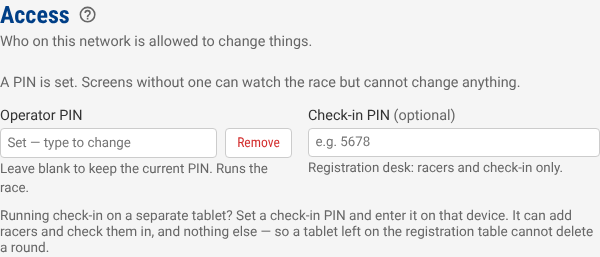
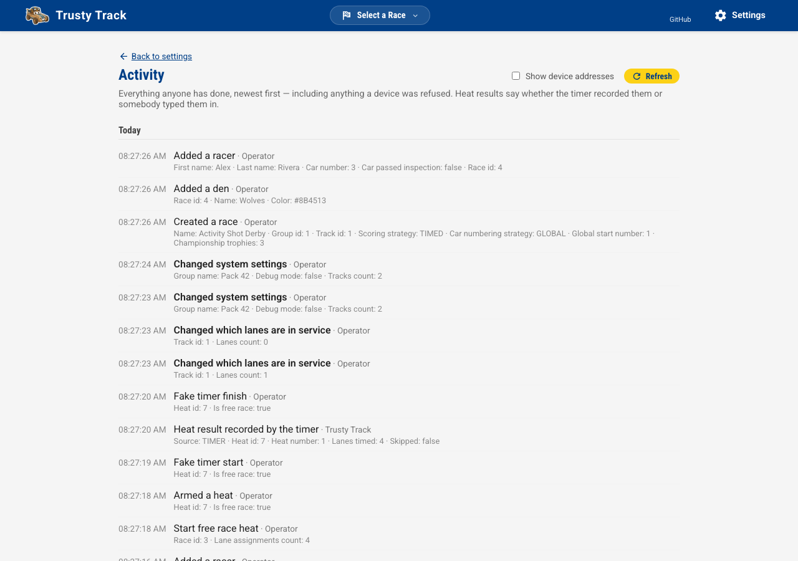

# Access and your network

Trusty Track runs on one machine at your venue and serves everything else over
the local network. That is what makes it work without internet — and it means
anyone who can reach that network can reach the app.

By default, so can anyone who wants to change it.

## What the risk actually is

Not hackers. A pack meeting is a room full of children with phones, and the
address is on the projector. Without a PIN, anything the operator can do,
anyone in the building can do — including deleting the race in the middle of
it.

Setting a PIN takes about ten seconds and removes essentially all of that.

## The three kinds of screen

Trusty Track decides what a screen may do from the PIN it holds, not from who
is using it. There are three:

| | Holds | Can |
| --- | --- | --- |
| **Displays** | nothing | watch the race — standings, the live heat, timing |
| **Check-in desk** | the check-in PIN | add and edit racers, check them in, take photos |
| **Operator** | the operator PIN | everything |

A display needs no setup at all. Point a browser at the address and it works,
which is the behaviour you want on a screen taped to a wall.

## Setting the PINs

**Settings → Access.**

- **Operator PIN** — required for the rest to mean anything. Setting it is what
  turns access control on.
- **Check-in PIN** — optional. Worth setting if the registration desk runs on a
  device of its own: that device can add racers and check them in, and nothing
  else, so a tablet left on the table cannot delete a round. The Access panel
  says as much beside the field.

> [!TIP]
> Pick something you will not have to think about at 8am. It is protecting the
> race from a bored ten-year-old, not from an attacker.

Leaving both blank keeps the old behaviour: no PIN, no restrictions. That is
deliberate, so upgrading between events never locks you out of your own race.

## Entering a PIN on a device

A padlock appears in the header once a PIN is set. Click it, type the PIN, and
that device remembers it.

Each device is separate — your laptop holds the operator PIN, the check-in
tablet holds the check-in one, and the displays hold nothing. Click the open
padlock to make a device forget its PIN again.

> [!NOTE]
> The page reloads when you enter a PIN. That is expected: the live connection
> has to be re-established with the new credential.

### Changing or removing a PIN

**Settings → Access.** Type a new PIN over the old one to change it — you do
not need the old one, and leaving the box blank keeps whatever is set rather
than clearing it.

To turn a PIN off, click **Remove** beside it and then **Save Settings**. The
box greys out and says what will happen; **Keep** puts it back if you change
your mind before saving.

### If you forget the operator PIN

Anyone who can reach the machine running Trusty Track can remove it, using
**Remove** as above. There is no recovery from another device, which is the
point of a PIN — but it also means the person at the machine is never locked
out of their own event.

## Which network to use

In rough order of preference.

**A dedicated access point.** A cheap travel router, not connected to anything
else, with the Pi plugged into it. Nothing else is on the network, so the PIN is
the second line of defence rather than the only one. This is also the most
reliable option — see the note on wifi below.

**Wired, where the screens allow it.** Ethernet to the displays removes the
single largest source of trouble on race day.

**The venue's wifi.** Works, and is what most packs will use. Set a PIN.

> [!WARNING]
> A school or church guest network often isolates clients from each other, so
> the displays cannot reach the Pi at all. Test this before the event, not on
> the morning.

### About wifi and the displays

The audience displays hold a live connection to the machine running Trusty Track. If wifi drops, they
reconnect on their own and catch up — that is handled, and they will keep
retrying for as long as it takes rather than giving up.

What they cannot do is show a race they cannot reach. If the displays matter to
your event, a dedicated access point is worth the twenty pounds.

## What is not protected

Being straight about the limits:

- **Reading is open to everyone**, by design. Anyone on the network can see the
  standings, the roster and the live heat. That is what a display is.
- **Traffic is not encrypted.** It is plain HTTP on a local network. Someone
  already on that network with the right tools could read the PIN as it goes
  past. Against the threat this is designed for — casual mischief in the room —
  that does not change much, but it is the honest position.
- **There are no user accounts.** One shared PIN per role, which is the right
  size of solution for a pack derby and would not be for anything larger. The
  [activity log](#the-activity-log) below records which *role* did what, and
  from which device — not which person, because the app has no way of knowing
  that.

## The activity log

**Settings → See what has happened**, or `/activity`.

Every operation anyone performs is recorded: what it was, when, which role did
it, and — kept out of the way until you ask for it — which device. It is the
answer to "who deleted that round", which until now had none.

Three things about it are worth knowing.

_The timeline, newest first. Each line carries the time, what was done, and which role did it; the details beneath name what it was done to._

**Heat results say how they arrived.** A result the timer recorded reads *Heat
result recorded by the timer*; one somebody typed into **Edit** or **Override**
reads *Heat result entered by hand*. That is the distinction a disputed time
turns on, and it is the reason the log covers more than the operations you
perform through the app's own screens.

**Refusals are recorded too.** If a device holding the check-in PIN tries to
delete a round, the attempt is in the log, in red. Nothing was deleted — the
[roles](#the-three-kinds-of-screen) still hold — but you can see that it was tried, and from where.

**No PIN is ever written down.** Setting or changing a PIN appears in the log
as an action; the PIN itself does not, under any spelling.

The log is operator-only. A wall display, or the check-in tablet, is refused
it — it records which device did what, and that is not something a screen on a
gym wall should be able to ask.

> [!NOTE]
> The log is trimmed to its most recent 50,000 entries when the app starts,
> which is many events' worth. It travels inside a [backup](backup-and-restore.md), and it
> is *not* deleted when a race is: the record of a race being deleted would be
> worth very little if the deletion took the rest of that race's history with
> it.
