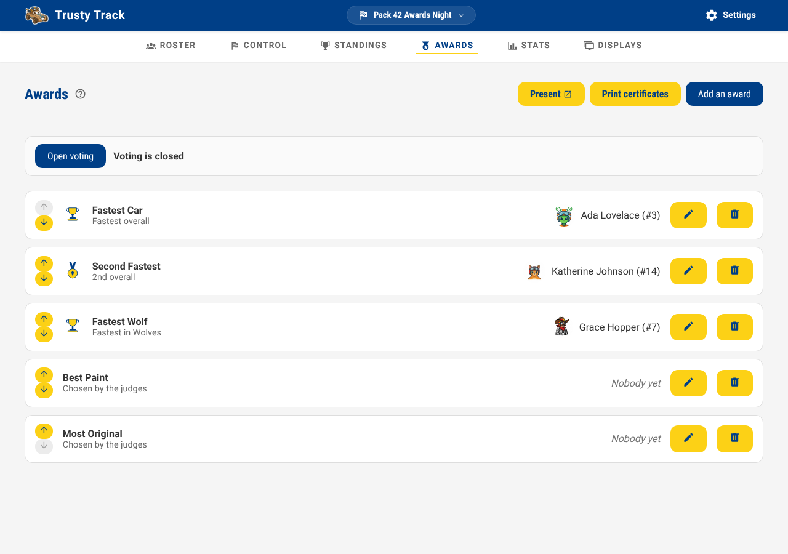
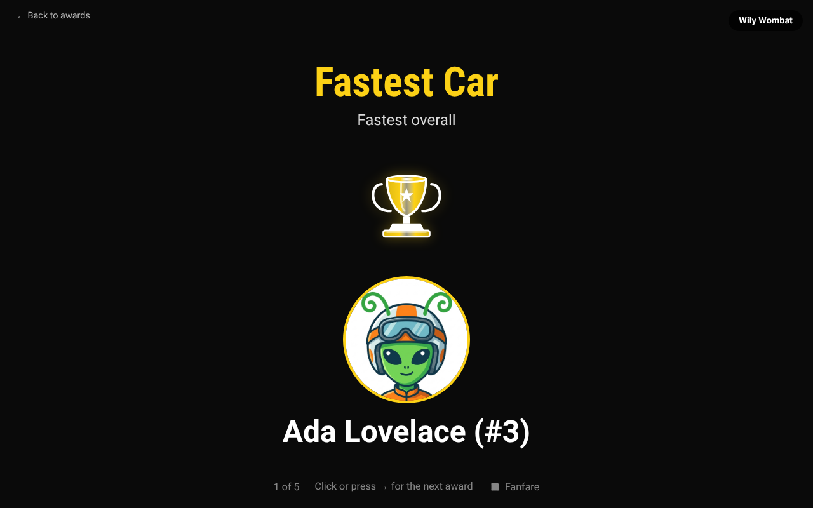
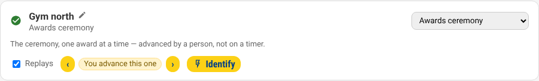
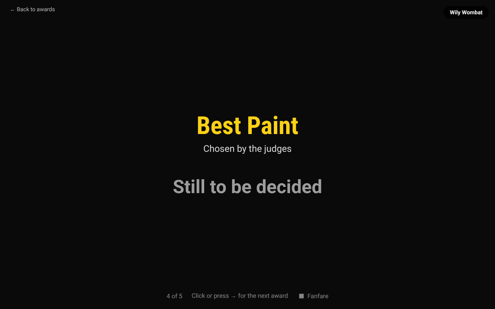
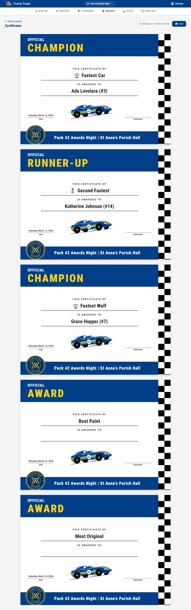

# Awards

Most of what a pack hands out at the end of a derby has nothing to do with the
timer. Best Paint, Most Original, Judges' Choice — somebody looks at the cars
and decides. Trusty Track can hold those alongside the speed trophies, so the
whole list is in one place when it is time to announce them.

**Race → Awards.**

## The two kinds

Every award is one name and one winner. What differs is where the winner comes
from.

| | Winner | Use it for |
| --- | --- | --- |
| **Speed-based** | worked out from the standings | Fastest Car, Fastest Wolf, Slowest Car, second and third place |
| **Somebody we choose** | you pick a racer | Best Paint, Most Original, Judges' Choice |

### Speed-based

You describe the award rather than naming a winner: *which standings*, *which
end*, *which position*, and optionally *which den*.

- **Standings to use** — the overall standings, or one round's. Pick a round for
  the trophy that goes to the winner of the final; pick the overall standings
  for a trophy based on the whole event.
- **Counting from** — *The fastest car* or *The slowest car*. Most awards count
  from the fastest; see [The slowest car](#the-slowest-car) below.
- **Position** — Fastest, 2nd, 3rd, and so on. Counting from the slowest, these
  read Slowest, 2nd slowest, 3rd slowest.
- **Limited to a den** — for "Fastest Wolf". Leave it on *The whole pack*
  otherwise.

> [!TIP]
> "Fastest in each den" is one award per den, not one award. Add them
> individually and name each after its den — that is also how they get
> announced.

Because the award describes a position rather than a person, **correcting a time
moves the trophy**. Set them up before the racing starts; if you find a mistyped
time at the end of the day and fix it, the awards follow.

#### The slowest car

Plenty of packs give a trophy to the slowest car, and it is the same standings
read from the other end. Set **Counting from** to *The slowest car* and leave
**Position** on *Slowest*.

It works with everything else on the form: limit it to a den for "Slowest Wolf",
or point it at one round for the slowest car in the final.

> [!NOTE]
> A car that has not raced yet can never win it. Racers with no result sit at
> the bottom of the standings, so without this the trophy would go to whoever
> registered and stayed home. Only cars that actually ran are considered.

### Somebody we choose

Just a name and, when you have decided, a racer. Leave the winner as *Not
decided yet* until the judging is done — most of these stay empty until the very
end of an event, which is normal and nothing is wrong.

#### Starting from a ready-made award

**Start from a ready-made award** offers the usual superlatives — Best Paint,
Most Original, Best Use of Colour, Most Aerodynamic, Most Patriotic, Best
Scout Spirit, Judges' Choice — so a pack that has never run one of these does
not have to invent a name the night before. Choosing one fills in the name
and its artwork; both stay ordinary editable fields afterward, so you can
rename it or type something else entirely without losing the picture.

It has no effect on a speed-based award. Those get their artwork worked out
automatically from what they are — first place, second and third, or the
slowest car — with nothing to choose.

## Letting people vote

For a judged award, you can let people vote from their own phones instead of
walking the cars around with a clipboard.

1. On the award, turn on **Let people vote for this**. It is on by default
   for a new judged award — turn it off for one your pack's leaders would
   rather decide privately.
2. When you are ready, click **Open voting** (near the top of this page). The
   button's label flips to **Close voting**, and the text beside it says
   "Voting is open." Share the address that appears next to it — a phone on
   the venue wifi that opens it sees every car's number, name and photo, and
   can vote for any award you have left on.
3. Click **Close voting** before the ceremony. Nothing does this
   for you — it is your call, the same way starting the ceremony itself is.

**Nobody's name or photo appears on the voting page.** Voting is about the
cars, and only the cars: a car's number, its name if it has one, and its
photo. Whoever is voting never sees who built it.

**One shared phone or tablet can be used all day.** Nothing stops someone
voting more than once from the same device — the assumption is a single
iPad by the cars, passed from hand to hand, not a ballot tied to a person.
What your pack decides that is worth is your call, not the app's.

**A vote never fills in the winner by itself.** As soon as an award has any
votes, its tally — how many votes each car got — appears right on its row in
the award list, with a **Use this result** button next to each car that
fills in the winner exactly as if you had picked it from the list. Both show
up while voting is still open, so you can watch the count as it comes in; you
do not need to close voting first. A tie, a car that shouldn't count, or a
lopsided result stays yours to look at and decide on before anything is
announced.

## The running order

Awards are listed in the order you will announce them, and the arrows on the
left move one up or down. Most packs put the speed awards last, because that is
the one everyone is waiting for.

## Reading the list

Each award shows what it is for and who currently holds it.

*Not decided by the racing yet* against a speed award means the standings have
not gone that far — an award for third place has no winner until three cars have
run. This is expected during an event.

If an award says **"Not set up — this award cannot be won"**, its rule is
missing. Edit it and choose which standings it reads and which place wins it.

## Announcing them

**Present** opens the ceremony: one award at a time, filling the screen, with
the winner's photo and — for a ready-made superlative or a speed award —
its artwork. Click or press the right arrow for the next one — a presenter
remote works too, since it sends the same keys.

It is an ordinary address (`/race/1/awards/present`), so you can also open it
directly on the machine driving the projector.

### Driving it from where you are

If the ceremony is on a screen across the room, you do not have to walk to
it. Put it there from **Race Control → Displays** — choose **Awards
ceremony** for that screen — and the row grows **‹** and **›** buttons that
move it on.

> [!NOTE]
> **Awards ceremony** is only in that list once the race has at least one
> award. Set them up here first.

_The screen's row on the Displays panel. **‹** and **›** move the ceremony
on that screen from wherever you are._

Both work at once: somebody at the screen can still use the arrow keys or a
presenter remote, and the buttons move whichever award is actually up. Hand
the remote to whoever is speaking and keep the buttons as a backup, or run
the whole ceremony from your laptop.

It does not move on by itself. The other audience screens rotate on a timer
because nobody is driving them; this one waits for you, so it will not announce
the next trophy over the applause for the last one. It also stops on the last
award rather than starting again, which is the one people photograph.

Awards nobody has won yet still appear, marked *Still to be decided* — most of
them are, right up until the moment you announce them.

## Printing certificates

**Print certificates**, next to **Present**, opens one certificate per award —
the ceremony's own running order, so the stack comes off the printer in the
order you will hand them out. An award still undecided prints too, with a
blank line to write a name on, rather than being left out of the batch; a
ready-made superlative or a speed award prints its artwork, and anything
else prints plain. More in
[Printed documents](reference/printing.md#certificates).

## What awards do not do

- **They are not the championship.** How many cars go through to the final is
  set when you create the round, not here.
- **Only the operator can change them.** If [a PIN is set](access-and-network.md),
  the check-in desk and the audience displays can see the awards but not edit
  them — see [Roles and permissions](reference/roles-and-permissions.md).
