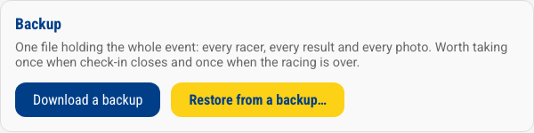

# Backup and restore

The whole event lives on one machine: the results and a folder of
photographs. If that machine's SD card fails, or somebody deletes the wrong
thing, everything goes with it — the roster, the check-ins, the photos and the
results.

Trusty Track can put all of it into a single file, and put it back.

## Taking a backup

**Settings → Backup → Download a backup.** Backup is one of the sections
listed down the left of the Settings page.

The file lands in your browser's downloads folder, named for the moment it was
taken. It contains everything: every race, racer, den, heat, result and photo.

Two moments are worth catching:

- **When check-in closes.** The roster is an afternoon of somebody's work and
  the racing has not started yet, so this is the backup that saves the most for
  the least.
- **When the racing is over.** The results are what people will ask about
  afterwards.

> [!TIP]
> Copy the file off the machine — onto a laptop, a phone, a USB stick, anywhere.
> A backup sitting on the SD card it is protecting is not a backup.

## Restoring

**Settings → Backup → Restore from a backup…**, then choose the file.

Trusty Track asks before it does anything, and names the file it is about to
restore. Confirming replaces **everything** currently in the app.

The page reloads afterwards. Any other screen — a display on the wall, the
check-in tablet — needs reloading too, because it is still showing the event you
just replaced.

### Undoing a restore

What was replaced is kept on the machine, beside the restored copy:

- `trusty-track.db.pre-restore`
- `uploads.pre-restore/`

Both are in the data folder (`~/.trustytrack` unless you have changed it).
Anyone with access to the machine can put them back by renaming them. Only the
most recent restore is kept this way, so if you restore twice, the first copy is
gone.

### When a restore is refused

Nothing is touched unless the whole file checks out, so a refusal costs you
nothing. The page says why — a damaged file, or a backup taken by a newer
version of Trusty Track. Each message, and what to do about it, is in
[the backup reference](reference/backups.md#when-a-restore-is-refused).

## Who can do it

Both are operator-only once [an operator PIN is set](access-and-network.md). A
backup contains every racer's name and photograph, and a restore replaces a
running event, so neither is something a display or the check-in tablet should
be able to do.

If no PIN is set, anyone on the network can — which is one more reason to set
one.

## What is in the file

Everything: every race, racer, den, heat, result and photo, plus the
[activity log](access-and-network.md#the-activity-log). What the zip holds,
piece by piece, is in
[the backup reference](reference/backups.md#what-is-in-the-file).
