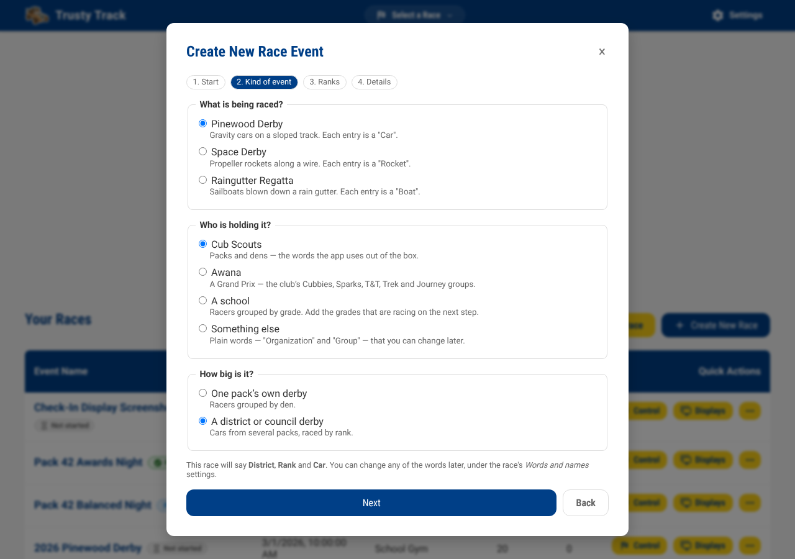
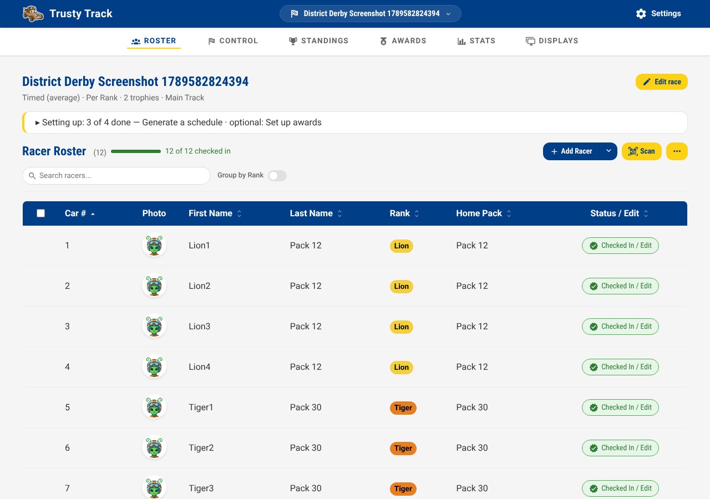
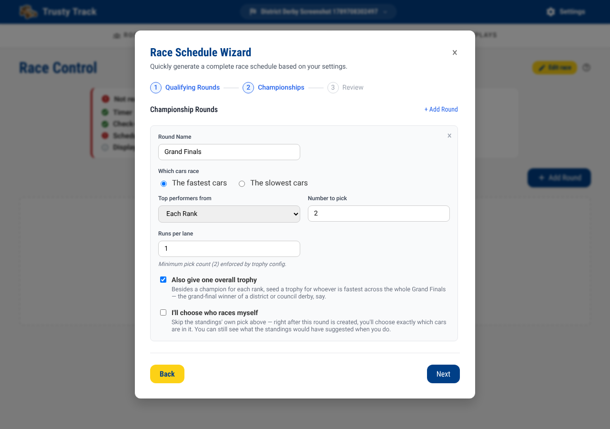
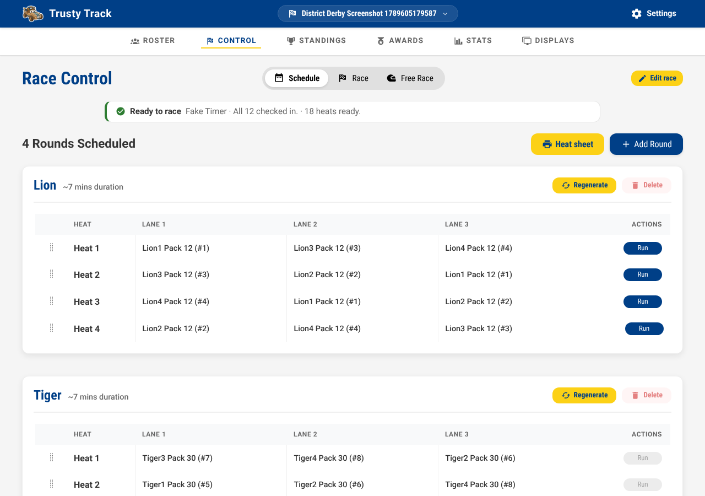
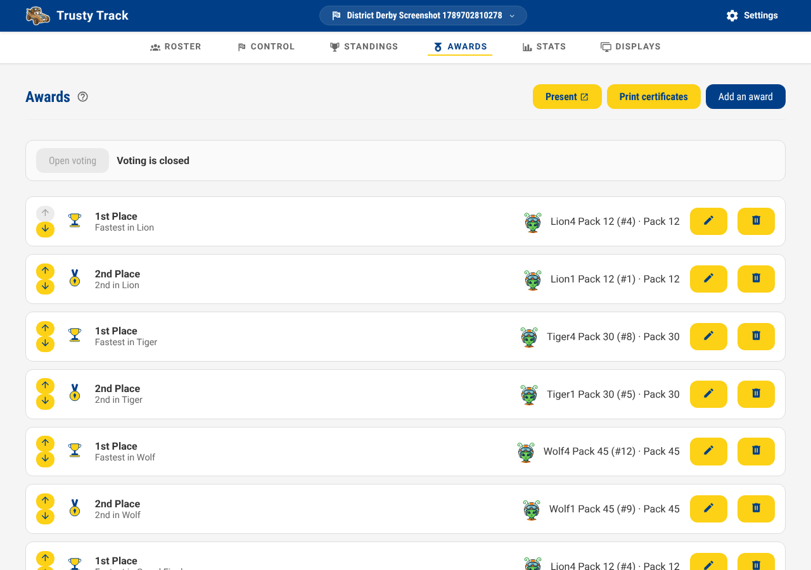

# District or Council Derby

A district or council derby is not a pack's own race with more cars — it is
several packs' qualifiers, raced together, on one track, one rank at a
time. This guide walks through setting one up: the wizard answer, a roster
that arrives from a dozen packs, check-in, the schedule, race day, and the
awards a district event hands out.

If you have not read [Getting Started](getting-started.md) yet, do that
first — this guide only covers what is *different* about a district event,
and everything else (System Settings, the roster toolbar, running a heat)
works exactly as it does there.

## What a district derby looks like

A dozen packs send their qualifiers — the top few from each rank, typically
— to one hall with one track. Ranks race one after another: Lions first,
then Tigers, and so on through Arrow of Light, each as its own block on the
schedule. A rank's own standings decide that rank's champion. Once every
rank has raced, the top few from *each* rank come back for a **grand
final** — one field, everybody racing together, one overall winner.

Nothing about that shape is new to Trusty Track. A rank is an ordinary
racing group; racing "by rank" is the same qualifying format a pack already
uses when it races "by den"; and a grand final drawing from every rank at
once is an ordinary championship round. What this guide covers is the
guided path through the parts that are new to a *district* event
specifically: the wizard's own district answer, a roster carrying each
racer's home pack, and the round wizard's own by-rank default.

## Setting it up: the wizard's district answer

From the Home page, click **+ Create New Race** the same way you would for
a pack's own derby. On the **Kind of event** step, choose **Cub Scouts**,
then — a question offered only for Cub Scouts — **How big is it?** and pick
**A district or council derby**.

That one answer does three things differently from a pack's own derby:

- The event's own words become **District** and **Rank** rather than
  **Pack** and **Den** — a racer's home pack keeps its own word regardless;
  see [below](#the-roster-a-racers-own-home-pack).
- The **Dens** step still scaffolds the same six Cub Scout ranks, in their
  rank colors, now labelled **Ranks** under a **District**. Remove the
  ones nobody is sending tonight the same way you would remove a den from
  a pack's own list — a district rarely fields all six.
- The **Round Wizard**, once you reach the Schedule tab, opens with
  different defaults — covered in its own section below, since you get
  there after the roster, not as part of this wizard.

Finish the **Details** step as you would for any race — name, date,
location, track, scoring — and click **Create Race**.

## The roster: a racer's own home pack

A district roster arrives from a dozen packs, each with its own numbering,
and the announcer and the results wall want "Johnny, Pack 12, Bear" — not
just "Johnny". Trusty Track carries this as each racer's own **Home Pack**,
separate from the rank they race within (which, at a district event, is
shared across every pack that sent a racer to it).

The easiest way in is a CSV import with a **Pack** column, the same
**Import from CSV** dialog every roster uses (**Roster → ⋯ → Import from
CSV**) — a `Pack`, `Home Pack`, `Home Unit`, or `Unit` header is picked up
automatically. Add racers by hand instead, and each one gets a **Home
Pack** field on the roster form. Either way, the roster's own table grows a
**Home Pack** column the moment any racer on it has one set — invisible on
an ordinary pack derby, where nobody sets one.

Check-in works exactly as it does for a pack's own derby — see [Race
Setup](race-setup.md) if this is your first race.

## The schedule: by rank, then a grand final

Once your roster is checked in, open the Schedule tab and click **Start
Round Creation Wizard**, the same as any race. For a district or council
derby, it no longer opens on "everyone races together" — it already knows
what you are setting up:

- **Step 1** opens on **By Rank** rather than "All District" — one
  qualifying round per rank, the same **Format** choice a pack's own "by
  den" race uses.
- **Step 2**'s championship round opens on **Each Rank**, with **Number to
  pick** defaulting to 2 per rank (never fewer than your race's own
  **Championship Trophies** setting) — the grand final's own field. A
  second checkbox, **Also give one overall trophy**, is already ticked:
  besides a champion for each rank, it seeds a trophy for whoever is
  fastest across the whole grand final — the event's overall winner.

Everything else about the wizard is unchanged: adjust the pick count,
runs per lane, or add further championship rounds the same way you would
for any race. Click **Generate schedule**.

**A note on the wizard scaffolding six ranks.** If a rank nobody sent
racers to is still in the list from the setup wizard's own scaffold, the
round wizard simply skips it — a rank with nobody checked in never becomes
a round, the same rule a pack's own "by den" race already follows. Removing
an unused rank on the setup wizard's own **Dens** step keeps the roster and
the Awards page free of trophies nobody will ever win, but it is not
required.

**A track that idles between ranks** is exactly what [master running
order](reference/running-order.md) exists for — interleaving one rank's
heats with the next's, so the track never sits empty while the next rank's
cars are staged. It is off by default; turn it on from the race's own
**Event** settings.

## Race day

Running the heats is identical to any other race — see [Race
Day](race-day.md). Racers are called by name, car number and rank as usual;
wherever a screen has room for it (the operator's own heat view, a printed
heat sheet), a racer's home pack rides along beside their name.

## Awards: per-rank champions and a grand-final trophy

The moment the round wizard builds the grand final, the [Awards](awards.md)
page already has both sets waiting, with nobody decided until the racing
says so:

- One **1st Place**/**2nd Place**/… set per rank — "Fastest in Lion",
  "Fastest in Tiger", and so on — narrowed to that rank's own racers within
  the grand final.
- One further set, unscoped to any rank, for whoever is fastest across the
  whole grand final — the event's overall winner. This is the **Also give
  one overall trophy** checkbox from the round wizard; untick it there if
  your district only wants the per-rank trophies.

A racer's own name on this page carries their home pack too — "Johnny
(#12) · Pack 12" — the same `awardText` rule every other award already
uses, reading `home_unit` when a racer has one.

[**At most one trophy per racer**](awards.md#at-most-one-trophy-per-racer)
applies here exactly as it does for a pack's own den trophies: if the
grand-final winner is also their own rank's fastest, turning on **One
trophy per racer** on the race's own settings rolls their rank trophy down
to the next-fastest racer in that rank, with a note on the Awards page
saying why.

## Multi-session events

Nothing enforces the race date on a round, a heat, or the schedule as a
whole — a council that runs qualifiers one weekend and the grand final the
next needs no special setup. Race the qualifying rounds, leave the grand
final's heats unrun, and come back to them later; the schedule and the
standings are exactly as you left them. The one thing to plan around by
hand is the roster: [check-in admits a racer the moment they
arrive](reference/mid-race-changes.md#a-late-arrival), so a pack arriving
for the finals-only session still needs to be on the roster and checked in
before its cars can be slotted into the final.

## What is not supported yet

- **A per-rank cut size.** **Number to pick** on the grand final's own
  round is one number, applied to every rank equally — a council that wants
  3 Bears and 2 Lions in the grand final has no single-question way to ask
  for that yet. Add further championship rounds by hand, or adjust a
  rank's own field with **I'll choose who races myself** on the round
  wizard, in the meantime.
- **A knockout stage between the ranks and the grand final.** Some
  councils run an optional bracket to trim the field before the grand
  final; today's championship-round vocabulary can only chain to *one*
  combined source, not several ranks' own knockout brackets at once. Two
  workarounds get most of the way there: chain a single elimination round
  after qualifying (the whole event races it together, not by rank), or
  build the grand final as an ordinary each-rank round and run a second,
  hand-configured elimination round afterward for its own field.
- **Simultaneous tracks.** A district that runs several tracks at once and
  merges the results is a different, larger feature — see the [architecture
  issue](https://github.com/dknowles2/trusty-track/issues/1076) if that is
  what your event needs; the pattern this guide covers is the one districts
  actually run in practice, one track with ranks as blocks.
