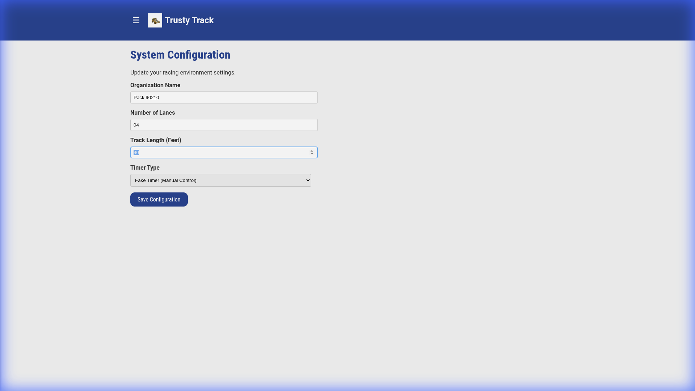
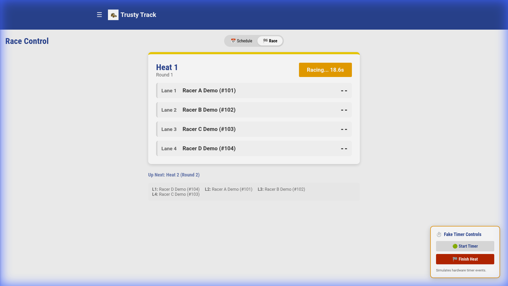

# Using the Fake Timer

Trusty Track includes a **Fake Timer** system that allows you to simulate race events (starting a race, finishing a race, and generating results) without needing physical hardware connected. This is ideal for testing the software, running simulations, or managing manual races where you simply want to record random results for verifying the system flow.

## 1. Configuration

To enable the Fake Timer, navigate to the **System Settings** page (shown automatically on first run, or reachable from the **Settings** gear in the top-right corner).

1.  Locate the **Timer Type** dropdown.
2.  Select **Fake Timer (Manual Control)**.
3.  Click **Save Settings**.

## 2. Running a Race with Fake Timer

Once configured, open the **Race Control** page for a race and switch to the **Race** view.

When you enter a heat, you will see the **Fake Timer Controls** panel docked in the bottom right corner of the screen.

### Workflow

1.  **Prepare the Heat**: Ensure racers are assigned to lanes. The status will show "Waiting for Timer...".
2.  **Start the Timer**: Click the **Start Timer** button (the one with the green arrow) on the control panel.
    *   The race status will change to **"Racing..."** and the elapsed time counter will start running.
    *   This simulates the hardware gate opening.
3.  **Finish the Heat**: The heat finishes on its own a few seconds after it starts. To end it sooner, click the red **Finish Heat** button.
    *   The system will generate random race times for all racers, between 3 and 4 seconds each.
    *   The results will be saved and displayed immediately.
    *   The heat is marked as complete.

## Tips

*   **No "Start Heat" Button**: Unlike previous versions, there is no generic "Start Heat" button on the main dashboard. You must use the Fake Timer Controls to initiate the race.
*   **It Finishes Itself**: Starting is manual, finishing is not. Three to five seconds after you press "Start Timer", the heat records its own results, the same as if you had pressed "Finish Heat". That is deliberate — it lets you click through a whole round at about the pace a real one runs.
