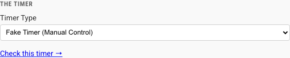

# Using the Fake Timer

Trusty Track includes a **Fake Timer** — a pretend timer that starts heats and makes up finishing times, no hardware needed. It is ideal for a practice run the night before, trying the software out, or a race where you plan to type the times in by hand anyway.

## 1. Choosing the Fake Timer

To enable the Fake Timer, navigate to the **System Settings** page (shown automatically on first run, or reachable from the **Settings** gear in the top-right corner).

1.  Open **Tracks** and find the card for your track. (On the very first run
    everything is on one page, so there is nothing to open.)
2.  Locate the **Timer Type** dropdown, under **The timer**.
3.  Select **Fake Timer (Manual Control)**.
4.  Click **Save Settings**.

_The timer section of a track's card in System Settings, with **Fake Timer (Manual Control)** chosen from the Timer Type dropdown._

## 2. Running a Race with Fake Timer

With the Fake Timer chosen, open the **Race Control** page for a race and switch to the **Race** view.

When you enter a heat, you will see the **Fake Timer Controls** panel docked in the bottom right corner of the screen.

### Workflow

1.  **Prepare the Heat**: Ensure racers are assigned to lanes. The status will show "Waiting for Timer...".
2.  **Start the Timer**: Click the **Start Timer** button (the one with the green arrow) on the control panel.
    *   The race status will change to **"Racing..."** and the elapsed time counter will start running.
    *   This stands in for the real start gate opening.
3.  **Finish the Heat**: The heat finishes on its own a few seconds after it starts. To end it sooner, click the red **Finish Heat** button.
    *   Every racer gets a made-up time between 3 and 4 seconds.
    *   The results will be saved and displayed immediately.
    *   The heat is marked as complete.

## Tips

*   **No "Start Heat" Button**: Unlike previous versions, there is no generic "Start Heat" button on the main dashboard. You must use the Fake Timer Controls to initiate the race.
*   **It Finishes Itself**: Starting is manual, finishing is not. Three to five seconds after you press "Start Timer", the heat records its own results, the same as if you had pressed "Finish Heat". That is deliberate — it lets you click through a whole round at about the pace a real one runs.
