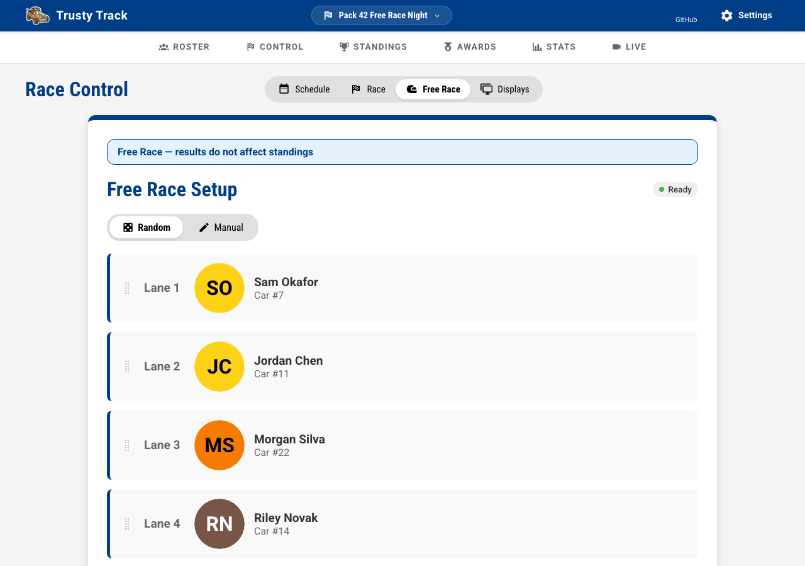
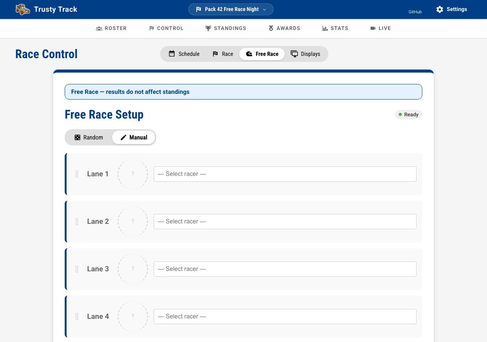
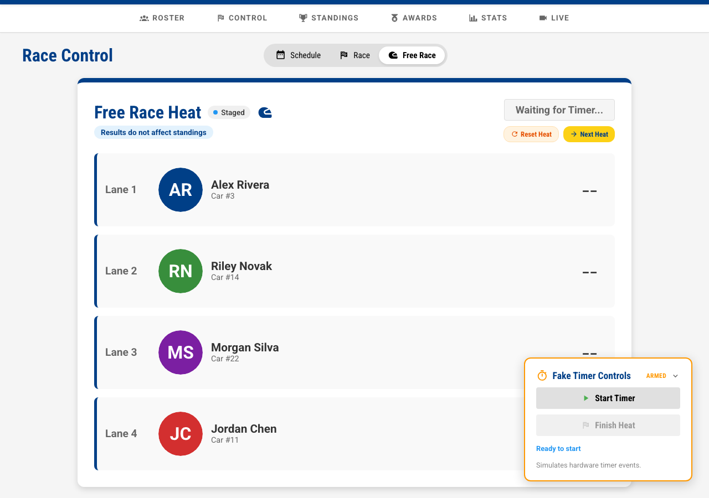
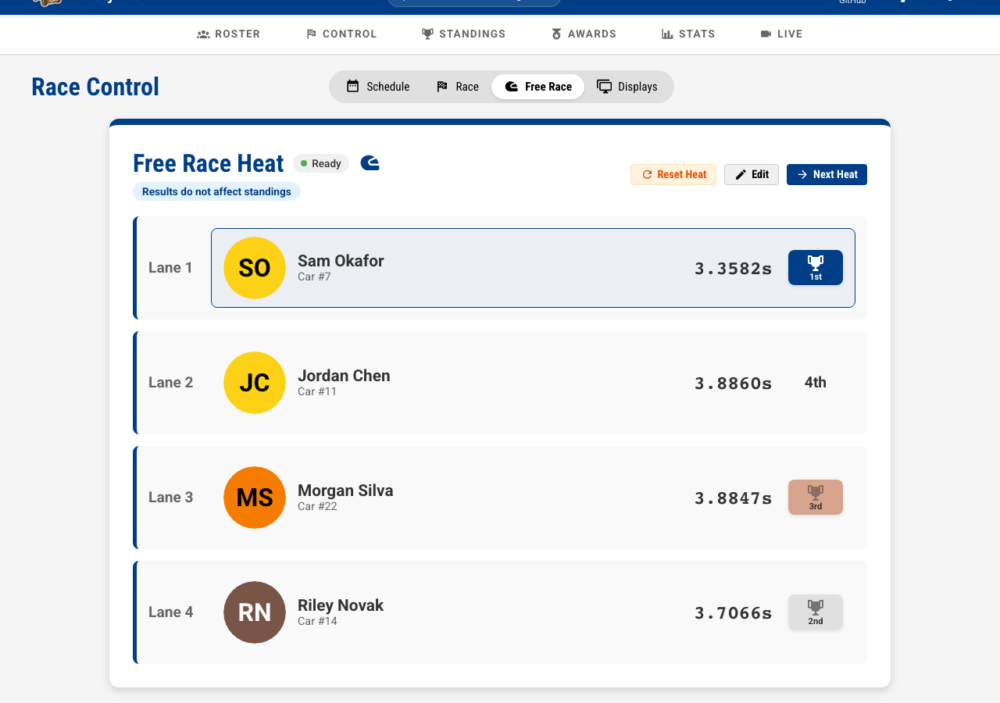

# Free Race

A **free race** is a heat that runs on the timer and shows on the audience
display, but counts for nothing. It is invisible to standings, scheduling,
championships and statistics, so it cannot disturb the event.

Use it for:

- a shake-down run before doors open, to prove the track and the timer
- a parent's or a sibling's car
- a demonstration for a scout who wants to see how the track works
- the fun heats at the end, once the trophies are handed out

---

## Opening Free Race

Go to **Race Control** and click the **Free Race** tab.

_The Free Race tab. The blue banner is on every screen in this mode — nothing you do here changes anyone's standing._

---

## Choosing who races

### Random

**Random** is the default and fills the lanes from the checked-in roster. It is
usually what you want for an impromptu run: click **Re-shuffle** for a
different draw. Drag a lane by its handle if you want to move someone.

### Manual

Switch to **Manual** to pick each lane yourself, and click **Clear All** to
empty every lane and start again. Lanes may be left empty — a two-car
exhibition on a four-lane track is fine.

_Manual mode gives every lane a racer picker. Leave a lane on "Select racer" to run it empty._

!!! note "Random draws from the checked-in racers only"

    A **Random** draw is made from the racers whose cars have passed
    inspection, so somebody who has not been checked in will never come up in
    one. The **Manual** pickers list the whole roster, checked in or not.

When at least one lane holds a racer, the button reads **Start Free Race
Heat**. With every lane empty it reads **Start Anonymous Heat**, which is the
right choice for testing the track itself with no cars assigned to anybody.

---

## Running the heat

Once started, the heat is staged and waiting for the timer, exactly like an
official one.

_A staged free race heat. With a fake timer configured, the Fake Timer Controls appear in the corner — see the [Fake Timer guide](fake-timer.md)._

- **With a hardware timer**: release the cars as normal; times arrive on their own.
- **With the fake timer**: click **Start Timer**. The heat finishes on its own a few seconds later, or click **Finish Heat** to end it at once.

Results appear as soon as the heat finishes, with places and the winner
highlighted.

_A completed free race heat. The same lane cards, times and places as an official heat — and the same reminder that none of it counts._

Three buttons sit above the results:

| Button | What it does |
| --- | --- |
| **Reset Heat** | Clears the times and re-arms the timer, so the same lane-up can race again |
| **Edit** | Enter or correct times by hand |
| **Next Heat** | Goes back to lane setup for another run |

**Next Heat** on a heat that never ran throws it away rather than leaving an
empty record behind.

---

## What the audience sees

A free race heat takes the "currently racing" spot on the
[Observation display](observation-displays.md), labelled **Exhibition** so
nobody mistakes it for part of the event, and its times appear in the results
panel when it finishes. The leaderboard beside it does not move.

The display follows the timer, so the spot goes to whatever is actually on the
track. Arm a free race in the middle of an event and the audience sees it;
finish it and the display returns to the scheduled heat. A free race you set up
and then left alone does not take the spot, because it is not on the track —
only an armed one is.

---

## What it never touches

A free race heat is excluded from:

- **Standings** and the live leaderboard
- **Race statistics** — lane fairness, per-racer averages, top moments
- **Heat scheduling** — it is not part of any round
- **Championship places** — a fast free race does not qualify anybody

That exclusion is the whole point of the mode. If you want a run that *does*
count, add a round from the **Schedule** tab instead.
