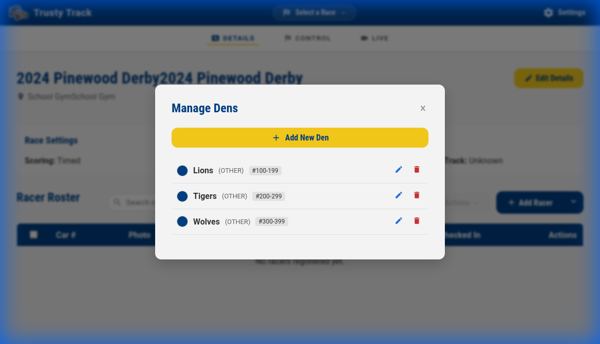

# Getting Started Guide

Welcome to Trusty Track! This guide will walk you through the initial setup and help you create your first race event.

## 1. Welcome to Trusty Track

Trusty Track is designed to make running a Pinewood Derby race smooth and enjoyable for organizers, racers, and spectators alike. This application handles everything from racer check-in and automated scheduling to real-time race execution and audience leaderboards.

## 2. Opening the App

Trusty Track runs directly in your web browser. Once the software is started, you can access it by navigating to the URL provided by your administrator (usually `https://localhost:5174` if running locally).

Multiple volunteers can open the app on different devices simultaneously to handle different tasks, such as check-in or race monitoring.

## 3. First-Time Setup: System Settings

The first time you launch Trusty Track, or when you need to adjust your organization's details, you'll use the **System Settings** page. You can access this at any time by clicking the **Settings** gear icon in the top right corner of the navigation bar.

### Organization Details

- **Organization Name**: The name of your Cub Scout Pack, school, or group (e.g., "Pack 123").

### Track Configuration

Trusty Track needs to know about your physical race track:

- **Track Name**: A descriptive name for the track.
- **Number of Lanes**: How many lanes your track has (e.g., 4).
- **Track Length**: The total length of the track in feet.
- **Timer Type**: Select the device connected to your track. Use **Fake Timer** for testing or practicing without physical hardware.

Click **Save Settings** to apply your changes.

## 4. Creating Your First Race

Once your system settings are configured, you're ready to create a race event.

1. From the Home page, click the **+ Create New Race** button.
2. Fill in the **Create New Race Event** form:
   - **Event Name**: A name for your race (e.g., "2024 Pinewood Derby").
   - **Date & Time**: When the race will take place.
   - **Location**: Where the race is being held.
   - **Track / Timer**: Select which track you'll be using for this event.
   - **Car Numbering**: Choose how car numbers should be assigned (Manual allows you to enter numbers during check-in).

After clicking **Create Race**, you will be taken to the **Race Details** page.

## 5. Setting Up Dens (Groups)

Before adding racers, you should define your racing groups, typically called "Dens" in Cub Scouting.

1. On the **Race Details** page, click **Manage Dens**.
2. Click **+ Add New Den** and enter the name (e.g., "Lions", "Tigers").
3. You can set specific car number ranges for each den if desired.

With your dens configured, your race is ready for racer registration and check-in!

## What's Next?

Now that your race is set up, you can proceed to adding racers and managing the event:

- [Race Setup Guide](race-setup.md) — Adding racers and managing dens
- [Race Day Operations Guide](race-day.md) — Check-in and running the race
- [Observation & Audience Displays Guide](observation-displays.md) — Setting up kiosks and displays
