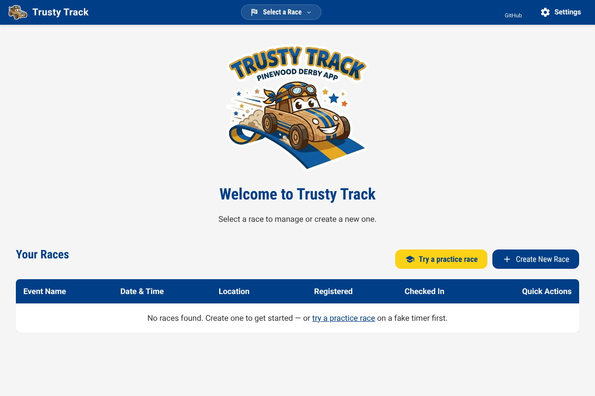
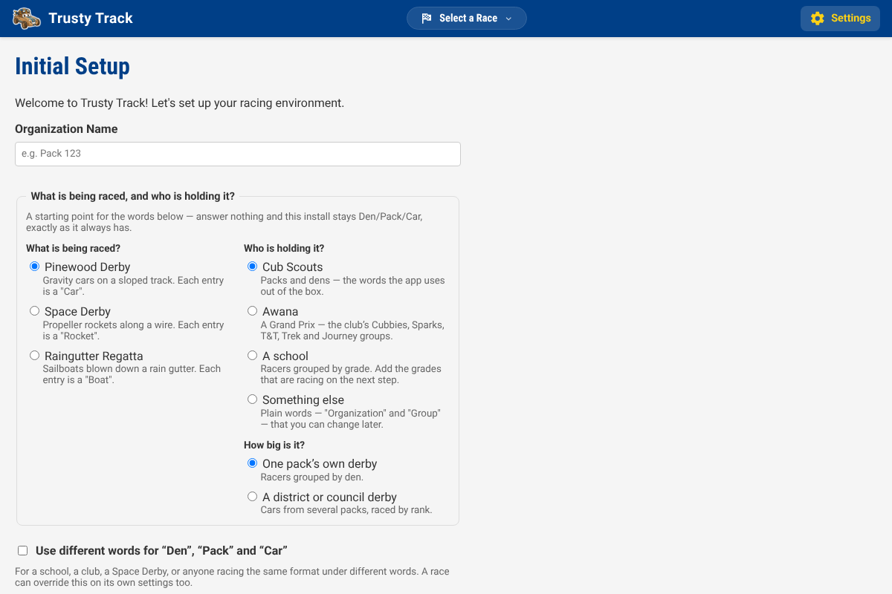
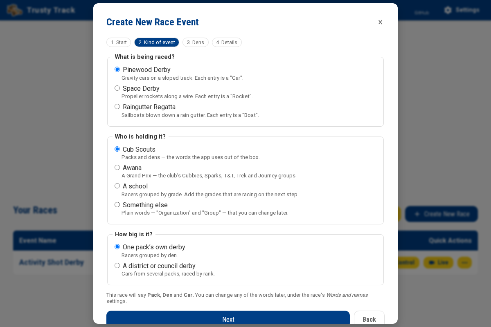
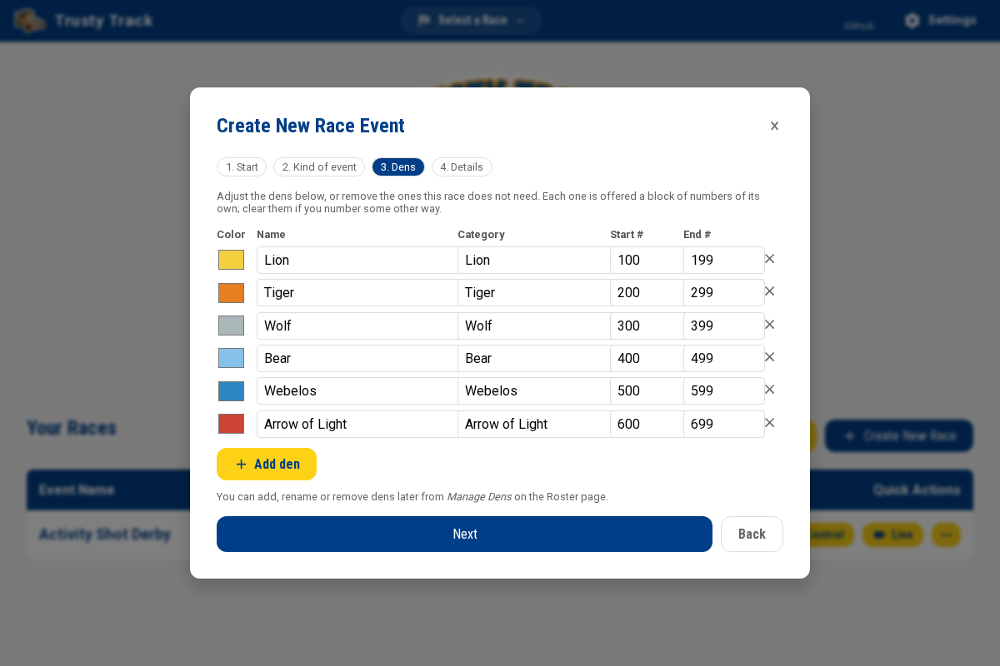
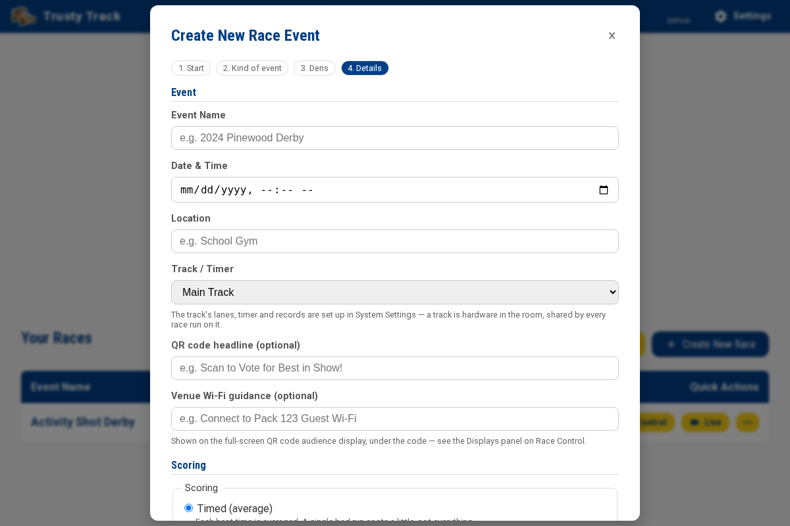
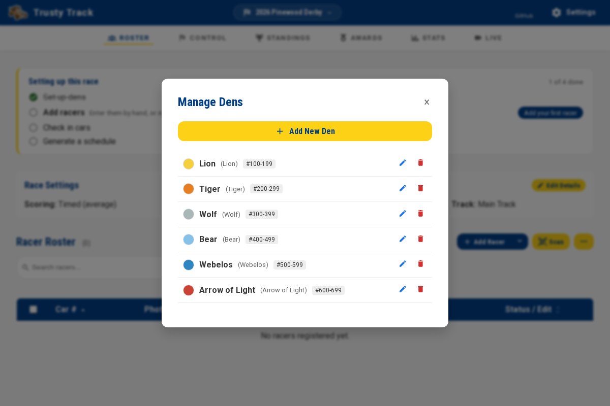
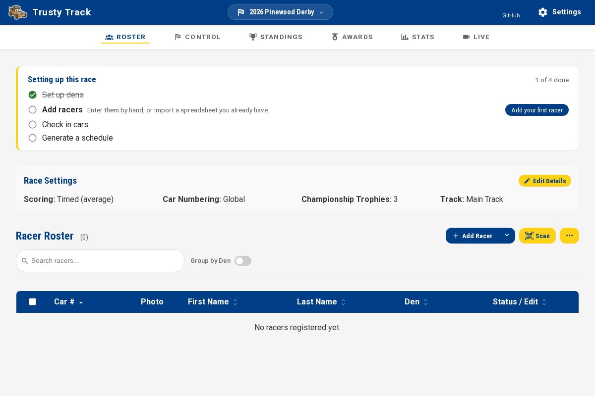

# Getting Started Guide

Welcome to Trusty Track! This guide will walk you through the initial setup and help you create your first race event.

## 1. Welcome to Trusty Track

Trusty Track is designed to make running a Pinewood Derby race smooth and enjoyable for organizers, racers, and spectators alike. This application handles everything from racer check-in and automated scheduling to real-time race execution and audience leaderboards.

This guide is written for a Cub Scout pack, since that is who most people
installing it are — but nothing about the app requires one. A school, a
club, or anyone running the same kind of race day can rename "Den" and
"Pack" to their own words; see [the words on screen](reference/race-settings.md#the-words-on-screen).

## 2. Opening the App

Trusty Track runs in your web browser. Once it is started, open it by typing its address into the browser — ask whoever set it up, or, on the machine running Trusty Track itself, it is usually `https://localhost:8000`. The [installation guide](user/install.md) for your platform gives the exact address, which differs a little between install methods.

Multiple volunteers can open the app on different devices simultaneously to handle different tasks, such as check-in or race monitoring.

_The Home page before any races exist. **Try a practice race** builds a whole rehearsal on a fake timer; see [below](#4-trying-a-practice-race-first)._

## 3. First-Time Setup: System Settings

The first time you launch Trusty Track, or when you need to adjust your organization's details, you'll use the **System Settings** page — headed **Initial Setup** until you have saved it once. You can access this at any time by clicking the **Settings** gear icon in the top right corner of the navigation bar.

The first time, everything below is on one page, in order — fill it in from top
to bottom. Afterwards the page splits into sections listed down the left —
**General**, **Appearance**, **Access**, **Tracks**, **Advanced** and **Backup**
— and shows one at a time.
**Save Settings** saves the lot, whichever section you are looking at.

### Organization Details

- **Organization Name**: The name of your Cub Scout Pack, school, or group (e.g., "Pack 123").

### Appearance

Every picker here already defaults to the app's usual look, so this section
is entirely safe to skip on a first run — come back to it later if you want
the wall display to look different for an evening race, a patriotic-themed
derby, or a print run that needs to save ink. See
[Themes](reference/themes.md) for the full list.

### Access

Next comes a security decision, and it's fine to skip it for a kitchen-table first run: by default there's no PIN, so anyone who can reach the app on your network can change anything — including deleting the race mid-event. Setting an **Operator PIN** locks that down; an optional **Check-in PIN** limits a registration-desk device to adding and checking in racers. Both can be added later before race day. See [Access and Your Network](access-and-network.md) for what each PIN protects and how to set one.

### Setting Up Your Track

Trusty Track needs to know about your physical race track:

- **Track Name**: A descriptive name for the track.
- **Lanes**: How many lanes your track has (e.g., 4).
- **Length (Feet)**: The total length of the track in feet — also what lets Trusty Track work out [scale speed](reference/race-settings.md#scale-speed), a real-world MPH shown beside a heat's recorded time.
- **Timer Type**: Select the device connected to your track. Use **Fake Timer (Manual Control)** for testing or practicing without physical hardware, or **No timer — I'll enter results by hand** if your pack genuinely has no electronic timer. If you have an electronic finish line, the [Hardware Timer guide](hardware-timer.md) covers plugging it in and checking it works — worth doing the week before, not on race morning.

If you run more than one track, **+ Add Another Track** adds another to the same form.

### Advanced

- **Debugging Mode**: Off by default. Turning it on shows extra timer controls and logs during races — leave it off unless you're troubleshooting.

Click **Save Settings** to apply your changes.

## 4. Trying a Practice Race First

Before your first real event, **Try a practice race** on the Home page builds a
whole rehearsal in one click: a dozen racers with photographs, sorted into
dens, all checked in, a qualifying round and a final — on a fake timer, so no
hardware is involved. It drops you straight onto Race Control with the first
heat ready to start.

Run a few heats, watch the standings move, let the final fill from the
placings, and put a screen on the [audience display](observation-displays.md).
Nothing here touches your real event.

Clicking the button again reopens the same rehearsal — it reads **Resume
practice race** once one exists — rather than building a second one. Want to
start over instead? A small **Start new** link appears beside the button for
exactly that.

When you are done, open the practice race and delete it like any other race.

> [!TIP]
> The night before is the time for this. It takes a couple of minutes and it is
> the difference between meeting the race control screen at a kitchen table and
> meeting it with sixty children waiting.

## 5. Creating Your First Race

Once your system settings are configured, you're ready to create a race event.

1. From the Home page, click the **+ Create New Race** button.
2. The **Create New Race Event** dialog walks you through a few short steps.
   Each one has **Next** and **Back**, so nothing is final until the last.
   - **Start** — only shown once you already have a race. Choose **Start from
     scratch**, or **Copy settings from a previous race** to reuse last year's
     dens, scoring, numbering and words. What is copied, and what is not, is
     listed in [Copying a previous race](reference/race-settings.md#copying-a-previous-race).
   - **Kind of event** — what is being raced (Pinewood Derby, Space Derby or
     Raingutter Regatta), who is holding it (Cub Scouts, Awana, a school, or
     something else) and, for Cub Scouts, whether it is one pack's own derby
     or a district one. The line at the bottom says which words the race
     will use — "Pack", "Den" and "Car" for a pack's Pinewood Derby.

   

   - **Dens** — a ready-made list from your answers: the six Cub Scout ranks
     for a pack, each with its rank colour and a block of a hundred car
     numbers. Rename, recolour, remove or add to them here, or leave the list
     empty if your race does not group racers. They can all be changed later
     from **Manage Dens** on the Roster page.

   

   - **Details** — the race form itself. It is one page, in three groups —
     the same groups you will find down the side of the edit form later on:
     - Under **Event**:
       - **Event Name**: A name for your race (e.g., "2024 Pinewood Derby").
       - **Date & Time**: When the race will take place.
       - **Location**: Where the race is being held.
       - **Track / Timer**: Select which track you'll be using for this event.
     - Under **Scoring**:
       - **Scoring**: Four methods — **Timed** (average heat time), **Points** (finishing places added up), **Cumulative time** (heat times added up), and **Fastest single run** (each racer's single best time). Every option shows its own one-line description right on the form. See [Scoring & Championships](scoring-and-championships.md) for what each means on race day.
       - **Drop worst run(s)**: `0` is off. Set it above `0` to drop each racer's worst counted results before scoring, once everyone who has raced has enough runs to spare.
       - **Ties**: How a tied score is settled where it decides something. **Leave it shared** is the default.
       - **Championship Trophies**: How many cars go into the final (3 by default).
     - Under **Check-in**:
       - **Car Numbering**: Choose how car numbers should be assigned (Manual allows you to enter numbers during check-in).
       - **Check car weights at inspection**: On by default at 5.0 oz, the usual pack rule. Change the limit, or turn the check off entirely if your pack does not weigh cars.

     Every field is explained in
     [Race and track settings](reference/race-settings.md).

   

3. Click **Create Race**. The race and its dens are created together, and you
   are taken to the **Roster** page.

## 6. Following the Setup Checklist

A new race opens with a **Setting up this race** panel at the top of the Roster page, listing the four things that have to happen before you can run a heat:

1. **Set up dens**
2. **Add racers**
3. **Check in cars**
4. **Generate a schedule**

Each item ticks itself off as you do it — there is nothing to mark complete by hand — and the panel shows a button for whichever step you are on. Once all four are behind you it disappears, so it is only ever on screen while something is genuinely outstanding.

If you set the race up with the wizard, the first step is already done — the dens it made are
there. If your pack does not use dens, skip that step: it counts as done as soon as you have racers.

## 7. Changing Your Dens

Racers are grouped into racing groups, typically called "Dens" in Cub Scouting. The setup wizard has
already made yours; this is where you change them — or add them, for a race that started with none.

1. On the **Roster** page, click **⋯** at the top right of the roster and choose **Manage Dens**.
2. Click the pencil beside a den to rename or recolour it, or **+ Add New Den** to add one.
3. Each den is offered a car number range to itself — 100–199 for the first den, 200–299 for the next. Change or clear those numbers if you number cars some other way.

With your dens in place, your race is ready for racer registration and check-in!

_A race with no racers yet. The setup checklist at the top is pointing at the next thing to do; it will remove itself once all four steps are done._

## What's Next?

Now that your race is set up, you can proceed to adding racers and managing the event:

- [Race Setup Guide](race-setup.md) — Adding racers and managing dens
- [Race Day Operations Guide](race-day.md) — Check-in and running the race
- [Observation & Audience Displays Guide](observation-displays.md) — Setting up kiosks and displays
