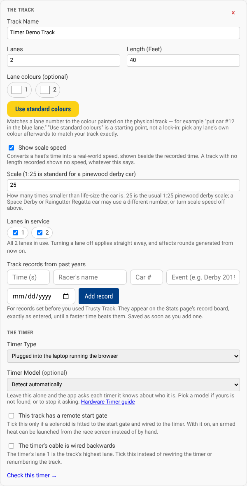
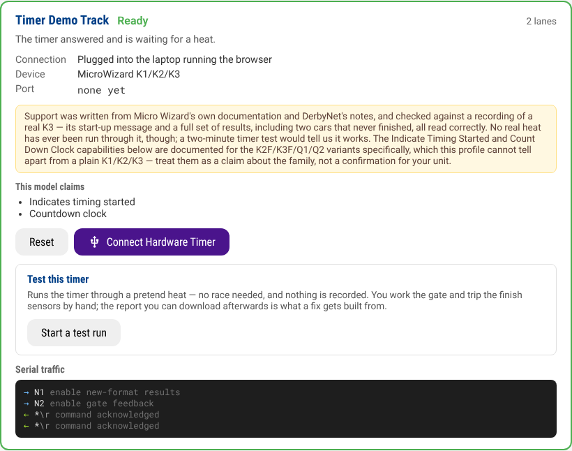
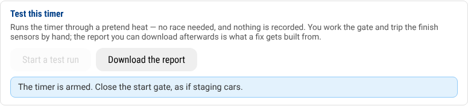
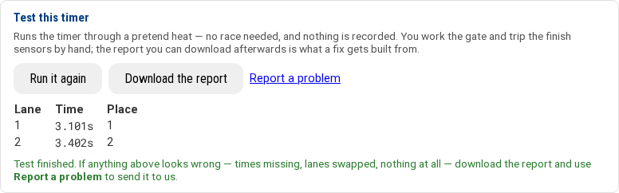
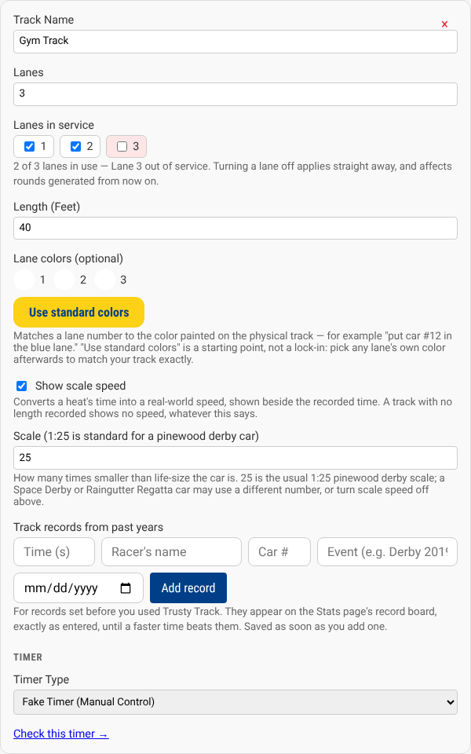

# Connecting a Hardware Timer

Trusty Track can read finish times directly from an electronic finish line, so
nobody has to watch the lanes and write times down.

If you want to try the software first, use the [Fake Timer](fake-timer.md)
instead. If you genuinely have no timer for race day, set the track's
**Timer Type** to **No timer** rather than Fake — see
[No timer](reference/race-settings.md#no-timer).

> [!TIP]
> Do this the week before the derby, not ten minutes before the first heat.
> The whole page below exists so that a problem surfaces on your bench, with
> time to fix it, rather than at the track with a queue behind the gate.

## The short version

For most people, connecting a timer is four steps:

1. Plug the timer's USB cable into the machine running Trusty Track.
2. In **Settings → Tracks**, set the track's **Timer Type** to
   **Plugged into this machine**. Leave **Serial Port** blank.
3. Open **System Settings → Check the timer connection**.
4. When it says **Ready**, you are done.

Everything else on this page is for when that did not work, or your setup is
different: the timer plugs into your laptop instead of the machine running Trusty Track, your model
has to be picked by hand, your track has a remote-controlled start gate, or a
lane dies on the morning of the event.

## Which timers work

Eight models, led by the **Micro Wizard K1 / K2 / K3** — the timer Trusty
Track has been built against. Seven of the eight are found automatically;
the NewBold family has to be picked by hand. The full list, and how well
each has been tested, is in [the timer reference](reference/timers.md#which-timers-work).

> [!WARNING]
> **None of these has run a real heat on real hardware yet** — including the
> Micro Wizard. If you own one,
> [testing it and sending us the result](#testing-your-timer-and-telling-us)
> takes about two minutes and is the most useful thing you could contribute.

Other models are not supported yet. Opening an issue naming the model, with
its manual if you have it, genuinely helps.

## Two ways to connect

Both are chosen per track in **Settings → Tracks**, on the track's card under
**The timer**.

_Everything about a track's timer lives on the track's own card in System Settings: how it connects, which model it is, whether a remote start gate is fitted, and whether its cable is wired backwards._

### Plugged into the machine running Trusty Track

**Plugged into this machine.** The timer's USB cable goes into the machine
running Trusty Track — typically the Raspberry Pi at the venue. This is the
setup to prefer when you have the choice: nothing depends on which laptop is
open or which browser it runs.

Leave **Serial Port** blank. When Trusty Track starts it checks each USB socket
in turn, asks whatever is plugged in to identify itself, and connects to the
one that answers. You do not need to know anything about ports or paths.

Fill the port in only if you have a reason to: a timer on a built-in serial
port rather than USB, or a machine where you want to be certain which device
gets used. A port you enter by hand is used exactly as you typed it — the app
does not go looking elsewhere.

### Plugged into the laptop running the browser

**Plugged into the laptop running the browser.** The timer's USB cable goes
into the computer you are operating from, and the browser passes what it says
along. Nothing extra to install.

> [!NOTE]
> This uses the browser's Web Serial support, so it needs **Chrome or Edge** —
> Safari and Firefox do not have it.

The browser asks you to pick the serial port the first time. After that, the
software identifies the timer exactly as it does when plugged in directly, so
you do not have to tell it which model you have. If nothing recognisable
answers, it takes about ten seconds to work through the models it knows before
falling back to assuming a Micro Wizard.

## Checking it works

**System Settings → Check the timer connection**, or go to `/timer-check`.

This page shows every track's timer live: what state it is in, which device
answered, and where it was found. You do not need a race set up to use it.

If you have more than one track, **Settings → Tracks** has a **Check this
timer** link at the foot of each track's card, which takes you straight to that
track's panel.

_A healthy timer: **Ready**, the device it identified itself as, and — in the yellow note — how well that device's support has actually been tested._

**Ready** is what you want: the timer answered and is waiting for a heat.
**Not connected** means check the cable, then search again — or, if the timer
is plugged into your laptop rather than the machine running Trusty Track,
press **Connect Hardware Timer** on the same page. Every other state
the page can show is explained in
[the timer reference](reference/timers.md#what-each-state-means).

### The scrolling text at the bottom

Beneath each timer, the page shows the conversation between Trusty Track and
the device. **You never need to read it.** It exists so a problem can be
*sent* rather than described — if the timer misbehaves,
[run the test below](#testing-your-timer-and-telling-us) and download the
report, and the conversation goes with it.

The one thing it tells you with no decoding: lines marked `→` are Trusty
Track talking, lines marked `←` are the timer answering. Arrows going out
with nothing ever coming back means the cable or the port is wrong. More in
[the timer reference](reference/timers.md#the-serial-log).

## When something goes wrong

**Nothing is found.** The timer check page says which ports it tried. Only USB
ports are searched — a timer on a built-in serial port has to have its path
entered by hand.

**"Results overdue".** The gate opened and the timer never reported a finish.
The Micro Wizard gives up roughly ten seconds after the gate opens, so this
usually means a car did not reach the finish line, or a lane sensor did not
see it. Use **Force Results** on the race screen to make the timer report what
it has, then enter anything missing by hand.

**The times are recorded against the wrong racers.** Stop and check the lane
numbering: lane 1 in Trusty Track must be the lane the timer calls `A`.

**A heat was armed and then the schedule changed.** The timer disarms itself
and says so, rather than recording times against cars that have moved.
Re-arm the heat and run it again.

**The browser-connected timer suddenly says it is disconnected.** With the
timer plugged into the laptop running the browser, only one tab can be
connected to it at a time — opening Race Control on a second device, or
reloading the page, takes it over. The tab that lost it says so; reload it
to reconnect, and make sure only one device is driving that timer at once.
More in [the timer reference](reference/timers.md#one-connection-at-a-time).

## Testing your timer and telling us

The timer check page can run your timer through a pretend heat — no race set
up, nothing recorded anywhere — and then package everything that happened
into a file you can send us. This is how a timer goes from "described from
documentation" to "known to work", and it takes about two minutes:

_The test walks you through it one step at a time — here it is waiting for a hand on the gate._

1. On the timer check page, press **Start a test run** under your track.
2. Do what the page asks: close the start gate, open it, then trip each
   finish-line sensor by hand — a wave over each lane works.
3. The times appear as the timer reports them. If a lane never fires, press
   **Finish with what it has** — a missing lane is worth reporting too.
4. Press **Download the report**, then **Report a problem**, and attach the
   downloaded file to the issue that opens.

_A finished test. If the times match what the timer's own display showed, it works; either way, the report is the thing to send._

The report holds the full conversation between Trusty Track and your timer,
which is exactly what a fix is built from — often it can be turned into a
permanent test, so the fix stays fixed. It contains nothing about your pack
or your racers.

If the test looks right, that is worth a word too: "it works" moves a timer
out of the untested column.

## Choosing the model yourself

Most people never touch this. Leave **Timer Model** on *Detect automatically*.
Pick one yourself only when:

- **Yours is the NewBold family** — it never announces itself, so the picker
  marks it *must be chosen*.
- **You would rather the app did not send its short "who are you?" question**
  to whatever is plugged in.

The setting sits under **Timer Type**, and only appears once you have chosen
something other than the fake timer. The details are in
[the timer reference](reference/timers.md#the-timer-model-picker).

## Launching a heat from the screen

Some tracks have a solenoid fitted to the start gate, wired to the timer.
Where that is the case, a **Release Start Gate** button appears on the race
screen once a heat is armed.

Two things have to be true first:

1. **The track has the hardware** — tick **This track has a remote start
   gate** on the track's card in System Settings. Only tick it if the
   release is actually fitted.
2. **The timer model has a command for it.** The Micro Wizard and the PDT
   do; the other six do not.

More in [the timer reference](reference/timers.md#the-remote-start-gate).

> [!WARNING]
> **This has not been tested against hardware**, and it is the only part
> that moves something physical. Try it with an empty track before you try
> it with a queue.

## If the timer's cable runs backwards

A finish-line unit is wired to its lanes in whatever order the installer
plugged it in. If that order is the reverse of how the track itself is
numbered — the timer's lane 1 is actually the track's lane 4 — every result
lands on the wrong car.

Rather than rewiring the timer or renumbering the track, tick **The timer's
cable is wired backwards** on the track's card in System Settings, under
**The timer**. Every result from then on is flipped to match the track. More
in [the timer reference](reference/timers.md#reverse-lane-numbering).

## If a lane stops working

A sensor fails, a connector comes loose, and one lane of the track stops
reporting. It happens, usually on the morning of the event.

**Settings → Tracks → Lanes in service.** Untick the lane on the track it
belongs to, and every round you generate from then on is scheduled around it:
the remaining lanes are used, everybody still races the same number of times,
and the heats name the lanes that actually exist rather than renumbering them.

Unlike the rest of the track's settings, this applies as soon as you click it
rather than when you press **Save Settings** — a lane going out of service is
something that happens to you mid-event, not something you plan.

Tick the lane again when it is fixed, and the next round uses it. A track with
no working lanes generates no schedule at all, and the settings page says so.

### What happens to the round you are in the middle of

It depends on how far it has got:

- A round not yet started is rebuilt for the lanes that remain.
- A round part-way through keeps every completed heat; the dead lane is
  dropped from the heats still to come. In a points race that round is then
  left out of the standings, and the standings page says so.
- A finished round is left alone.

The full rules are in
[Changes in the middle of a race](reference/mid-race-changes.md#a-lane-stops-working).
