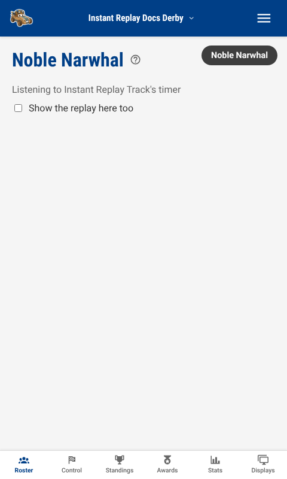
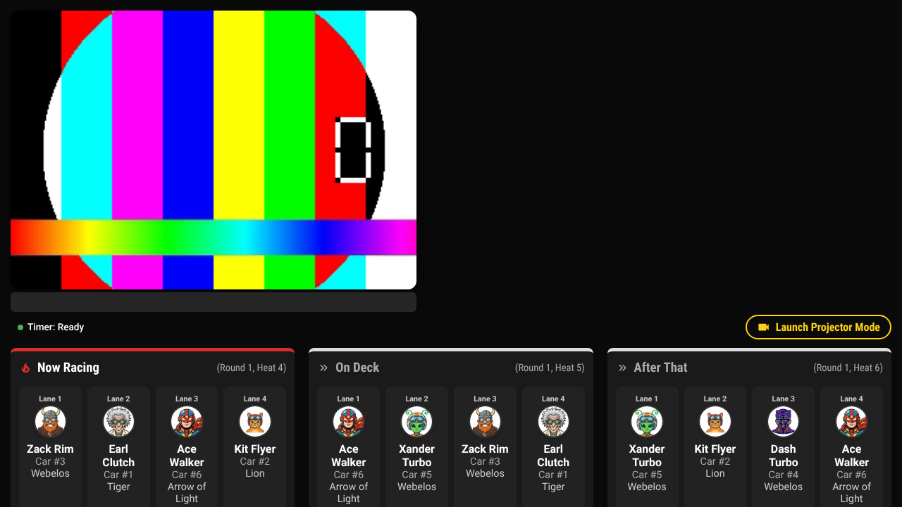
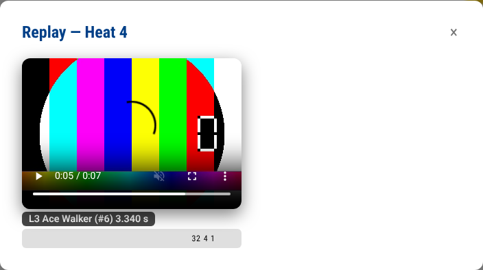
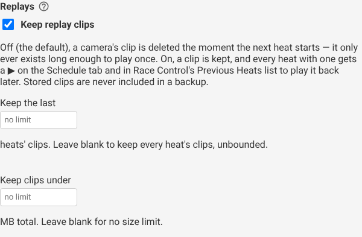
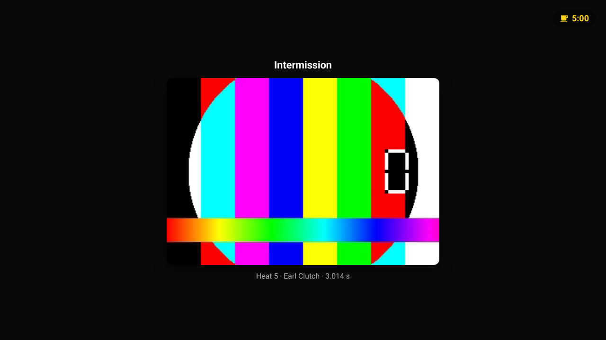

# Instant Replay Guide

Turn a phone, tablet or laptop into a finish-line camera. When a heat
finishes, everyone watching an audience display sees a slow-motion clip of
it a few seconds later, cut to the timer's own start and finish so it always
shows the actual race.

> [!NOTE]
> **Prerequisite:** A track needs a timer set up (or at least a race running
> on it) before there is anything for a camera to time itself against. See
> the [Hardware Timer Guide](hardware-timer.md) or the
> [Fake Timer Guide](fake-timer.md).

---

## What You Need

- A device with a camera — a phone propped on a tripod or a stack of books
  works fine, and so does a laptop's built-in webcam.
- A recent browser: **Chrome, Edge, or Safari 16.4 or later.** Firefox does
  not have the video pipeline this feature is built on and is not
  supported. See [Browser requirements](#browser-requirements) below.
- Trusty Track reached over **HTTPS**, or on the same machine that is
  running it (`localhost`). See [A note on HTTPS](#a-note-on-https).
- Nothing to install — the camera page is a normal web page, like the
  audience display.

---

## The Happy Path

1. On the device that will hold the camera, open **Displays** in the race
   navigation row, find the address shown there — the same one a wall
   display uses — and add `/camera` to the end of it, or scan the QR code
   and edit the path. (A direct link from the Displays panel is on the
   roadmap; for now, typing the address is the way in — see
   [`reference/displays.md`](reference/displays.md) for how a screen
   normally finds its own address.)
2. The browser asks for camera permission. Allow it, and a live preview
   appears.
3. Pick which **track** this camera is listening to from the dropdown at
   the top — the same track the heats you want replayed are running on.
4. Aim the camera at the finish line (see [Aiming the camera](#aiming-the-camera)
   below) and prop it up. There is nothing else to do — leave the page open.

_The camera page: the track it is listening to and a status line saying
what it is doing. A real camera also shows a live preview above the track
picker — this picture comes from the automated test harness, which has no
camera to preview._

5. Race a heat as normal. A few seconds after the result lands, the camera's
   status line says **uploaded** — the clip has already been cut and sent.
6. Any screen with **Replays** turned on (every screen, by default) plays
   the clip once its own results overlay has shown, twice at half speed,
   and then goes back to what it was showing before.

_The replay on an audience display — muted, full-screen, gone again after
two showings._

Nothing needs to be told which heat just ran, or when: the camera watches
the timer and the results on its own, and the clip finds its way to every
screen watching this race.

---

## The Camera Page

The status line under the preview says everything the camera is currently
doing:

> Listening to Main Track's timer · buffer 10s · last clip 2s ago

- **Listening to *(track)*'s timer** — which track's results this camera is
  watching, chosen from the dropdown above.
- **buffer *N*s** — how much recent video it is currently holding, in
  case a result lands. This climbs to about ten seconds and stays there.
- **last clip *time* ago** — when this camera's most recent clip was
  uploaded, so you can tell at a glance that it is still working.
- **uploading… / uploaded / upload failed** — appears briefly around each
  heat. A failed upload is retried automatically on the next result; nothing
  needs re-doing by hand.

If more than one camera is plugged into the same device (a laptop with a
built-in webcam and a USB one attached, say), a second dropdown lets you
choose which one to use.

**Show the replay here too** is a checkbox on the camera page itself — tick
it and the camera's own screen also plays back the clip it just captured,
useful for checking the framing without needing a second device nearby.

---

## Aiming the Camera

Point the camera across the finish line, close enough that the cars filling
the frame are still readable at the resolution the device captures. A
straight-on view across all the lanes, a few feet back, works better than a
close-up on one lane — the replay is cut to cover every lane's own finish,
not just the winner's.

There is nothing to calibrate: the clip's timing comes from the track's own
timer, not from anything the camera detects in the picture. A camera aimed
slightly off, or catching a little too much or too little of the track, is
a framing problem to fix by moving it — it does not affect *when* the clip
starts or stops.

---

## Which Cameras Are Registered

Every camera that has opened its page shows up on the **Displays** panel,
alongside the audience screens — with a track picker in place of the view
dropdown an ordinary screen gets, and a note saying when its last clip
landed.

_A camera row on the Displays panel — pick its track here just as well as on
the camera page itself, and see at a glance that it is still uploading._

Race Control also shows a small badge for each registered camera, above the
lock banner, so the operator can tell a camera is still connected without
leaving the heat they are running.

_"Finish line — connected, last clip 2s ago" — one badge per camera, on the
operator's own screen._

### Several Cameras

With more than one camera pointed at the same track, each row on the
Displays panel gets a small **↑ / ↓** beside its track picker — pick which
camera's clip plays first when a heat has more than one. Both the replay a
display shows after a result and the camera picker in the ▶ modal (see
[Keeping Clips Longer](#keeping-clips-longer) below) follow this order.
Two cameras nobody has ever reordered still play in a fixed, stable order of
their own (there is always *some* order, never an arbitrary one) — the
arrows only matter once there is a reason to prefer one camera's angle over
another's.

---

## Turning Replays Off, Per Screen

Every ordinary display has its own **Replays** checkbox on the Displays
panel, on by default. Turn it off for a screen that should never show the
replay — a check-in kiosk at the door, say, or a screen dedicated to the
awards ceremony. It has no effect on a camera row, which has nothing of its
own to play back, and it has no effect on [highlights during a
break](#highlights-during-a-break) either — that is the operator's own
explicit choice for the break, not the ordinary after-heat replay this
checkbox controls.

There is no setting for *how many* times a clip plays or at what speed yet
— every screen shows it twice, at half speed. That is a per-device setting
stored in the browser rather than something the operator can change from
across the room, and a future stage may add operator control over it.

---

## Finish Frames and Slow Motion

Every replay — the one that plays automatically after a result, and one
opened on purpose from the ▶ (below) — shows a thin strip under the video
with a small lane marker for each car's finish. Click one (on a clip opened
on purpose; the automatic overlay's own strip is for looking at, not
clicking) and the video jumps to that instant and freezes, with the lane's
time overlaid — click again, or press the space bar, to keep playing from
there. While frozen, the **,** and **.** keys step one video frame at a
time, for lining a car up against the line exactly. Two cars that finish
close enough together stack their markers onto a second row of the strip
rather than overlapping, so every lane stays its own, separately clickable
marker.

_Clicking Lane 3's marker froze the clip there and printed its time — the
same strip appears under every replay, clickable only on a clip somebody
opened to look at._

The last second before the first car crosses the line, through a moment
after the last one does, plays at the display's own slow-motion rate
automatically — the rest of the clip, including the lead-in, plays at
normal speed. That is the "slow it down" the automatic replay already
promised, aimed at the part of the clip actually worth slowing down rather
than the whole thing.

**These markers are placed from the timer's own times, not read off the
picture** — the camera's clock is corrected against the timer's to within
about half a network round trip, and a video frame is roughly 1/30th of a
second, so expect a marker within a frame or two of where a car actually
crosses, not to the pixel. A car whose finish falls outside what a
particular camera's clip actually captured (a second camera with a shorter
buffer, say) simply gets no marker on that camera's own clip rather than
one in the wrong place.

---

## Keeping Clips Longer

By default a clip only exists long enough to play once, right after its
heat: the moment the next heat starts, the old clip is gone. That is fine
for watching the room, but it means nobody can go back and replay heat 12
after the fact.

**System Settings → Displays → Replays** has a **Keep replay clips**
checkbox that changes this. Turned on, a clip is kept — and every heat with
one gets a small **▶** you can click on the **Schedule** tab or in Race
Control's **Previous Heats** list to play it back, any time during the
event.

_Keep replay clips, and the two ways to bound how many stick around._

Two optional limits go with it, and either, both, or neither can be set:

- **Keep the last _N_ heats' clips** — once more than N heats have a clip,
  the oldest one's clip (and any camera's clip for it) is deleted to make
  room. Leave blank for no limit on heat count.
- **Keep clips under _N_ MB total** — once the stored clips for a race pass
  this size, the oldest ones are deleted until the total is back under it.
  Leave blank for no size limit.

Leaving both blank keeps every clip for the whole event, unbounded — a real
choice for a short event on a machine with plenty of storage, and one worth
thinking about on a Raspberry Pi's SD card for a long one. A re-run heat
keeps *both* its clips (the corrected run and the one it replaced) for as
long as that heat itself is inside whichever bound is set — a re-run is
history worth keeping, not a heat that should cost two slots. Deleting a
heat or a round takes its stored clips with it, the same as the two
retention limits above — nothing is left behind for a schedule change to
serve back later.

**Turning this on is not available on the public demo** — it means writing
a file to disk on every upload, the same reason the demo has no cameras at
all (see [Troubleshooting](#troubleshooting) above).

### Replaying an Earlier Heat

Once the setting is on and a heat has at least one clip, a **▶** appears
next to it on the **Schedule** tab:

_Click it to open that heat's clip — or, with more than one camera,
choose which one first._

Clicking it opens the same player a display uses, in a small window: muted,
with a camera picker if more than one camera has a clip for that heat.
Race Control's **Previous Heats** list offers the identical button for a
heat that has just finished, without switching tabs.

### A Note on Privacy

A stored clip is served the same way a racer's photograph already is: a
web address with a long, unguessable name and no other gate on it, on any
screen in the room including one nobody has typed an operator PIN into
(see [Roles and Permissions](reference/roles-and-permissions.md)). That is
deliberate and unchanged from the moment-of-broadcast case above — a video
of the finish line is a video of children too, the same reasoning behind
shortening a racer's name on public screens (see
[Race and track settings](reference/race-settings.md#names-on-public-screens)).
Keeping a clip longer does not make it any more exposed than it already was
in the seconds after it played; it just means the address stays live
longer. Stored clips are never included in a backup — see
[Backups](reference/backups.md#what-a-backup-does-not-contain) — so
restoring one starts with no stored clips at all, whatever was kept
before.

---

## Highlights During a Break

Once [stored clips](#keeping-clips-longer) are turned on and the race has at
least one, [taking a break](race-day.md#taking-a-break) offers a second
option beside the duration and the label: **Show replay highlights**. Turn
it on and every screen showing this race — not only the ones with their own
**Replays** setting turned on — spends the break looping the current
round's clips instead of the usual quiet preview of who races next.

_"Show replay highlights" is ticked by default whenever there is something
for it to play; the note underneath the checkbox says where to turn stored
clips on when there isn't._

The clips play fastest time first, muted, at normal speed, one after
another until the break ends — the same round-progress countdown stays in
the corner the whole time, so the room still knows when racing picks back
up. Each clip is captioned with the heat number, the winning car, and its
time. A round with more than ten heats plays only the ten most recent
rather than the whole afternoon.

If nothing has been stored for the current round yet — a break called
before its first heat's clip has landed — the checkbox is still there, but
the screen falls back to the ordinary next-up preview until a clip exists.

Race Control names what is playing on the break's own card ("Highlights: 8
clips from Round 2"), so the operator can tell at a glance whether the
reel is worth the wait.

---

## No Electronic Timer

A track running with **No Timer** (results typed in by hand) has no
"the gate just opened" moment for a clip to anchor to. On a track like that,
the camera instead cuts a fixed clip: about four seconds before the result
is recorded, through a short follow-through after — the same shape DerbyNet
uses for the same case. The camera's own status line says so:
"no electronic timer — cutting a fixed clip around each result."

Aim for consistency rather than precision here — since the cut is not tied
to an actual gate-open event, the same margin applies to every heat
regardless of how long that particular heat actually took to run.

---

## Browser Requirements

| Browser | Supported |
| --- | --- |
| Chrome, Edge (desktop or Android) | Yes |
| Safari 16.4 or later (macOS, iOS) | Yes |
| Firefox | No |

The camera page checks this itself and says so plainly rather than failing
partway through a heat — open it in an unsupported browser and it explains
what to use instead before ever asking for camera permission.

---

## A Note on HTTPS

A browser only allows a page to use the camera over a secure connection —
HTTPS, or a page served from the same machine (`localhost`). Trusty Track
serves HTTPS by default (see
[HTTPS, certificates, and plain HTTP](reference/roles-and-permissions.md#https-certificates-and-plain-http)),
so this is normally nothing to think about. If HTTPS has been turned off
(`TRUSTYTRACK_HTTP_ONLY`), the camera page says so directly and names the
fix — either open the site on the computer actually running the server, or
turn HTTPS back on.

---

## Troubleshooting

**The camera page won't ask for permission / the preview stays black.**
Check the browser is one of the supported ones above, and that the address
is reached over HTTPS (or is `localhost`) — both gates say so on the page
itself rather than failing silently.

**A heat finished and nothing uploaded.** Confirm the camera's status line
names the right track — a camera listening to the wrong track never sees
that track's results. If the status line says **upload failed**, it
retries automatically on the very next result; check the device still has
a network connection to the machine running Trusty Track.

**The clip never plays on a display.** Check that display's own **Replays**
checkbox on the Displays panel is turned on. A display reconnecting (a
reload, a dropped wifi connection) deliberately does not replay whatever
heat was current when it reconnects — only a heat finished *after* it is
back online.

**The public demo has no cameras.** Uploading a clip writes a file to disk
with no credential attached, the same reason the demo refuses photo
uploads — see [The Public Demo](demo.md).

---

## What's Next?

- [Observation & Audience Displays Guide](observation-displays.md) — every
  other thing an audience screen can show
- [Hardware Timer Guide](hardware-timer.md) — setting up the timer a
  replay's timing comes from
