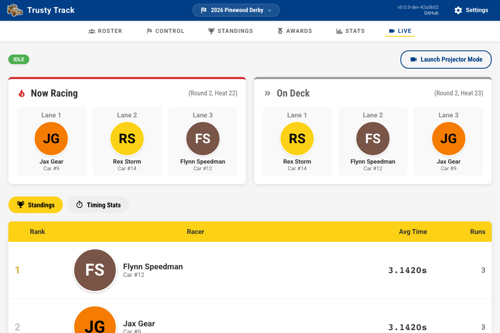
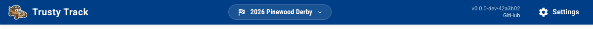
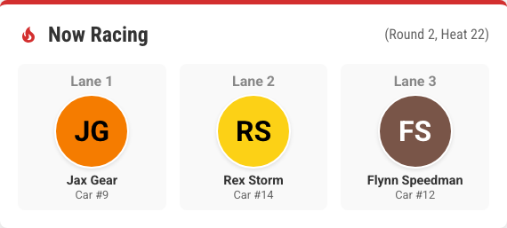
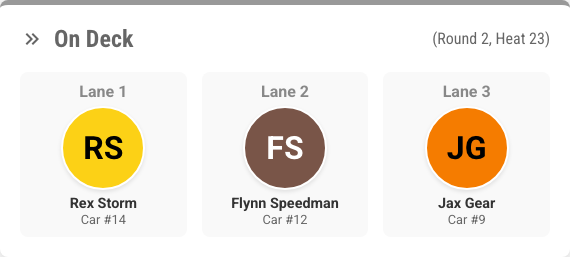
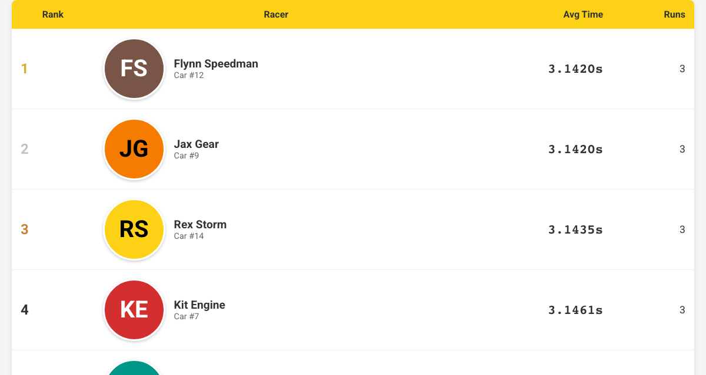
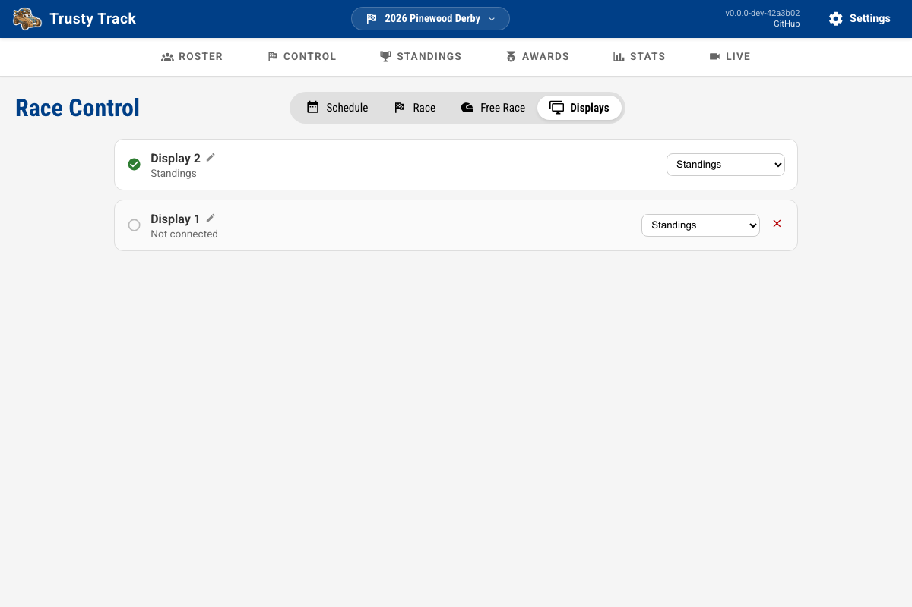
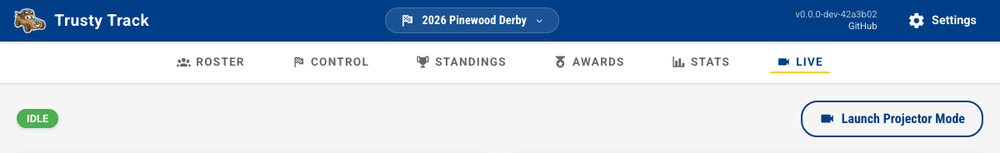
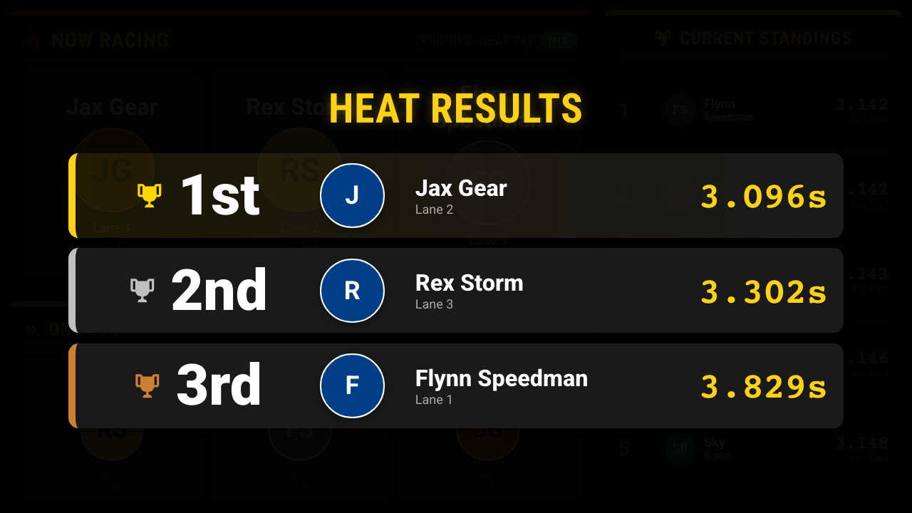

# Observation & Audience Displays Guide

This guide explains how to set up and use Trusty Track's audience display pages so spectators can follow the race in real time.

> [!NOTE]
> **Prerequisite:** A race should be in progress or about to begin. The Observation page works best once heats are being run.

---

## What Is the Observation View?

Trusty Track includes a dedicated audience display — a page designed to be shown on a projector, large monitor, TV, or tablet. It updates automatically as the race progresses, showing:

- **Which cars are currently on the track** ("Now Racing")
- **Which cars race next** ("On Deck")
- **Live standings** for all racers

No one needs to manually refresh the page — it stays current throughout the event.

_The Observation page in standard view, showing the "Now Racing" and "On Deck" panels above the live leaderboard._

---

## Opening the Observation View

Any device on the same network as the Trusty Track server can open the Observation page. You do not need to use the same device running race control.

1. Open a browser on the display device (laptop, tablet, TV with a browser, etc.).
2. Navigate to the race's Observation page. You can find the link in the top navigation bar when viewing any race page — look for the **Live** tab.
3. The page connects automatically and begins showing live data.

_Open the Observation page from any device on your network using the link in the race navigation bar._

---

## What the Observation Page Shows

### Now Racing

The "Now Racing" panel shows which cars are on the track right now. For each racer it displays:

- Racer name
- Car number
- Lane number
- Racer photo (if a photo was uploaded during check-in)

_The "Now Racing" panel, showing one card per lane with each racer's name, car number, and lane. If racer photos have been added, they appear here._

---

### On Deck

The "On Deck" panel shows which racers will compete in the **next heat**, so they can get their cars ready and line up at the starting gate.

_The "On Deck" panel shows the upcoming heat's racers so they can prepare._

---

### Live Leaderboard

The **Standings** tab shows the current leaderboard for all racers, updated after each completed heat. It is deliberately narrow for reading at a distance — rank, racer, average time, and runs. The fuller table, with car number and den, is on the Standings page — the **Standings** tab in the race navigation bar.

Switch to the **Timing Stats** tab to see the results of the most recently recorded heat: every car that ran it, in finishing order, with its place and its time.

> [!NOTE]
> A [free race](free-race.md) heat shows on this display like any other — the
> audience watching a demonstration run sees the cars and the times. The
> leaderboard beside it does not move.

_The live leaderboard showing current standings with average times and placement for each racer. The display updates automatically after every heat._

---

## Changing what a screen shows, from where you are

With four screens taped around a gym, changing one used to mean finding it and
driving its browser — the operator leaving the timer mid-event. They can be
told instead.

**Race Control → Displays.** Every screen that has the Live page open appears
in the list on its own; there is nothing to add, and nothing to set up before
an event. Pick what each one shows from the dropdown beside it and the screen
changes within a second or two.

Two things worth knowing:

- **Name them.** A list of "Display 1, Display 2, Display 3" is no help when
  you are trying to change the one at the back. Click the pencil and call it
  what you call it — "gym north", "by the doors". The name sticks to that
  screen, including through a reload.
- **A screen that has gone quiet stays in the list**, marked *Not connected*.
  That is deliberate: it is how you find out the projector at the back has
  dropped off the wifi. Trusty Track cannot tell a screen that was switched
  off from one whose network died, so it leaves the row for you to clear with
  the ✕.

> [!NOTE]
> Assigning the **Awards ceremony** to a screen puts the ceremony on it, and
> that one waits for you — it does not advance on its own. See the
> [Awards guide](awards.md#announcing-them).

### If you never open that list

Nothing changes. A screen that has not been assigned anything follows its own
URL exactly as before, so `?view=timing` and `?projector=true` still work and
still do what they always did. Assigning a screen overrides its URL; there is
no way to get into a state where a screen cannot be reached from the operator's
laptop, which is the point.

---

## Projector Mode

For large events with a big screen or projector, use **Projector Mode** — a full-screen, high-contrast layout designed for maximum visibility from a distance.

### Launching Projector Mode

Click the **Launch Projector Mode** button in the top-right corner of the Observation page. A new browser tab opens with the projector layout, which fills whatever space the browser gives it.

> [!TIP]
> Press **F11** (or use your browser's full-screen option) on the projector display device to remove the browser chrome and make the display completely immersive.

_Click "Launch Projector Mode" to open the audience display in a new tab._

### Projector Mode Layout

Projector Mode fills the entire screen with a dark background and large, high-visibility text:

- **Left side (65% of screen)**: "Now Racing" section (large racer cards with big names and avatars) above the "On Deck" section
- **Right side (35% of screen)**: Top 5 standings with large rank numbers, racer avatars, and finish times

_Projector Mode, caught with the heat-results overlay up over the standing layout. Large text and high contrast make it easy to read from across a room._

### Heat Results Overlay

After each heat finishes, a brief **results overlay** appears over the full screen for about 5 seconds, showing each racer's name, photo, placement, and finish time. It then fades away automatically, returning to the standing leaderboard view.

---

## Recommended Display Setups

### Large Projector or TV

1. Connect a laptop or small computer (such as a Raspberry Pi) to your projector or TV via HDMI.
2. Open a browser on that device and navigate to the Observation page.
3. Click **Launch Projector Mode** to open the full-screen display.
4. Press **F11** (or use your browser's full-screen mode) to hide the browser toolbar.
5. Place the display where the entire audience can see it — at the end of the track, along the side, or on a dedicated screen.

### Tablet at the Track

The standard Observation page (not Projector Mode) works well on a tablet placed near the starting gate. The race operator can quickly glance at "On Deck" to confirm who needs to stage their cars next.

### Multiple Displays

You can open the Observation page on as many devices as you want simultaneously — every device shows the same live data. One common setup: Projector Mode on the main screen, plus the standard view on a tablet for the operator.

---

## Tips for a Great Audience Experience

- **Add racer photos** during check-in. The "Now Racing" panel and Projector Mode show photos next to each racer's name — this makes the display much more engaging for parents and families. Even simple smartphone photos work great.
- **Position the display** at the end or side of the track, where it's visible to the whole crowd.
- **Leave it running** — the page updates automatically. No one needs to manually refresh or interact with the display during the race.
- **Use a dedicated display device** — keeping the audience display separate from the race control device prevents accidental interference and lets both run smoothly.

---

## Display Without Photos

If racer photos haven't been added, the Observation page still works — it shows placeholder avatars in place of photos. The display is fully functional either way.

_The Observation page works without photos — placeholder avatars are shown instead. Adding photos during check-in enhances the display but is not required._
