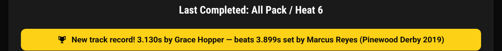
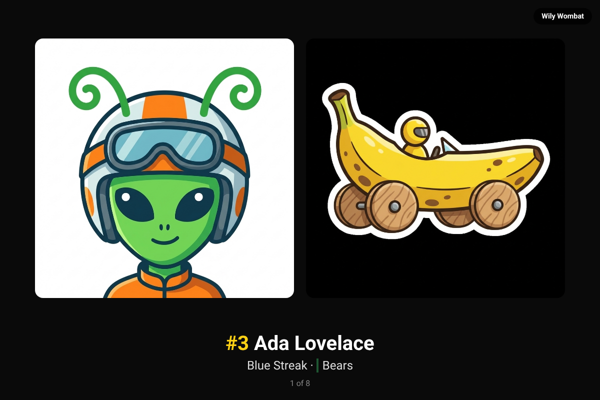
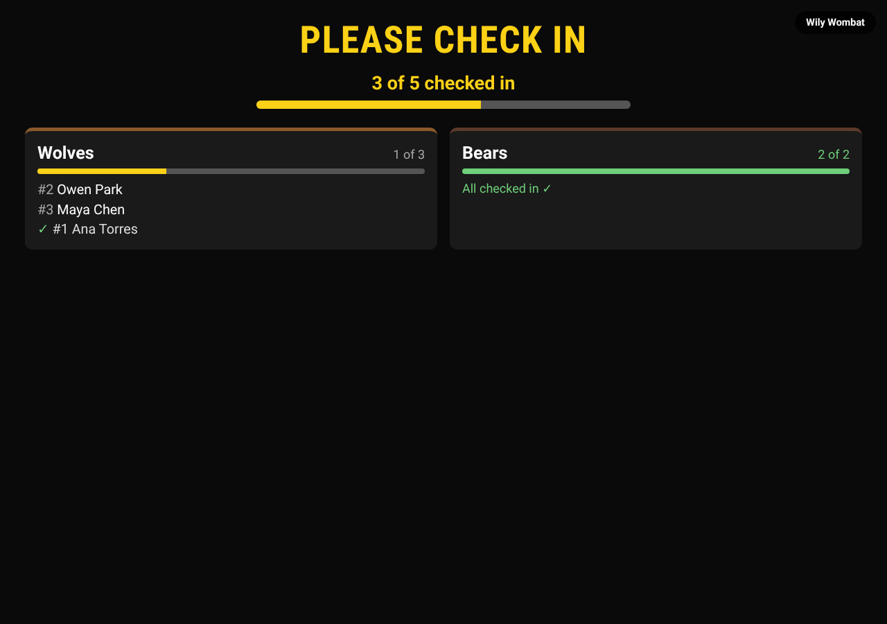
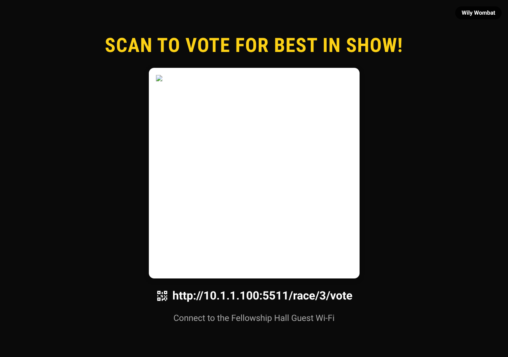

# Observation & Audience Displays Guide

This guide explains how to set up and use Trusty Track's audience display pages so spectators can follow the race in real time.

> [!NOTE]
> **Prerequisite:** A race should be in progress or about to begin. The Observation page works best once heats are being run.

---

## What Is the Observation View?

Trusty Track includes a dedicated audience display — a page designed to be shown on a projector, large monitor, TV, or tablet. It updates automatically as the race progresses, showing:

- **Which cars are currently on the track** ("Now Racing")
- **Which cars race next** ("On Deck") and the heat after that ("After That")
- **Live standings** for all racers

No one needs to manually refresh the page — it stays current throughout the event.

_The Observation page in standard view, showing the "Now Racing", "On Deck" and "After That" panels above the live leaderboard._

---

## Opening the Observation View

Any device on the same network as the machine running Trusty Track can open the Observation page. You do not need to use the same device running race control.

1. Open a browser on the display device (laptop, tablet, TV with a browser, etc.).
2. Navigate to the race's Observation page. You can find the link in the top navigation bar when viewing any race page — look for the **Live** tab.
3. The page connects automatically and begins showing live data.

_Open the Observation page from any device on your network using the link in the race navigation bar._

---

## What the Observation Page Shows

### Now Racing

The "Now Racing" panel shows which cars are on the track right now. For each racer it displays:

- Racer name
- Car number
- Lane number
- Den category (if the racer's den has one set — usually a Cub Scout rank like "Wolf")
- Racer photo (if a photo was uploaded during check-in)

_The "Now Racing" panel, showing one card per lane with each racer's name, car number, and lane. If racer photos have been added, they appear here._

---

### On Deck

The "On Deck" panel shows which racers compete in the **next heat**, and "After That" shows the one following it.

Two heats rather than one, because the child named on the screen is usually
in the bleachers. Reading the "After That" names aloud gives each family a
heat's notice, so the cars are at the track when they are wanted.

_Mid-round: the heat on the track, the one on deck, and the one after that. Each panel names the round and heat number it is for._

---

### Live Leaderboard

The **Standings** tab shows the current leaderboard for all racers, updated after each completed heat. It is deliberately narrow for reading at a distance — rank, racer, average time or points (whichever the race scores by), and runs. A racer's den category shows beneath their name when their den has one. The fuller table, with car number and den, is on the Standings page — the **Standings** tab in the race navigation bar.

Switch to the **Timing Stats** tab to see the results of the most recently recorded heat: every car that ran it, in finishing order, with its place and its time — plus a rough real-world scale speed beside it, on a track that has [scale speed](reference/race-settings.md#scale-speed) turned on.

### When the track record falls

If a heat beats the track record, both audience views say so on their own —
a banner over the projector's results overlay, and one above the Timing
Stats results — naming the new time, who set it, and the record it beat.
Gold is Field Uniform's own accent colour; a different
[Display theme](reference/themes.md) gives it a different one.

_The banner names the new time and the record it beat — including records
[entered from past years](race-stats.md#records-from-before-trusty-track)._

It only fires for a record that stood **before today's race** — earlier races
on the track, or a record entered by hand — so a pack's first event does not
"break the record" on every fast heat. The rules are in
[Stats and exports](reference/stats-and-exports.md#the-track-record).

> [!NOTE]
> A [free race](free-race.md) heat shows on this display like any other — the
> audience watching a demonstration run sees the cars and the times. The
> leaderboard beside it does not move.

_The live leaderboard showing current standings with average times and placement for each racer. The display updates automatically after every heat._

---

### Racer photos

Check-in collects a photo of each scout and of their car, and until now they
appeared on screen only while that racer was in the heat — a few seconds each,
once per round. Most of an event is the gaps between heats.

The **Racer photos** view fills a screen with them, one racer at a time: the
headshot, the car, the name, car number and den.

It goes in car number order, so every family knows their child is coming
round once per cycle. Racers with no photo are skipped rather than shown
blank. More in
[Audience display views](reference/displays.md#the-ten-views).

> [!TIP]
> This is the view to leave up during check-in and between rounds. Set the
> interval on the same row in **Race Control → Displays** — about five seconds
> per racer suits a small pack, longer for a big one.

---

### Check-in progress

The question a coordinator ends up shouting across the gym — "are there any
more Wolves who haven't checked in?" — answered on a screen instead. One card
per den, a progress bar and a count, and the cars still to come listed by
number and name underneath. It updates the moment the check-in desk flips a
racer's status, on every screen assigned to it.

_The Bears are all through; the Wolves still have two cars to come, listed by number and name._

A large pack can switch a screen's row in **Race Control → Displays** to
**Pending only**, which drops the already-checked-in rows and keeps a den's
card down to just the cars still needed at the scale. More in
[Check-in progress](reference/displays.md#check-in-progress).

> [!TIP]
> This is the natural screen for the entrance or the table by the door — put
> it up before check-in opens and it keeps working, quieter, once racing
> starts too: a car that arrives after the first heat can still join the
> schedule (see [Mid-race changes](reference/mid-race-changes.md)).

---

### QR code

Instead of shouting an IP address across the gym or walking a laptop around,
put up a screen with a large, scannable code on it. By default it opens this
race's own Live page on whichever phone scans it; switch its row in **Race
Control → Displays** to **Voting ballot** and it opens the
[voting page](awards.md#letting-people-vote) instead.

_A large code, the address printed underneath, and an optional headline and Wi-Fi line set on the race's edit form._

Set an optional headline (*"Scan for Live Results"*, *"Scan to Vote for Best
in Show!"*) and a line of Wi-Fi guidance on the race's own edit form — both
are blank by default, and the screen falls back to a sensible headline of
its own with nothing under it. More in
[QR code](reference/displays.md#qr-code).

> [!TIP]
> This is a good screen for the entrance during check-in, or for an
> auxiliary TV during an intermission — anywhere the audience has a moment
> to reach for their phones. The Awards page's **Project QR code** button
> opens one already pointed at the ballot, with nothing to configure first.

---

### Broadcast overlay

If you stream the event for family who cannot be there, this view is built
for it. Unlike every other screen on this page it has no background of its
own — nothing to screenshot, since it disappears everywhere it is not
actively drawing something — so your camera feed shows through it in
whatever streaming program you composite it with. It draws a bar naming the
current heat and its line-up, an optional top-5 standings ticker, and a
banner that reveals each heat's result and lingers for ten seconds.

Setting it up in OBS Studio is step-by-step in
[Streaming your event with OBS Studio](access-and-network.md#streaming-your-event-with-obs-studio);
what it shows in full is in
[Broadcast overlay](reference/displays.md#broadcast-overlay).

---

## Changing what a screen shows, from where you are

With four screens taped around a gym, changing one used to mean finding it and
driving its browser — the operator leaving the timer mid-event. They can be
told instead.

**Race Control → Displays.** Every screen showing this race appears in the
list on its own — the Live page, or the awards ceremony — and there is
nothing to add, or to set up before an event. Pick what each one shows from the dropdown beside it and the screen
changes within a second or two.

Two things worth knowing:

- **Every screen already has a name** — an adjective and an animal, like the
  second row above — so the list is usable before you have renamed anything,
  and the same screen keeps the same name across a reload. Rename it if
  you'd rather, the way the top row already has been — click the pencil and
  call it what you call it, "gym north", "by the doors" — or click the **🎲**
  next to the field for another animal, if the room happens to have a real
  Badger in it.
- **Not sure which row is which screen?** Click **Identify** on a row and
  that screen's name flashes across it for a few seconds — look up, and
  whichever screen just lit up is that row. A screen also names itself
  briefly, in a small corner badge, the moment you first open it.
- **A screen that has gone quiet stays in the list**, marked *Not connected*
  — that is how you find out the projector at the back has dropped off the
  wifi. Clear the row with the ✕.

The ten views a screen can show, and how assignment behaves, are in
[Audience display views](reference/displays.md).

> [!TIP]
> **Two monitors on the same computer** used to report as a single screen —
> assigning one moved both. The **Open a new display window** button above
> the list opens a second window that is its own screen from the start, with
> nothing to type. See [Two screens, one computer](reference/displays.md#two-screens-one-computer).

> [!NOTE]
> **Awards ceremony** is in the dropdown once the race has awards — set them
> up on the [Awards page](awards.md) first. It puts the ceremony on that
> screen, and that one waits for you — it does not advance on its own. The row grows
> **‹** and **›** buttons so you can move it on from here, and the arrow keys
> or a presenter remote at the screen keep working alongside them. When the
> ceremony is over, pick any other view from the same dropdown and the screen
> comes back. See the [Awards guide](awards.md#announcing-them).

### If you never open that list

Nothing changes. A screen that has not been assigned anything follows its own
URL exactly as before, so `?view=timing` and `?projector=true` still work and
still do what they always did. Assigning a screen overrides its URL; there is
no way to get into a state where a screen cannot be reached from the operator's
laptop, which is the point.

---

## Projector Mode

For large events with a big screen or projector, use **Projector Mode** — a full-screen, high-contrast layout designed for maximum visibility from a distance.

### Launching Projector Mode

Click the **Launch Projector Mode** button in the top-right corner of the Observation page. A new browser tab opens with the projector layout, which fills whatever space the browser gives it.

Each tab is named after the page it shows and the race it belongs to —
"Live — 2026 Pinewood Derby" — so a row of them is still readable once you
have several open.

> [!TIP]
> Press **F11** (or use your browser's full-screen option) on the projector display device to remove the browser chrome and make the display completely immersive.

_Click "Launch Projector Mode" to open the audience display in a new tab._

### Projector Mode Layout

Projector Mode fills the entire screen with a dark background and large, high-visibility text:

- **Left side (65% of screen)**: "Now Racing" section (large racer cards with big names and avatars) above the upcoming heats
- **Right side (35% of screen)**: Top 5 standings with large rank numbers, racer avatars, and each racer's average time or points

_Projector Mode, caught with the heat-results overlay up — here celebrating a broken track record, with each time's scale speed alongside it. Large text and high contrast make it easy to read from across a room._

### Heat Results Overlay

After each heat finishes, a brief **results overlay** appears over the full screen for about 5 seconds, showing each racer's name, photo, placement, and finish time — with a scale speed alongside it wherever the track has [that](reference/race-settings.md#scale-speed) turned on. It then fades away automatically, returning to the standing leaderboard view.

If the heat [broke the track record](#when-the-track-record-falls), a gold
banner tops the overlay with the new time and the record it beat.

---

## Recommended Display Setups

### Large Projector or TV

1. Connect a laptop or small computer (such as a Raspberry Pi) to your projector or TV via HDMI.
2. Open a browser on that device and navigate to the Observation page.
3. Click **Launch Projector Mode** to open the full-screen display.
4. Press **F11** (or use your browser's full-screen mode) to hide the browser toolbar.
5. Place the display where the entire audience can see it — at the end of the track, along the side, or on a dedicated screen.

### Tablet at the Track

The standard Observation page (not Projector Mode) works well on a tablet placed near the starting gate. The race operator can glance at "On Deck" and "After That" to confirm who needs to stage their cars next.

### Multiple Displays

You can open the Observation page on as many devices as you want simultaneously — every device shows the same live data. One common setup: Projector Mode on the main screen, plus the standard view on a tablet for the operator.

This includes two monitors plugged into one computer — see [Two screens, one
computer](reference/displays.md#two-screens-one-computer) for the button that
makes the second one its own display rather than a mirror of the first.

---

## Tips for a Great Audience Experience

- **Add racer photos** during check-in. The "Now Racing" panel and Projector Mode show photos next to each racer's name — this makes the display much more engaging for parents and families. Even simple smartphone photos work great.
- **Position the display** at the end or side of the track, where it's visible to the whole crowd.
- **Leave it running** — the page updates automatically. No one needs to manually refresh or interact with the display during the race.
- **Use a dedicated display device** — keeping the audience display separate from the race control device prevents accidental interference and lets both run smoothly.

---

## Display Without Photos

If racer photos haven't been added, the Observation page still works — each racer
gets a coloured circle with their initials instead. Adding photos during check-in
makes the display nicer, but nothing here needs them.

(Every screenshot on this page has photographs in it, so none of them shows the
fallback. There is nothing to see: the same layout, with a circle of initials
where a face would be.)
