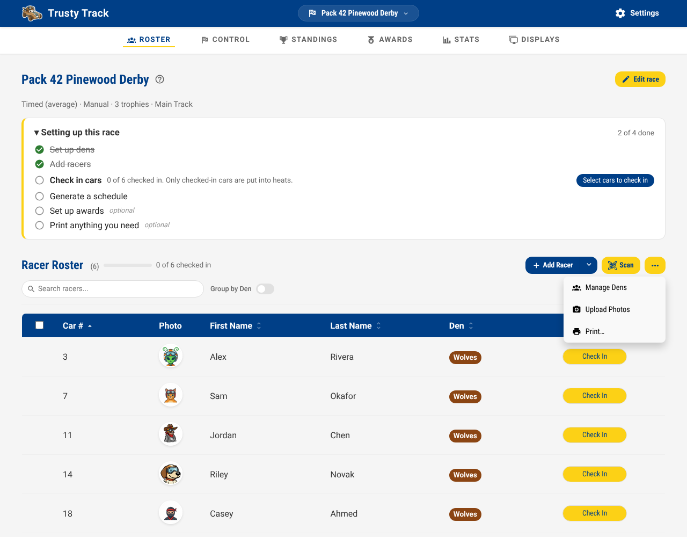
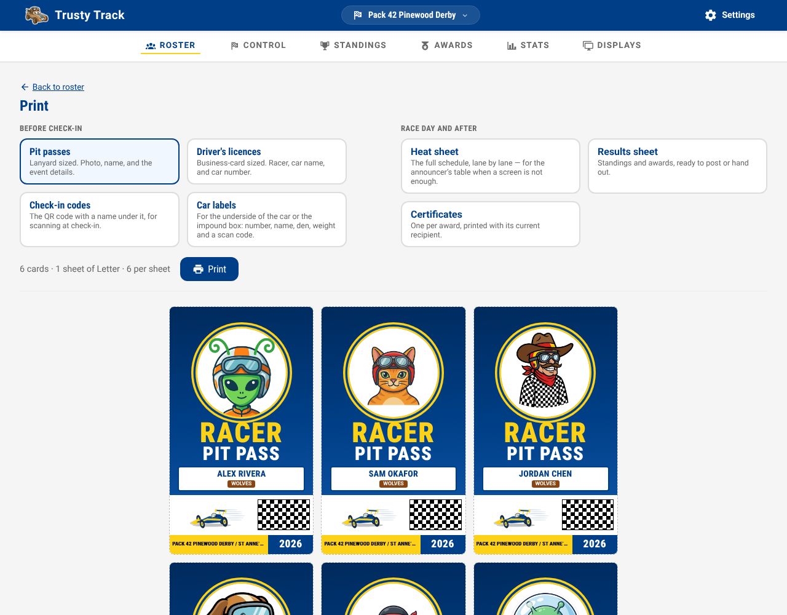
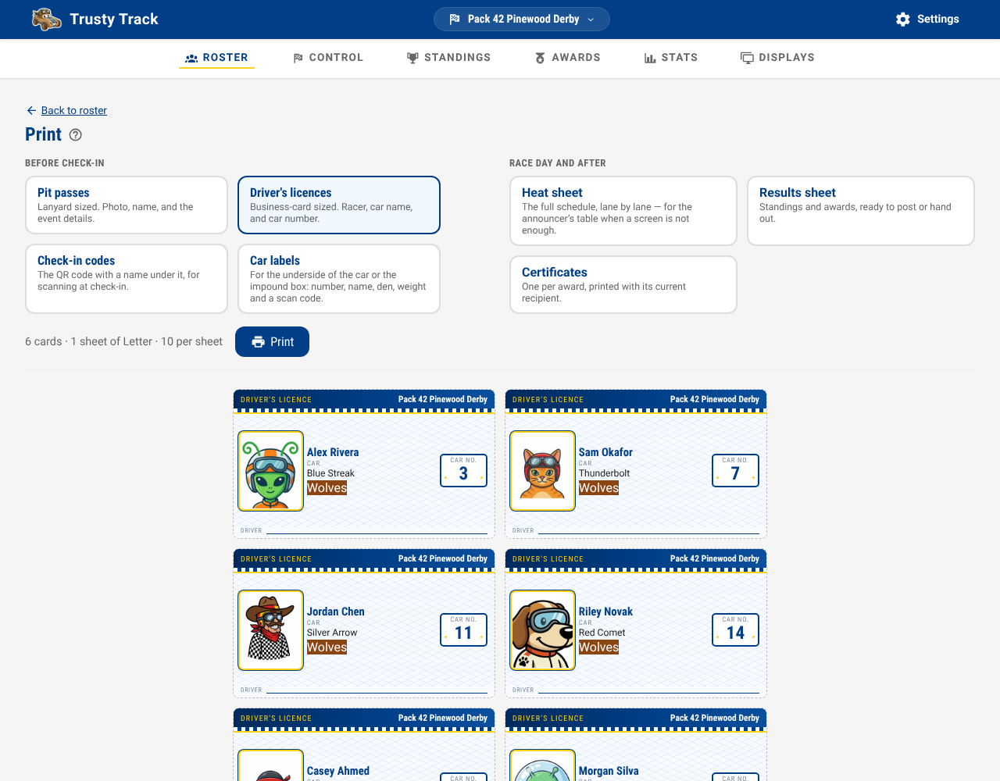
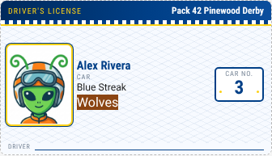
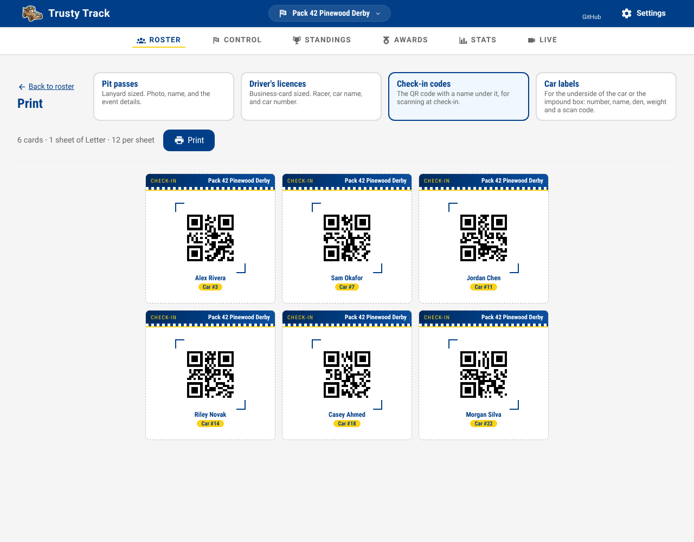
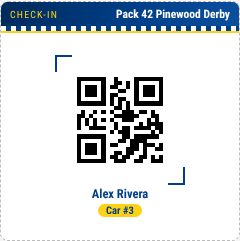
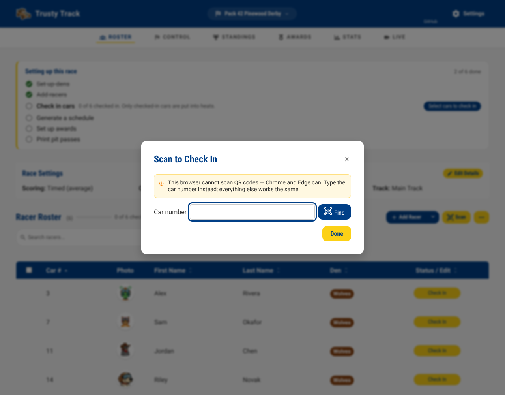
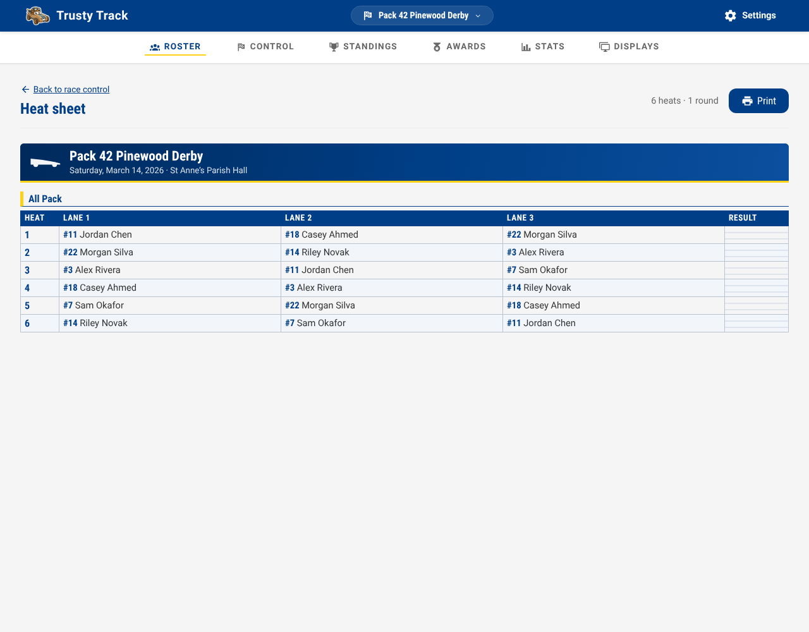
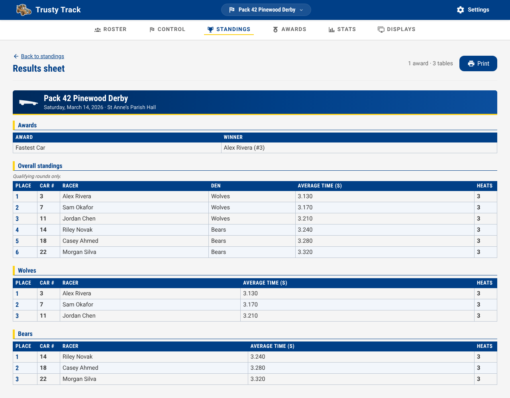

# Printables

Trusty Track prints three things: **pit passes**, **driver's licences**, and
**check-in codes**. All three come off a normal printer on plain paper or card
— there is nothing to install and no PDF to download.

Print before check-in opens. The whole roster is one job, and the sheets are
laid out to be printed and then cut up.

## Getting there

Open a race, click **⋯** at the top right of the roster, and choose **Print**.

Tick some racers first and the button prints just those — useful when a den
turns up late, or a scout registers on the morning. With nothing ticked it
prints the whole roster.

## Choosing what to print

The three buttons across the top switch between documents. The line underneath
tells you how much paper the job is before you commit any:

> 6 cards · 1 sheet of Letter · 10 per sheet

Cards come out in car-number order, so the stack matches how the roster reads.
**Racers with no car number sort to the end** — they are the ones still needing
a number, and that is easier to notice at the bottom of the stack than in the
middle of it.

### Pit passes

Lanyard sized, six to a sheet. The photo, the name, the den, the car, and the
event details — what a scout needs to know where to be.

A racer with no photo yet gets their initials instead. Passes usually get
printed *before* check-in, which is exactly when the photos are missing.

{ width=260 }

### Driver's licences

Business-card sized, ten to a sheet — the same size as stationery-shop business
card stock, if you want to print them on card rather than cut them out.

The car number is the biggest thing on it, because that is what gets called out
at the track.

{ width=260 }

### Check-in codes

A QR code per racer, twelve to a sheet, with the name and car number
underneath.

{ width=260 }

Cut them up and hand them out, or leave the sheet whole and scan off it as
scouts arrive — the name under each code is there for both.

The code identifies **that racer at that race**. A code printed at last year's
derby will not scan into this year's, which is deliberate: the racer it points
at could well be a different scout this year, and scanning the wrong child in
at check-in is expensive.

## Scanning at check-in

Click **Scan** above the roster, hold a printed code up to the camera, and that
racer's check-in opens.

*(The green pattern above is a test camera — yours shows the real one.)*

There is a **Car number** box under the viewfinder, and it works everywhere.
Use it when a code is creased, the camera will not focus, or there is a queue.

!!! note "Scanning needs Chrome or Edge"

    QR decoding uses a browser feature only Chromium-based browsers have. In
    Safari and Firefox the scanner opens without a viewfinder and the car
    number box is the way in — everything else about check-in is the same.

If the scanner refuses a code, it says why — a code that is not Trusty
Track's, one from a different race, or one for a racer no longer on the
roster. Each message is explained in
[Printed documents](reference/printing.md#check-in-codes).

## Printing

Click **Print** and your browser's own print dialogue opens. Two things worth
setting the first time:

!!! tip "Turn on background graphics"

    In the print dialogue, under **More settings**, tick **Background
    graphics** (Chrome) or **Print backgrounds** (Safari, Firefox). Without it
    the blue header bars and den colours print white.

!!! tip "Set margins to Default, not None"

    The sheets are laid out for a half-inch margin. "None" will crop the outer
    column.

The dashed lines on screen are cut guides — they do not print.

## The heat sheet

The running order on paper: a table per round, a row per heat, a column per
lane, and an empty **Result** column to write the finishing order into.

**Race Control → Schedule → Heat sheet.** It lives there rather than with the
cards above because it prints the *schedule* rather than the roster.

This is the artefact that matters when something goes wrong. The wifi drops,
the laptop runs flat, the timer stops talking — and the announcer still has to
know which cars are next. Print it once the schedule is settled and put it on
the table.

A lane with nobody coming reads **—**, and a championship place not yet
decided reads **To be decided** — somebody will write a name in. More in
[Printed documents](reference/printing.md#the-heat-sheet).

## The results sheet

The other half of the pair: the heat sheet goes on the table before the racing,
this one goes on the noticeboard afterwards. Awards and their winners at the
top, then the standings — overall, and one table per den.

**Standings → Print results.** It lives there rather than in the roster's print
menu, because that menu prints the *cards* — one per racer, before the event —
and this is one document about the whole race once it is over.

_Awards first, then the overall standings, then a table per den. The den tables
are the overall standings narrowed, so they cannot disagree with a "fastest
Wolf" trophy about who won._

The standings on it are the **qualifying rounds only**, and the sheet says
so — the championship trophies are in the awards table at the top. Each
den's table is numbered from 1, and an undecided award prints as **Not
awarded**. The rest of the rules are in
[Printed documents](reference/printing.md#the-results-sheet).
