# Race Day Operations Guide

This guide covers the full race day workflow: checking in racers, scheduling heats, running the race, and viewing final standings.

> [!NOTE]
> **Prerequisite:** Your roster should already be set up before race day. See the [Race Setup Guide](race-setup.md) if you still need to add racers or configure dens.

---

## Race Day Overview

On race day, two operators typically work side by side:

| Role | Primary Page | What They Do |
|------|-------------|--------------|
| **Check-In Operator** | Roster | Verifies cars passed inspection, records car weight, adds photos |
| **Race Control Operator** | Race Control | Schedules heats, starts heats, records results |
| **Audience / Spectators** | Observation | View live standings and currently-racing heats |

The check-in and race control functions can be handled by the same person for smaller events, or split across two devices for larger packs.

---

## Part 1: Check-In

### Opening the Check-In View

Check-in happens on the **Roster** page — the same page used to manage the roster before the event. On race day, you work through the racer list and mark each car as inspected before it races.

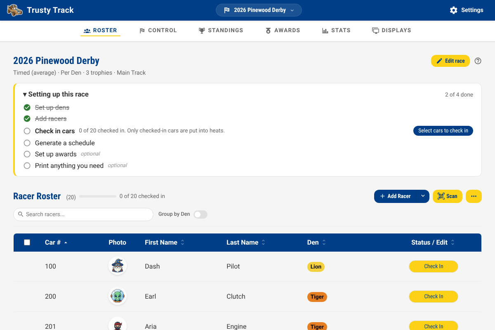
_The Roster page at the start of race day. Every racer has a gold **Check In** button in the Status column; it turns green and reads **Checked In / Edit** once they are through._

---

### Checking In a Racer

1. Find the racer in the list. Scroll, or use the search box above the roster — it matches on name, car number, and den.
2. Click the **Check In** button at the end of their row to open the check-in form.
3. Toggle **Passed Inspection / Checked In** to mark the car as cleared to race.
4. Optionally enter or update the **Car Name** if not already provided.
5. Optionally enter the **Car Weight (oz)**. If the race has a weight limit set, the box turns red and says so when the car is over it.

    This is a warning, not a refusal — you can still check the car in. The inspector at the table decides what happens next; the app is only making the rule visible at the moment it matters. Weights within a hundredth of an ounce of the limit pass, because desk scales disagree in the last decimal place and that is a fact about the equipment rather than about the car.
6. Optionally upload or capture a **Racer Photo** and/or **Car Photo** — each has an **Upload File** button and a **Camera** button.
7. Click **Save Check-in**.

_The check-in modal for a racer, with "Passed Inspection / Checked In" toggled on._

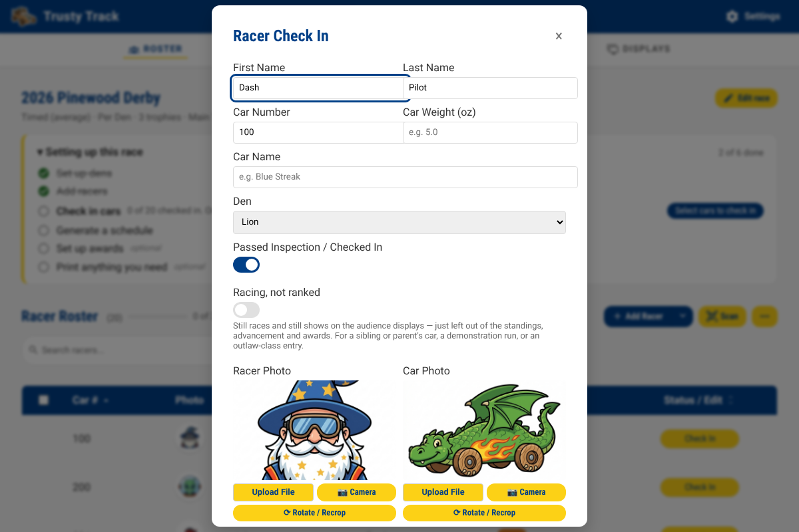
_A racer photo loaded in the check-in modal. Photos appear on the live audience display during the race._

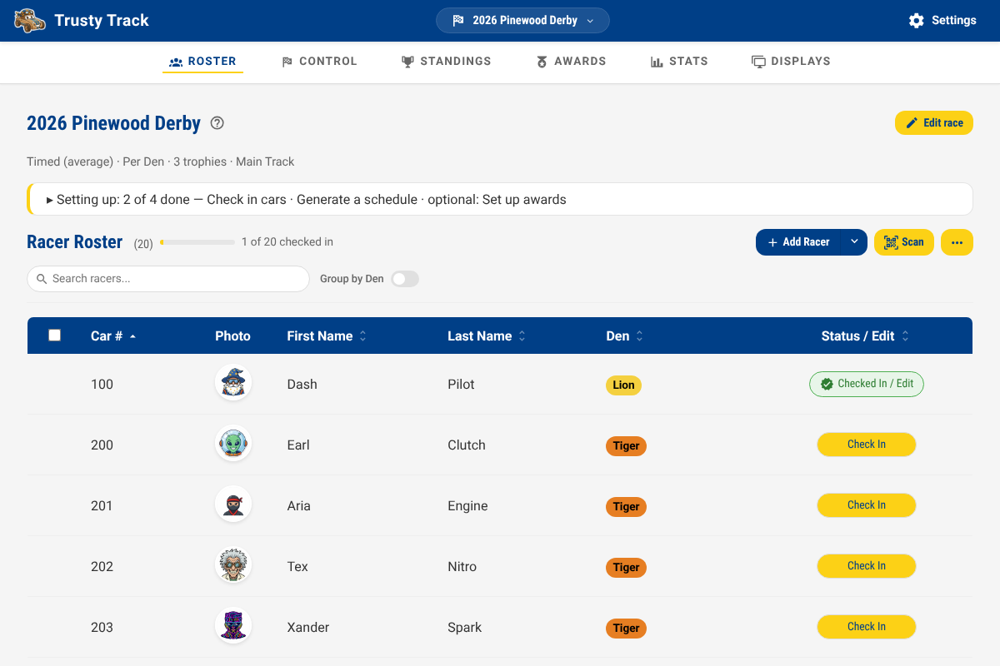
_After saving, that racer's button turns green and reads **Checked In / Edit**. Clicking it again reopens the same form._

---

### Scanning a Check-In Code

If you printed check-in codes (see the [Printables guide](printables.md)), click
**Scan** above the roster, hold a code up to the camera, and that racer's
check-in form opens straight away — no searching a list of sixty.

There is a **Car number** box under the viewfinder for a creased code or a
camera that will not focus.

> [!NOTE]
> Scanning needs Chrome or Edge. In Safari and Firefox the panel opens without
> a viewfinder and the car number box is the way in — check-in is otherwise
> identical.

---

### Tracking Check-In Progress

A **checked in** count sits beside the **Racer Roster** heading — "43 of 60
checked in" — so the question the room keeps asking can be answered without
scrolling a list and counting buttons. It updates as check-ins land, including
ones done on another device.

The Status column shows where every racer stands: a green **Checked In / Edit**
button once they are through, a gold **Check In** button until then. Click the
**Status / Edit** header to bring everybody still to come to the top. Turn on
**Group by Den** to work through one den at a time, which is usually how
families arrive.

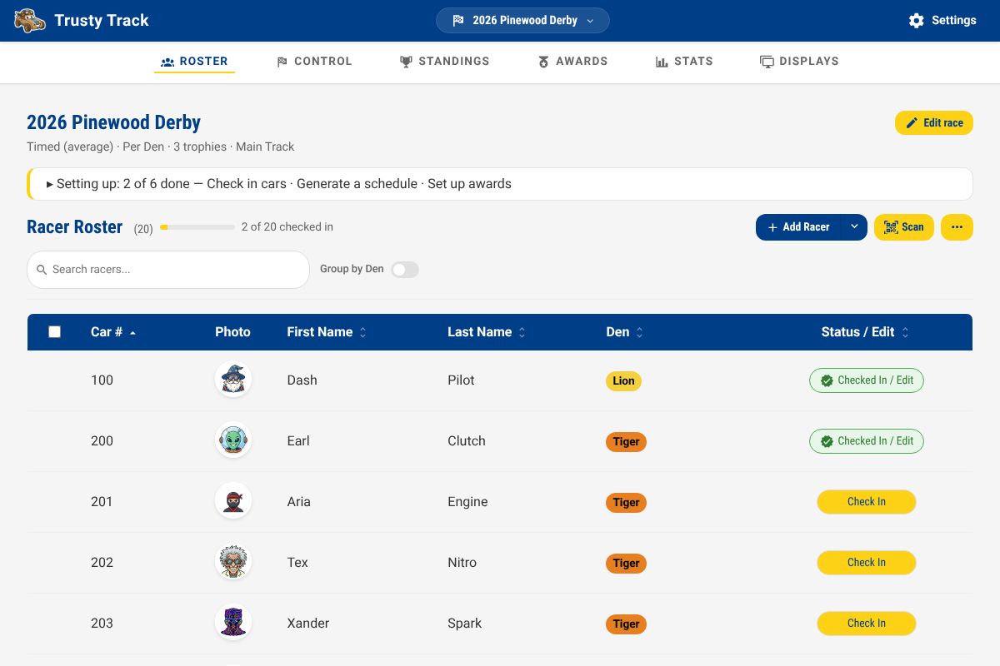
_The roster part-way through check-in — green for done, gold for still to come, and the count beside the heading saying how far there is to go._

---

### Uploading Photos in Bulk

If a photographer takes portraits or car photos before the race, you can upload and assign all of them at once using the **Upload Photos** button — without opening each racer's check-in form individually.

**When to use this:** After a pre-race photo session where you have a folder of racer or car images to associate with the correct racers.

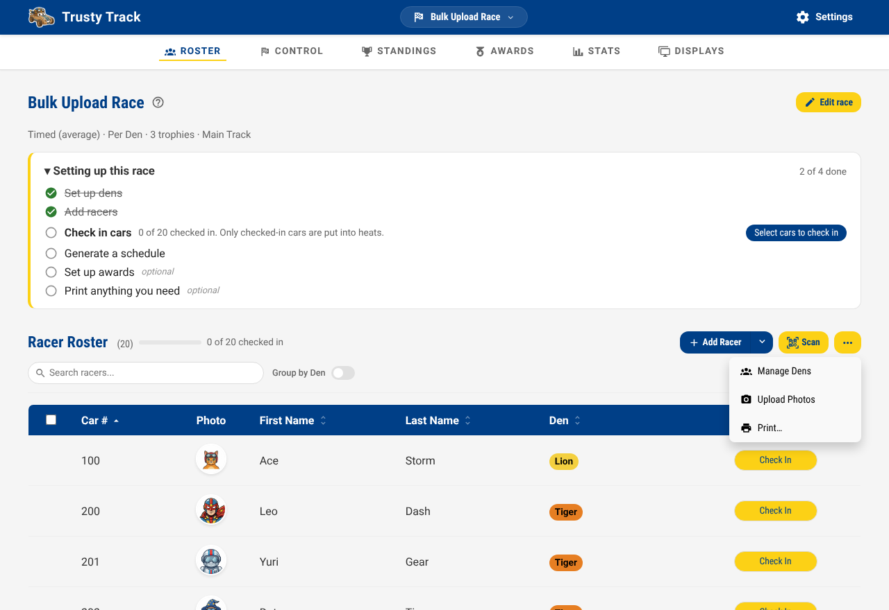
_**Upload Photos** is in the **⋯** menu at the top right of the roster, between **Manage Dens** and **Print**._

1. Click **⋯** at the top right of the roster and choose **Upload Photos**.
2. The **Upload & Assign Photos** modal opens. Click **Choose Photos** and select one or more image files from your device.

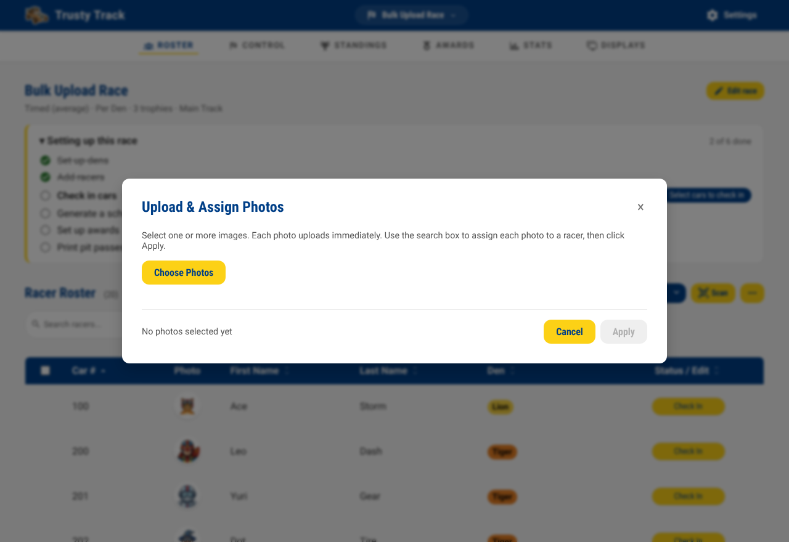
_The modal before any photos are selected. Click "Choose Photos" to pick files from your device._

3. Each image uploads immediately and appears as a thumbnail card. The footer shows how many photos have been assigned so far.

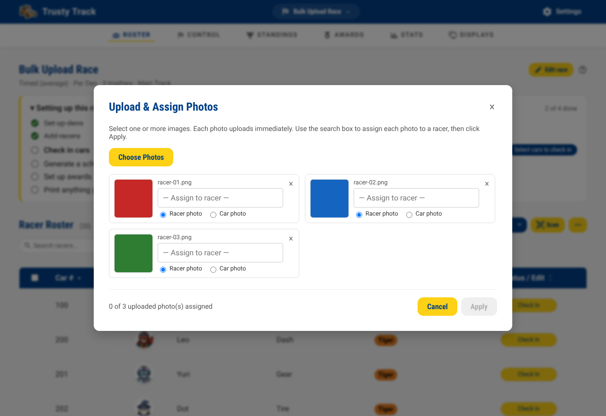
_Three photos loaded and ready to assign. Each card shows the filename, an assignment search box, and a Racer/Car photo toggle. The footer tracks progress ("0 of 3 uploaded photo(s) assigned")._

4. Click the search box on a card and start typing a racer's name or car number. A filtered list appears as you type.

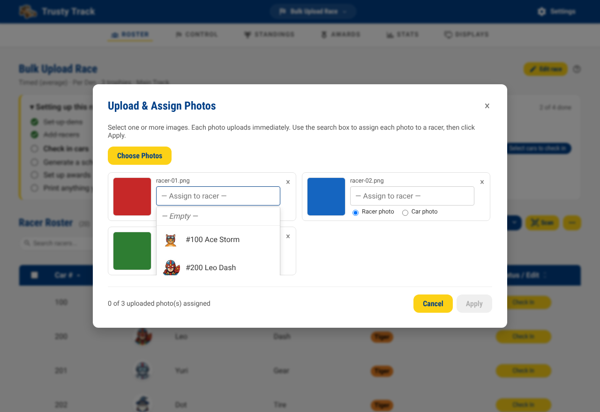
_Clicking the search box shows all racers sorted by car number. Scroll or start typing to narrow the list._

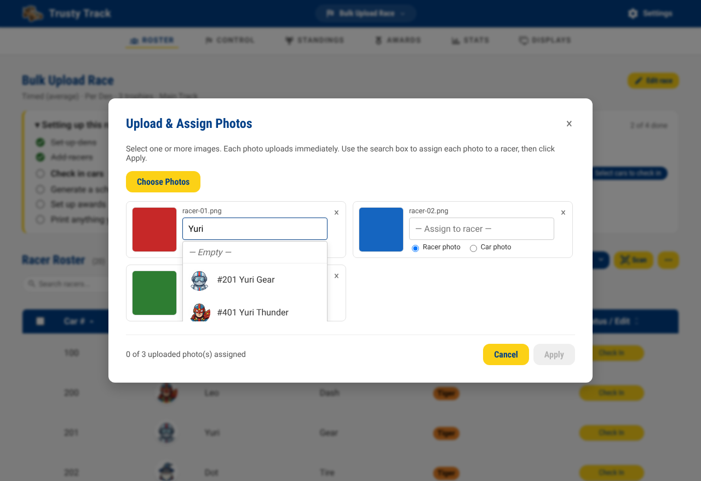
_The list narrows as you type, matching on car number as well as name. Click a name to assign it, or use the arrow keys and press Enter; if nothing matches, the box says so._

5. Use the **Racer photo** / **Car photo** radio buttons on each card to indicate what the image shows (default is Racer photo).
6. After assigning all photos, click **Apply N Assignment(s)** to save.

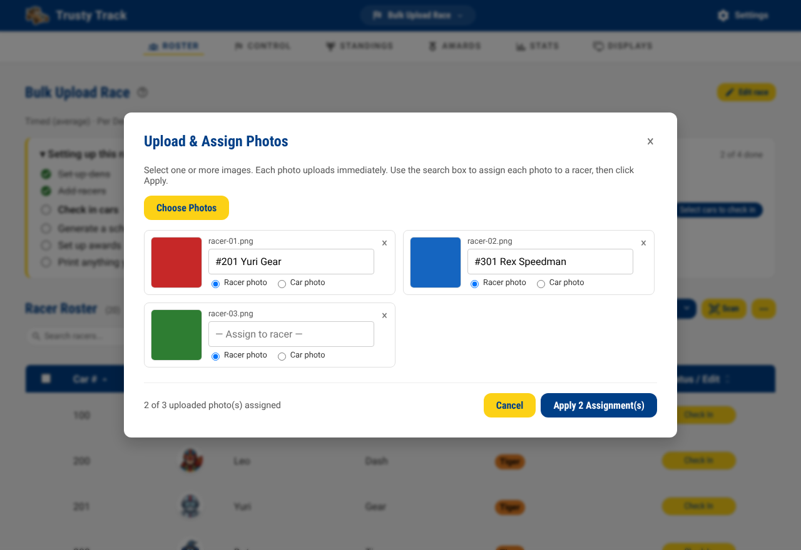
_Two photos assigned and one still to go. **Apply** stays greyed out until at least one photo has a racer against it, and the footer beside it counts how many are ready._

Photos that are uploaded but not assigned to any racer are silently skipped — only photos with a racer selected are saved. Assignments can be applied at any time during or after check-in; the photos will be visible on the audience display during the race.

> [!TIP]
> If an upload fails (for example, due to a slow network), a **Retry** link appears on that card. Other cards are not affected — you can assign and apply the successful uploads while retrying the failed ones.

> [!NOTE]
> Photos can also be added individually through each racer's check-in form (see [Checking In a Racer](#checking-in-a-racer) above). The bulk upload tool is most useful when photos were taken as a batch outside the app and you want to assign them all at once.

---

## Part 2: Scheduling the Race

### Navigating to Race Control

Once check-in is underway, the race control operator can move to the **Race Control** page to build the heat schedule. Click the **Control** link in the top navigation bar.

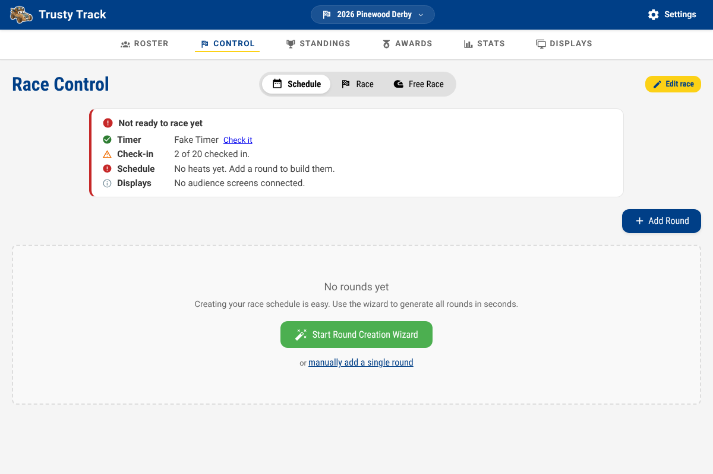
_The Race Control page before any rounds have been added. The readiness panel at the top is reporting the missing schedule; click "Start Round Creation Wizard" to begin._

---

### The Readiness Check

Until the first heat has been recorded, a readiness panel sits at the top of the **Schedule** and **Race** tabs. It answers the four questions that otherwise only surface as an error at the start line:

| Item | What it tells you |
|------|-------------------|
| **Timer** | Whether the timer is connected and which model it reported. **Check it** opens the [timer diagnostics page](hardware-timer.md#checking-it-works), where the profile's provenance and the serial log live. |
| **Check-in** | How many cars are through inspection. Only checked-in cars are put into heats. |
| **Schedule** | How many heats exist. |
| **Displays** | How many audience screens are currently connected. |

Red means you cannot run a heat yet; amber means you can, but something is worth a look — a queue still at the check-in desk, most often. Displays are reported in grey because having no audience screen is a choice rather than a problem.

Once nothing needs attention the panel collapses to a single line, and it disappears entirely as soon as a heat has been recorded — from that point the timer badge and the race execution screen report anything that goes wrong.

---

### Understanding Rounds and Heats

Before building the schedule, it helps to know two terms:

- **Heat** — A single race run with N cars (one per lane). Each heat takes about 10–30 seconds on the track.
- **Round** — A complete set of heats where every racer competes. Trusty Track automatically generates the minimum number of heats needed so that every racer races in every lane exactly once.

A typical Pinewood Derby has one **qualifying round** (all racers) followed by one optional **championship round** (top finishers only).

---

### Creating a Round with the Round Wizard

The **Round Wizard** is the fastest way to set up your complete race schedule, including optional championship rounds. Click **Start Round Creation Wizard** to open it.

#### Step 1: General Rounds

Choose the format for your qualifying round:

- **All Pack** — Every racer races against everyone else. Best for events where den membership isn't important for heat grouping.
- **By Den** — Racers race only against others in their own den during the qualifying round.

Set **Runs Per Lane** (default: 1). Increasing this number means each racer runs in every lane more than once, which produces fairer averages but takes more time.

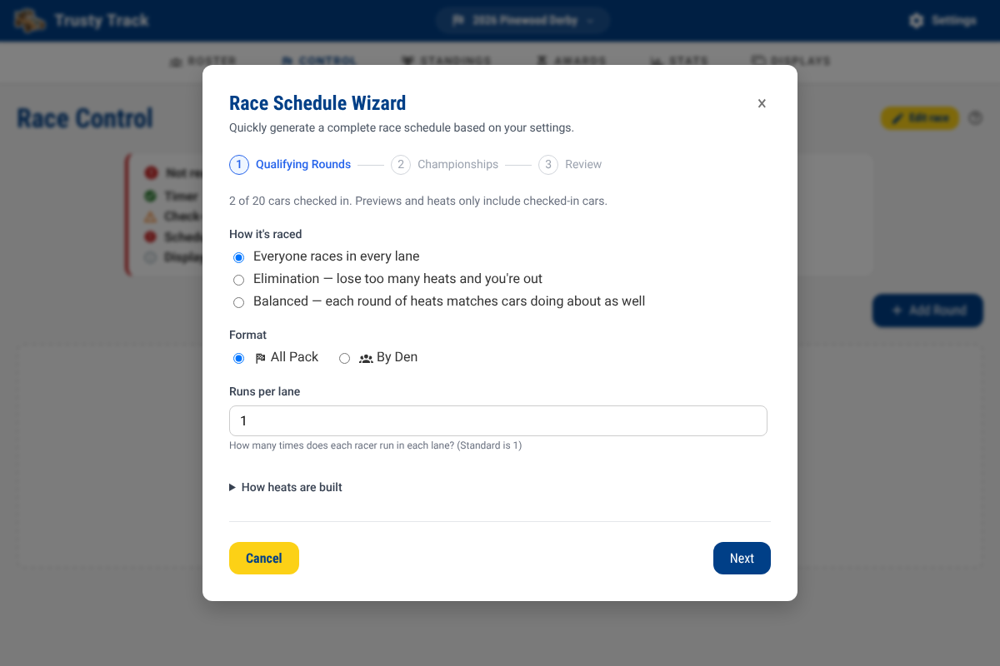
_Step 1: choose the qualifying round type. "All Pack" is the most common choice._

#### Step 2: Championship Rounds (Optional)

Add one or more championship rounds. For each championship round, configure:

- **Round Name** (e.g., "Grand Finals")
- **Advancement Source**: **Top Overall (Pack)** or **Top per Den**
- How many advance — the box is labelled **Number of Finalists** for Top Overall, and **Advancing per Den** for Top per Den
- **Runs Per Lane** for this round — the finalists race the whole round again for each run, which is worth it when a final is close enough that one heat should not decide it

Click **+ Add Round** to add more championship rounds if needed. Only the first
championship round chooses a source; any round after it always draws from the
championship round before it, and says so instead of offering a choice.

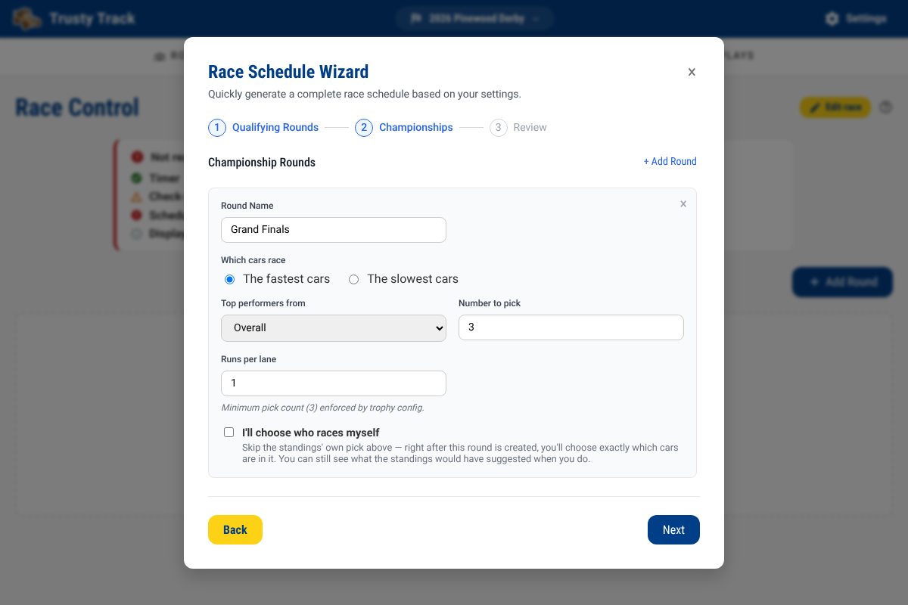
_Step 2: configure optional championship rounds. Each round can advance a different number of racers._

#### Step 3: Review and Generate

The wizard shows an estimate of total heats and approximate run time. Review the schedule summary, then click **Generate Schedule** to create all rounds and heats at once.

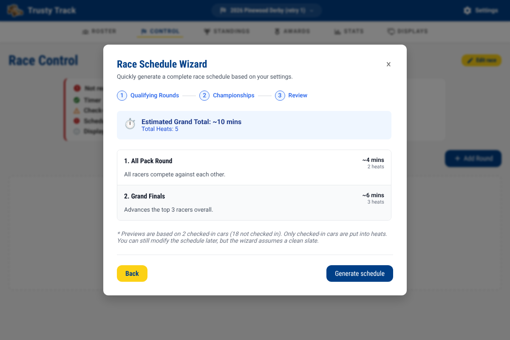
_Step 3: the schedule preview shows total heats and estimated duration before you commit._

---

### Viewing the Schedule

After generating, the **Schedule** tab lists each round in turn, one below the
other. A round is a table with a row per heat and a column per lane, so reading
across a row tells you who is in which lane.

_The full schedule after generation. Each round has its own table; a heat's row shows the racer in every lane, and picks up their finish times once it has been run._

---

### Reordering Heats (Optional)

If you need to adjust the heat order before racing begins (for example, to separate siblings or accommodate a late arrival), drag a heat by the handle at the left-hand end of its row to move it within its round.

> [!NOTE]
> A heat can only be moved while it has no times against it. Once a heat has been run its handle is greyed out; a heat you skipped can still be moved, because it has no times.

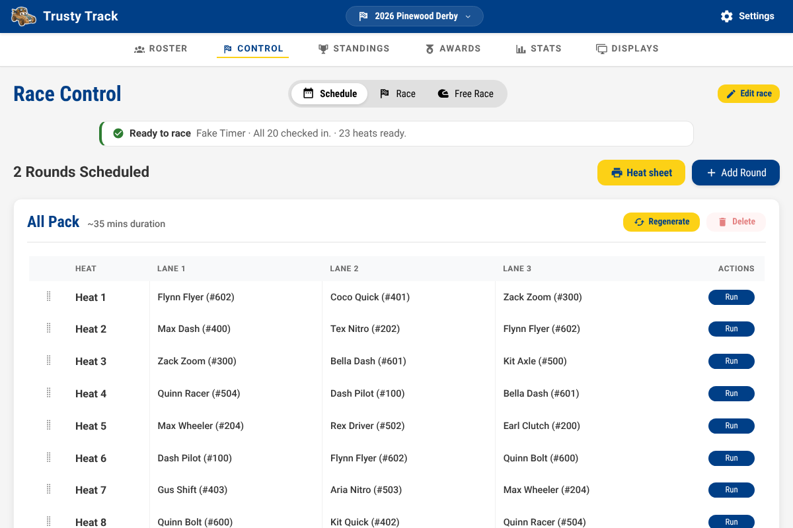
_Drag the handle at the left-hand end of a heat's row to reorder it within the round._

> [!TIP]
> **Print the running order** once the schedule is settled. **Heat sheet**, beside Add Round, gives you a table per round with an empty column to write results into — the one thing that still works when the wifi drops. See the [Printables guide](printables.md#the-heat-sheet).

> [!TIP]
> **Jumping Ahead:** If you want to run a later heat immediately, click the **Run** button on that heat in the Schedule view. Trusty Track will automatically move it to be the next heat in the order and take you directly to the **Race** tab. This only works within the round you are on — **Run** is greyed out on a round that is still waiting for an earlier one to finish.

---

## Part 3: Running the Race

### The Race Execution View

Switch to the **Race** tab in Race Control to enter the race execution view. This is where heats are started and results are recorded.

The view is split into two columns:

- **Left (main area)**: The current heat — racer names, lane assignments, and results.
- **Right (sidebar)**: **On Deck** — the next heat's lane-up, so those cars can be staged — with the round's progress below it and any later rounds after that.

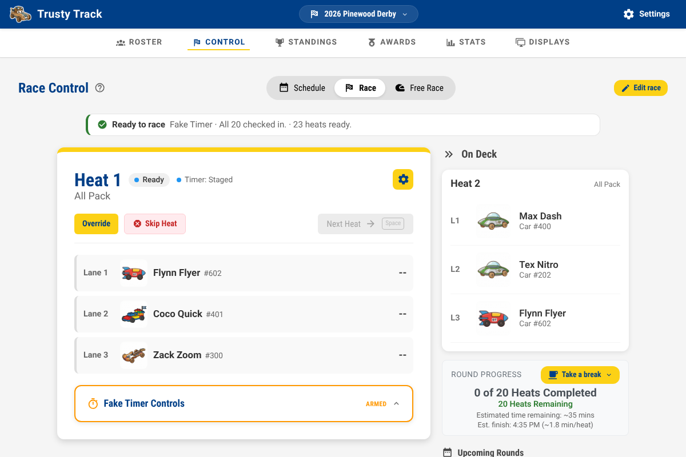
_The Race Execution view showing the active heat with lane assignments. The On Deck panel beside it is the next heat, so those cars can be staged._

---

### Starting a Heat

How a heat starts depends on your track timer:

- **With a hardware timer**: Trusty Track automatically prepares the timer for the next heat. Place the cars on the track and release them as normal — the timer records finish times automatically.
- **With the fake timer** (for testing without a physical track): A **Fake Timer Controls** panel appears in the bottom-right corner. Once the heat is staged the panel reads "Ready to start" — click **Start Timer** to send the cars off. The heat then finishes on its own a few seconds later, or you can click **Finish Heat** to end it immediately.

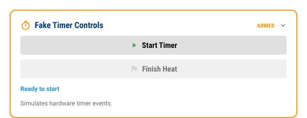
_The Fake Timer Controls panel used for testing. "Start Timer" begins the run; "Finish Heat" ends it and records simulated times._

---

### Recording Results

When a heat finishes:

- **Hardware timer**: Results appear automatically in the lane cards, showing each racer's finish time and placement.
- **Fake timer**: Results appear when the run ends — either on its own a few seconds after **Start Timer**, or as soon as you click **Finish Heat**.
- **Manual override**: Click **Override** (before the heat) or **Edit** (after) to enter times by hand.

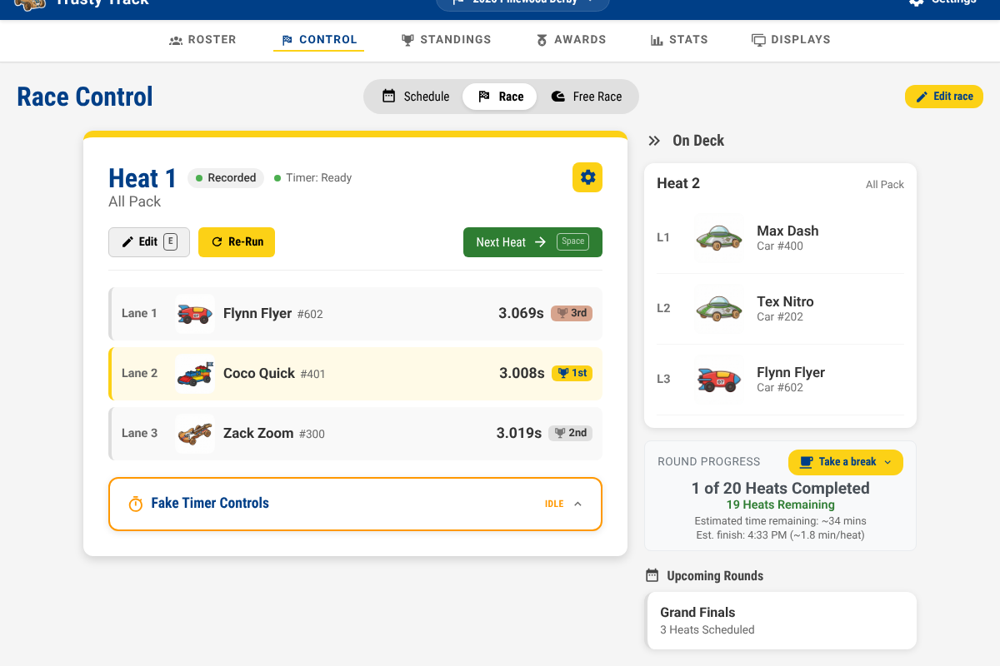
_After a heat completes, each lane shows the racer's finish time and placement (1st, 2nd, 3rd, etc.). The 1st-place racer is highlighted in gold._

After reviewing results, click **Next Heat** to advance to the next heat — or enable **Auto-advance** to move forward automatically after 10 seconds.

> [!TIP]
> The **Auto-advance** toggle is in the lower section of the active heat card. When on, the display counts down and advances without any button click.

### Keyboard Shortcuts

The race control operator usually has a microphone in one hand. Three keys cover
the repetitive parts, and each is printed on the button it mirrors:

| Key | What it does |
|-----|--------------|
| **Space** | Move on to the next heat, once the current one is recorded. |
| **E** | Open the result editor — **Edit** after a heat, **Override** before one. |
| **Esc** | Cancel the auto-advance countdown. |

They do nothing while you are typing in a box, while a dialog is open, or when
held with Ctrl, Cmd or Alt — so correcting a car name never advances the race,
and the browser keeps its own shortcuts. Space deliberately does not *start* a
heat: on a real timer the gate is released by hand.

### The Finish Sound

**Finish sound**, beside the auto-advance toggle, plays a short chime when a
heat's results are recorded. Forty feet from the screen nobody knows the result
is in until somebody says so, and the chime tells the room without anyone
looking at a monitor.

It is off until you switch it on, and the setting is remembered on that device
only — your laptop can have it while the wall displays stay silent. Switching it
on plays the sound once, which is how you find out whether the machine is muted
without waiting for a heat to finish.

---

### Correcting a Result

If a timer result is wrong (for example, a photo-finish dispute or a false start):

1. Click **Edit** on the completed heat card.
2. Update the time for each lane as needed.
3. Click **Save Results**.

To completely re-run a heat, click **Re-Run** — this clears the results and returns the heat to "pending" so it can race again.

---

### Skipping a Heat

**Skip Heat** passes over the current heat without racing it — for when every
car in it has scratched, say. The schedule moves on, and the skipped heat can
be run later with **Run** if the cars turn up after all.

Two things to know:

- A skipped heat does not hold anything up. The round still finishes, and a
  championship round waiting on it still fills.
- **If your race is scored on points**, the cars in a skipped heat are scored
  as if they finished last in it — a scratch classifies last, the same as in
  any racing series. On a timed race a skipped heat simply is not part of
  anyone's average.

---

### Viewing the Live Leaderboard

The leaderboard updates automatically after every heat. During the race you can check the current standings at any time from the **Standings** page in the top navigation bar, and the **Stats** page keeps count of the heats completed so far. The audience can follow standings live on the Observation page (see the [Observation Displays Guide](observation-displays.md)).

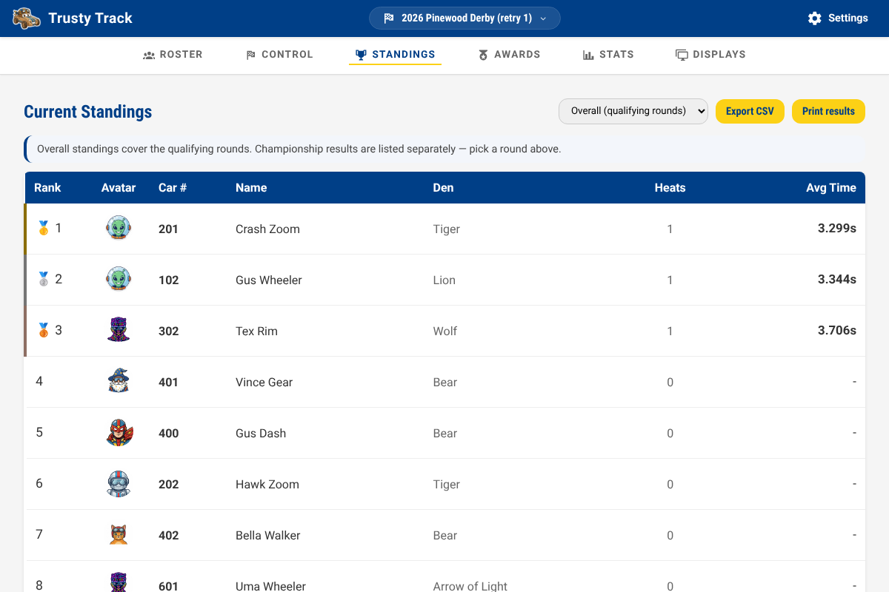
_The Stats page part-way through the race, with heats completed and lane fairness updating as results come in._

---

## Part 4: Championship Rounds (Optional)

When the last qualifying heat is recorded, Trusty Track works out who has made the championship round and shows a summary of them. Click **Start Next Round** to move on. The summary appears because a championship round was waiting to be filled — if you did not configure one, there is nothing to decide and no summary appears.

The championship round schedule is generated automatically based on who qualified — only the top racers from the qualifying round are included.

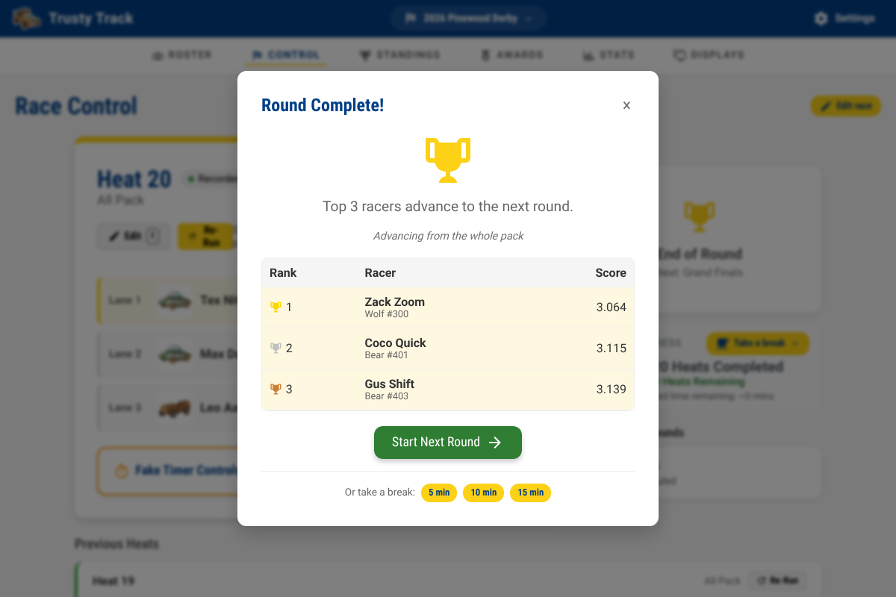
_When the field for a championship round is decided, the summary lists the racers who advance, with their finishing scores._

Run the championship heats the same way as the qualifying round. Championship results determine final placement.

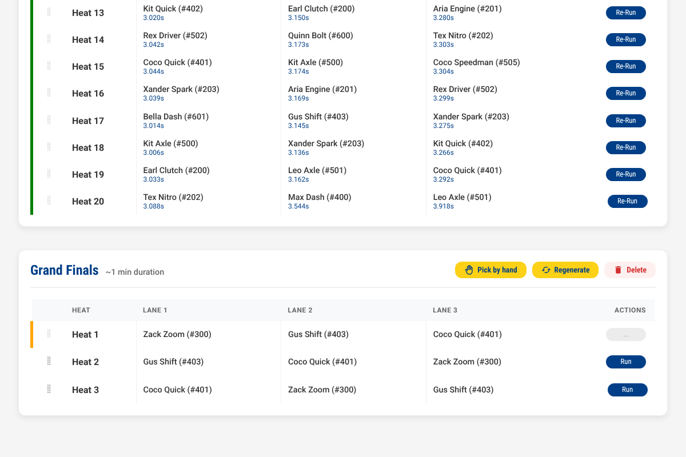
_The Schedule tab once the qualifying round is complete — every heat has its times. The championship round, now filled with the qualifiers, sits below it._

---

## Part 5: Final Standings

After all heats are complete, the **Standings** page shows the final ranked results. Navigate there from the top nav bar.

The Standings page can be put on a large screen or projector so everyone can see the final results.

**Print results**, at the top of the Standings page, puts the standings and the
trophy winners on one page for the noticeboard or the newsletter — see
[printables](printables.md#the-results-sheet).

For the ceremony itself, use the [Awards](awards.md) page instead. It holds the trophies you are handing out — the speed ones worked out from these standings, and the judged ones like Best Paint — and **Present** puts them on a projector one at a time, paced by whoever is holding the microphone.

If the race has a championship round, a selector appears above the table. Use it
to switch between **Overall (preliminary rounds)** and any one championship
round. A race with no championship rounds has nothing to switch between, so no
selector appears.

> [!NOTE]
> Overall standings cover the **preliminary** rounds only. A championship field
> is picked *from* those standings, so folding the final's times back into them
> would change who was supposed to be in the final. Championship results are
> shown by selecting that round.

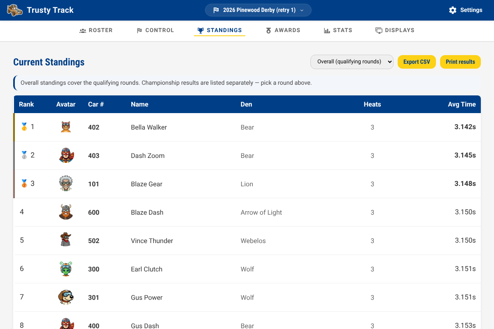
_The standings show rank, car number, name, den, heats completed, and average time for every racer. The top three rows are shaded gold, silver, and bronze._

> [!NOTE]
> **A tie shares a rank.** Two racers with the same score both show the same
> rank, and the next rank skips — 1st, 1st, 3rd. The app deliberately does not
> break the tie for you: deciding one is a judgment call, and yours to make —
> a race-off, or a corrected time from the [result editor](#correcting-a-result).
> Ties are common in points-scored races and rare, but possible, in timed ones.

---

## Common Race Day Scenarios

### A racer arrived late

Add them to the roster and check them in as normal. **Checking them in is what puts them in the racing** — Trusty Track then works out what to do with the round already on screen, and there is nothing else for you to press.

What happens depends on how far that round has got:

| The round | What happens |
| --- | --- |
| Not started | Rebuilt with them in it — everybody gets an equal schedule |
| Part-way through | Every recorded time is kept, and heats are added at the end for the newcomer |
| Finished | Left alone. They start from the next round you create |

The middle case is the interesting one. The newcomer gets one heat in each lane, the same spread everybody else got, because lanes are not equal and that is what the schedule exists to even out. The other lanes of those extra heats have to hold somebody, so a few racers run once more than their peers.

- **If your race is scored on times** (the default), that is fine — standings use each racer's average, so an extra run does not flatter anybody.
- **If your race is scored on points**, it is not, because points add up and lower is better. Trusty Track leaves that round out of the standings and says so on the standings page. The round still runs and its results are still there to look at; it just does not decide the trophies.

This is the same rule as [a lane going out of service](hardware-timer.md#if-a-lane-stops-working), for the same reason.

> [!TIP]
> If somebody is checked in and shows **No heats** on the roster, they arrived after the round they would have been in had already finished. Create the next round and they will be in it.

### A racer had to withdraw

Open their check-in entry and turn **Passed Inspection / Checked In** off. Heats they already appeared in keep their recorded times, and heats that have already been scheduled still list them — delete or skip those if they come up. Any round you create or regenerate from that point on leaves them out.

### A timer result came in wrong

Click **Edit** on the completed heat in the Race Execution view to manually correct any time value. If the entire heat needs to be re-run, click **Re-Run** to clear all results and race it again.

### We need to run a practice heat that doesn't count

Use **Free Race**. A free race heat runs on the timer and appears on the audience display like any other, but it is invisible to standings, scheduling, advancement and statistics — so it cannot disturb the event.

It is the right tool for a shake-down run before doors open, a parent's or sibling's car, a demonstration for a scout who wants to see the track work, and the fun heats at the end.

From **Race Control**, switch to the Free Race view and choose who is in each lane. **Random** fills the lanes from the checked-in roster, which is usually what you want for an impromptu run; you can also pick racers by hand, and lanes may be left empty. Run it exactly as you would an official heat.

See the [Free Race guide](free-race.md) for the full walkthrough.
