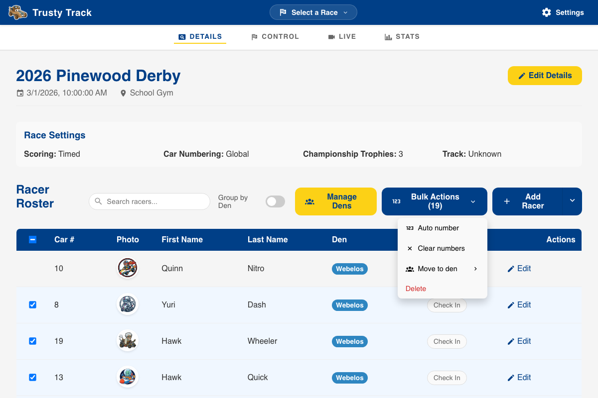

# Race Setup Guide

This guide covers the essential steps to prepare your Pinewood Derby race roster, including managing dens, adding racers, and assigning car numbers.

## Race Details Overview

Once you have created or selected a race from the Home page, you will be taken to the Race Details page. This is your central hub for roster management.

_The Race Details dashboard provides a summary of race settings and the current racer roster._

---

## Managing Dens

Dens (sometimes called Groups) are the sub-organizations within your race (e.g., Lions, Tigers, Wolves). Trusty Track uses dens to group racers for heat scheduling and optional car numbering ranges.

### Opening Den Manager

Click the **Manage Dens** button above the racer roster to open the Den Manager.

### Adding a New Den

1. Click **+ Add New Den**.
2. Enter the **Name** (e.g., "Lions").
3. (Optional) Set a **Car Number Range**. If provided, the "Auto-Number" feature will use this range for this specific den.
4. Select a **Color** to identify the den in the UI and on the live stream.
5. (Optional) Select a **Rank Mapping** to automatically assign standardized ranks.
6. Click **Add Den**.

---

## Adding Racers

You can add racers one by one for small events or late registrations, or bulk-import a full roster from a CSV file.

### Manual Addition

1. Click the **Add Racer** button (or the arrow next to it and select **Add Manually**).
2. Enter the racer's **First Name** and **Last Name**.
3. Enter a **Car Number** (if not using Auto-Number later).
4. Select the appropriate **Den**.
5. Click **Save Racer**.

The racer will now appear in your roster.

---

### Batch Import from CSV

If you have a large roster (e.g., exported from Scoutbook or a spreadsheet), you can import it in seconds.

Your file does not have to be in any particular format — you match its columns to the fields Trusty Track needs, so a roster exported from Scoutbook or a spreadsheet someone has been keeping by hand will both work as they are.

1. Click **Select CSV File** and choose your file. If you are starting from scratch, use **download a template** for a file with the right columns already in it.
2. Check the **Match your columns** section. Trusty Track guesses from your headers — `Scout First Name`, `Car #` and `first_name` are all recognised — but you can change any of them, or set one to **Not included**.

    First Name and Last Name are required; Car Number, Car Name, Den and Passed Inspection are optional.

3. Look over the **Preview**, which shows the first few rows exactly as they will be imported.
4. Read any warnings. Trusty Track points out rows missing a name, car numbers that are not numbers, and car numbers used twice, before anything is saved.
5. Click **Import Racers**.

Any dens named in the file are created automatically and the racers assigned to them.

---

## Car Numbering & Bulk Actions

### Bulk Actions Menu

Select one or more racers using the checkboxes on the left to enable the **Bulk Actions** menu.

From here, you can:

- **Auto-number**: Automatically assign car numbers based on your Race Settings (Global or Per-Den).
- **Move to Den**: Batch change the den assignment for selected racers.
- **Clear numbers**: Remove car numbers from selected racers.
- **Delete**: Remove selected racers from the race.

### Final Roster Review

Before moving to the "Control" phase, review your roster to ensure every racer is assigned to the correct den and has a unique car number.

> [!TIP]
> You can sort the roster by clicking on any column header (Car #, Name, or Den) to quickly spot missing data.
