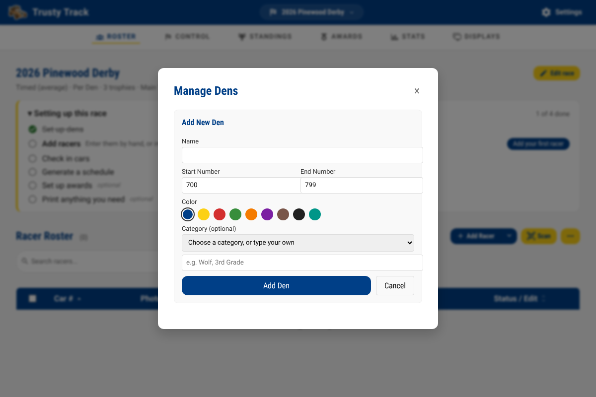
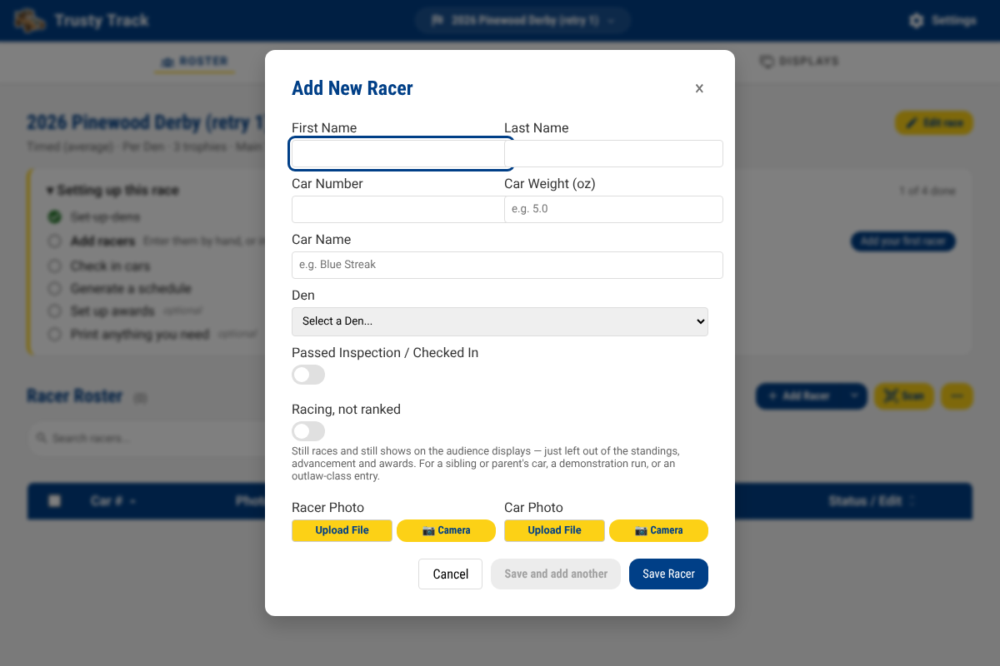
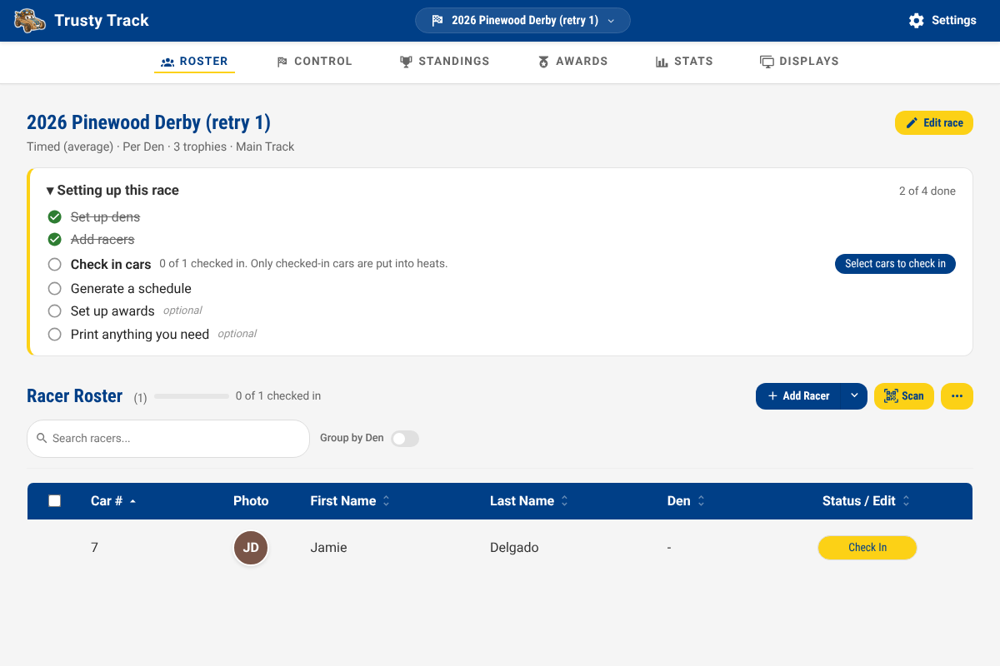
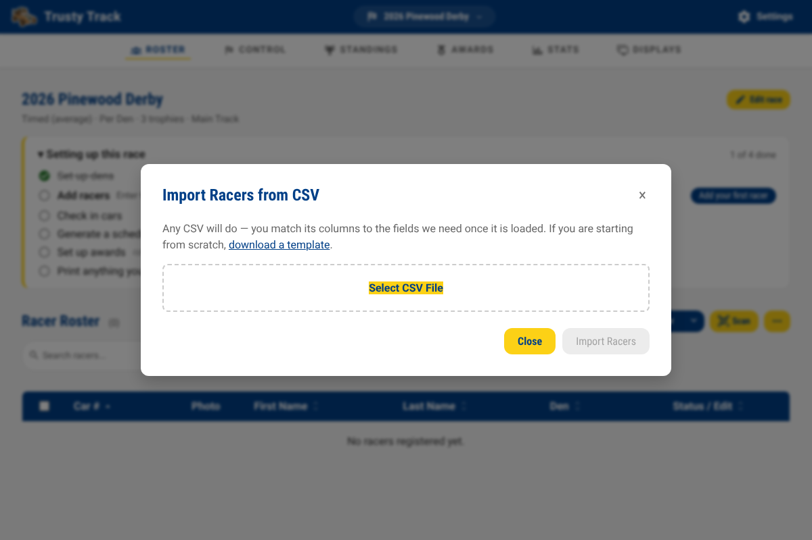
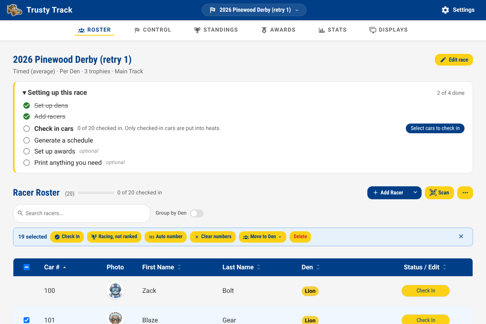
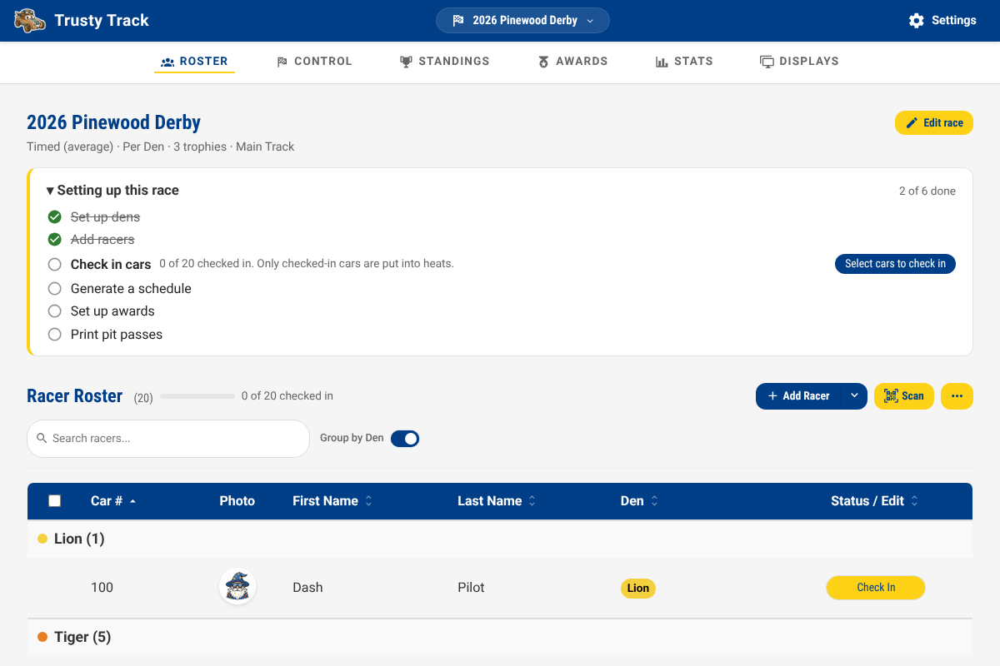

# Race Setup Guide

This guide covers the essential steps to prepare your Pinewood Derby race roster, including managing dens, adding racers, and assigning car numbers.

## The Roster page

Once you have created or selected a race from the Home page, you will be taken to the **Roster** page — the first tab in the race navigation. This is your central hub for roster management.

### Sorting the roster

Click any column header — **Car #**, **First Name**, **Last Name**, **Den**, or **Status / Edit** — to sort by it, and click it again to reverse. The roster starts in car number order, with racers who have no number yet at the end, where they are easy to find.

Sorting by **Status / Edit** is the one worth remembering on race morning: it brings the racers who are *not* yet checked in to the top, which is the question a queue at the desk keeps asking.

_The Roster page provides a summary of race settings and the current racer roster. On a race that is not yet set up, the checklist described in the [getting started guide](getting-started.md) sits above them._

---

## Managing Dens

Dens are the sub-groups within your race (e.g., Lions, Tigers, Wolves). Trusty Track uses them to divide the roster up — for a round raced by one den, for a championship that takes the top few from each den, and for car number ranges.

### Opening Den Manager

Click the **⋯** button at the top right of the roster and choose **Manage Dens**.

The overflow menu holds the things you do once before an event — managing dens, uploading photos and printing. **Add Racer** and **Scan**, which you reach for repeatedly, stay on the toolbar itself.

### Adding a New Den

1. Click **+ Add New Den**.
2. Enter the **Name** (e.g., "Lions").
3. Check the **Start Number** and **End Number**. They arrive filled in with a block of a hundred that no other den is using, and **Auto number** hands out numbers from that block when the race is set to Per Den numbering. Clear them if you number cars some other way.
4. Select a **Color** to identify the den. It is the colour of the den's tag in the roster, on printed pit passes and licences, and in the den comparison on the Stats page.
5. (Optional) Set the den's **Category** — a dropdown offers the traditional Cub Scout ranks (Lion, Tiger, Wolf, Bear, Webelos, Arrow of Light) to fill the box, or type anything you like. It is shown beside the den's name in the list, beside the den's name in the Den column on the Standings page, and beneath a racer's name on the audience displays, where their den is not otherwise shown.
6. Click **Add Den**.

---

## Adding Racers

You can add racers one by one for small events or late registrations, or bulk-import a full roster from a CSV file.

### Manual Addition

1. Click the **Add Racer** button. (The arrow beside it is for the other two ways in — **Import from CSV** and **Populate Test Data**.)
2. Enter the racer's **First Name** and **Last Name**.
3. Enter a **Car Number** (if not using **Auto number** later).
4. Select the appropriate **Den**. **Car Name**, **Car Weight** and a photo can all be filled in now or left until check-in. A photo taken or uploaded here can be straightened and cropped the same way as at check-in — see [Straightening a Photo](race-day.md#straightening-a-photo).
5. Click **Save Racer** — or **Save and add another**, which saves this racer and hands you the form back for the next one.

**Save and add another** is for typing a roster in at a sitting. It keeps the den you were working through, since rosters usually arrive grouped that way, and clears everything else. The car number is deliberately *not* carried forward or incremented: under manual numbering, the next car is not reliably the last one plus one, and a wrong number that looks deliberate is worse than a blank one.

The racer will now appear in your roster.

---

### Batch Import from CSV

If you have a large roster (e.g., exported from Scoutbook or a spreadsheet), you can import it in seconds.

Your file does not have to be in any particular format — you match its columns to the fields Trusty Track needs, so a roster exported from Scoutbook or a spreadsheet someone has been keeping by hand will both work as they are.

1. Click **Select CSV File** and choose your file. If you are starting from scratch, use **download a template** for a file with the right columns already in it.
2. Check the **Match your columns** section. Trusty Track guesses from your headers — `Scout First Name`, `Car #` and `first_name` are all recognised — but you can change any of them, or set one to **Not included**.

    First Name and Last Name are required; Car Number, Car Name, Den and Passed Inspection are optional.

3. Look over the **Preview**, which shows the first few rows exactly as they will be imported.
4. Read any warnings. Trusty Track points out rows missing a name, car numbers that are not numbers, and car numbers used twice, before anything is saved.
5. Click **Import Racers**.

Any dens named in the file are created automatically and the racers assigned to them.

---

## Acting on several racers at once

Tick the checkboxes on the left of any rows you want to change. A bar appears
above the table showing how many you have selected and what you can do with
them.

- **Check In**: Mark the selected racers as passed inspection and checked in.
- **Racing, not ranked**: Mark the selected racers as racing but not
  competing for a trophy — a sibling or parent's car, a demonstration run,
  an outlaw-class entry. They still get heats, still show on the audience
  displays, and their times are still recorded; they are only left out of
  the standings. See [Racing without being ranked](reference/scoring.md#racing-without-being-ranked).
- **Auto number**: Assign car numbers to the selected racers, following the race's **Car Numbering** setting — sequentially from the global start number, or from each den's own range. A race set to Manual numbering is left alone.
- **Clear numbers**: Remove car numbers from selected racers.
- **Move to den**: Batch change the den assignment for selected racers, or move them to Unassigned.
- **Delete**: Remove selected racers from the race.

Check In, Racing not ranked, Auto number and Move to den leave your selection
in place afterward, so you can select a group once and run through several of
them in a row — select everyone, auto-number, then check them in, without
re-ticking anything in between. Clear numbers and Delete clear the selection
instead, since both remove something rather than adding to it.

The **✕** on the right clears the selection and puts the bar away.

### Final Roster Review

Before moving to the "Control" phase, review your roster to ensure every racer is assigned to the correct den and has a unique car number.

> [!TIP]
> Turn on **Group by Den** above the roster to check each den in turn, and use the search box to find a racer by name, car number, or den.

---

## Printing for Race Day

With the roster settled, print the paperwork before doors open — pit passes,
driver's licences, and the check-in codes an operator can scan. See the
[Printables guide](printables.md).
