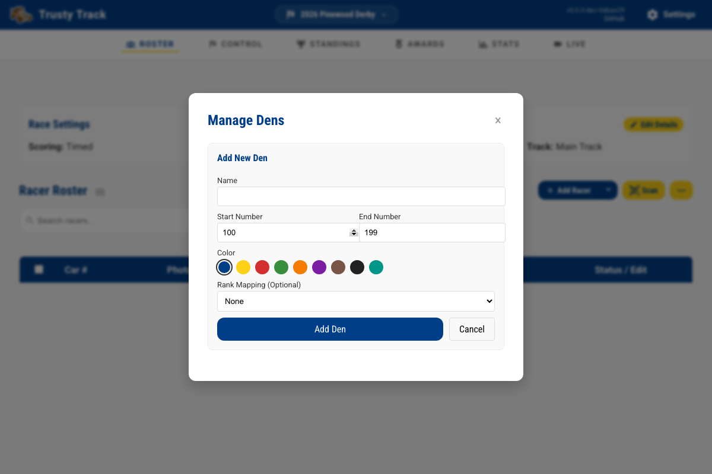

# Race Setup Guide

This guide covers the essential steps to prepare your Pinewood Derby race roster, including managing dens, adding racers, and assigning car numbers.

## Race Details Overview

Once you have created or selected a race from the Home page, you will be taken to the Race Details page. This is your central hub for roster management.

_The Race Details dashboard provides a summary of race settings and the current racer roster._

---

## Managing Dens

Dens are the sub-groups within your race (e.g., Lions, Tigers, Wolves). Trusty Track uses them to divide the roster up — for a round raced by one den, for a championship that takes the top few from each den, and for car number ranges.

### Opening Den Manager

Click the **Manage Dens** button above the racer roster to open the Den Manager.

### Adding a New Den

1. Click **+ Add New Den**.
2. Enter the **Name** (e.g., "Lions").
3. Check the **Start Number** and **End Number**. They arrive filled in with a block of a hundred that no other den is using, and **Auto number** hands out numbers from that block when the race is set to Per Den numbering. Clear them if you number cars some other way.
4. Select a **Color** to identify the den. It is the colour of the den's tag in the roster, on printed pit passes and licences, and in the den comparison on the Stats page.
5. (Optional) Select a **Rank Mapping** to tie the den to a standard Cub Scout rank.
6. Click **Add Den**.

---

## Adding Racers

You can add racers one by one for small events or late registrations, or bulk-import a full roster from a CSV file.

### Manual Addition

1. Click the **Add Racer** button. (The arrow beside it is for the other two ways in — **Import from CSV** and **Populate Test Data**.)
2. Enter the racer's **First Name** and **Last Name**.
3. Enter a **Car Number** (if not using **Auto number** later).
4. Select the appropriate **Den**. **Car Name**, **Car Weight** and a photo can all be filled in now or left until check-in.
5. Click **Save Racer**.

The racer will now appear in your roster.

---

### Batch Import from CSV

If you have a large roster (e.g., exported from Scoutbook or a spreadsheet), you can import it in seconds.

Your file does not have to be in any particular format — you match its columns to the fields Trusty Track needs, so a roster exported from Scoutbook or a spreadsheet someone has been keeping by hand will both work as they are.

1. Click **Select CSV File** and choose your file. If you are starting from scratch, use **download a template** for a file with the right columns already in it.
2. Check the **Match your columns** section. Trusty Track guesses from your headers — `Scout First Name`, `Car #` and `first_name` are all recognised — but you can change any of them, or set one to **Not included**.

    First Name and Last Name are required; Car Number, Car Name, Den and Passed Inspection are optional.

3. Look over the **Preview**, which shows the first few rows exactly as they will be imported.
4. Read any warnings. Trusty Track points out rows missing a name, car numbers that are not numbers, and car numbers used twice, before anything is saved.
5. Click **Import Racers**.

Any dens named in the file are created automatically and the racers assigned to them.

---

## Car Numbering & Bulk Actions

### Acting on several racers at once

Tick the checkboxes on the left of any rows you want to change. A bar appears
above the table showing how many you have selected and what you can do with
them.

- **Check In**: Mark the selected racers as passed inspection and checked in.
- **Auto number**: Assign car numbers to the selected racers, following the race's **Car Numbering** setting — sequentially from the global start number, or from each den's own range. A race set to Manual numbering is left alone.
- **Clear numbers**: Remove car numbers from selected racers.
- **Move to den**: Batch change the den assignment for selected racers, or move them to Unassigned.
- **Delete**: Remove selected racers from the race.

The **✕** on the right clears the selection and puts the bar away.

### Final Roster Review

Before moving to the "Control" phase, review your roster to ensure every racer is assigned to the correct den and has a unique car number.

> [!TIP]
> Turn on **Group by Den** above the roster to check each den in turn, and use the search box to find a racer by name, car number, or den.

---

## Printing for Race Day

With the roster settled, print the paperwork before doors open — pit passes,
driver's licences, and the check-in codes an operator can scan. See the
[Printables guide](printables.md).
