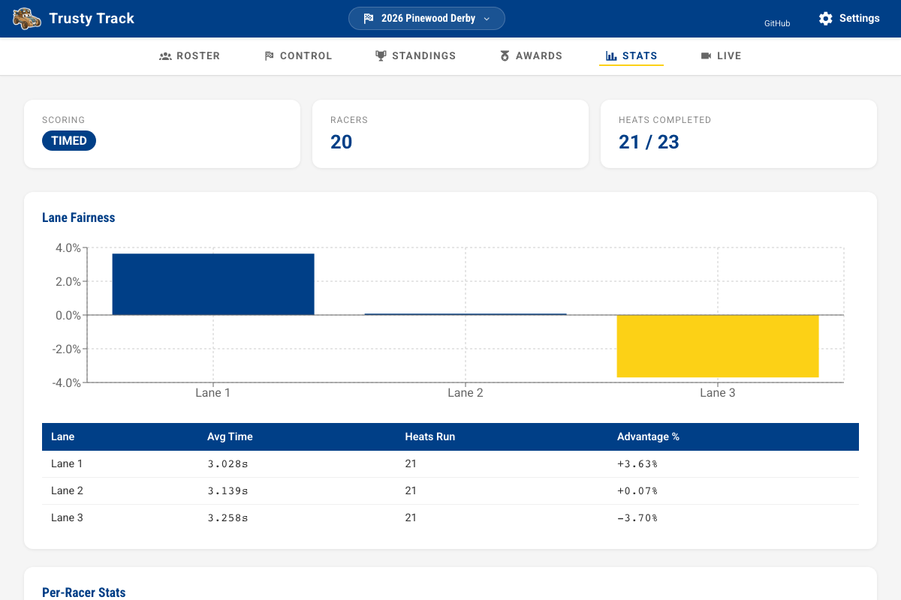
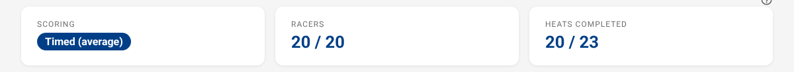
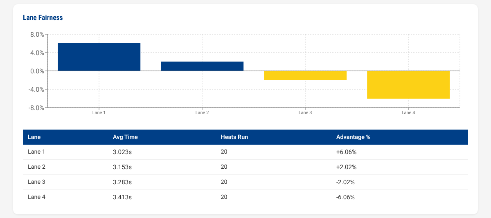
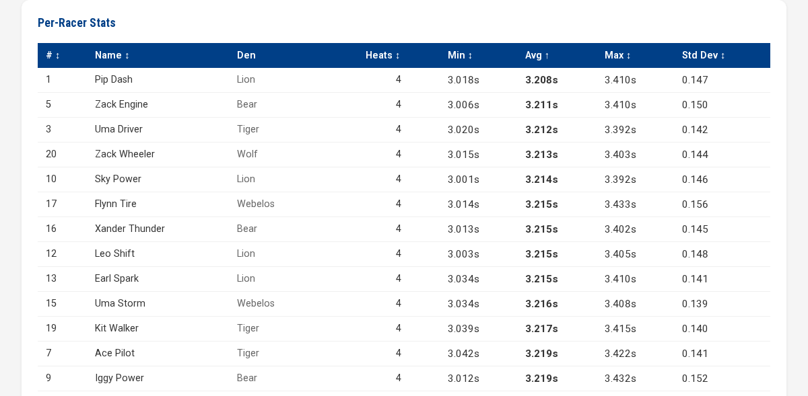
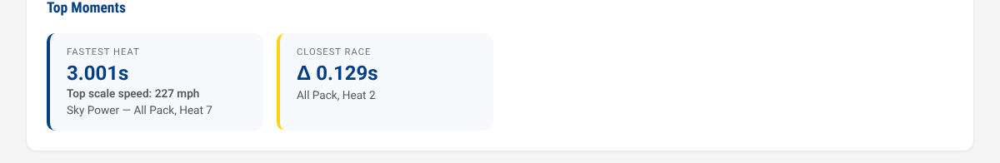
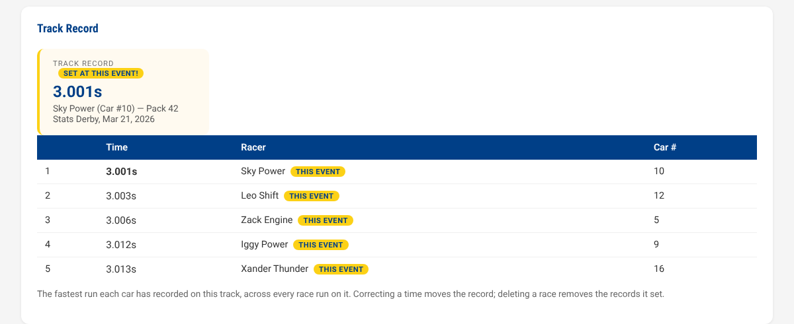
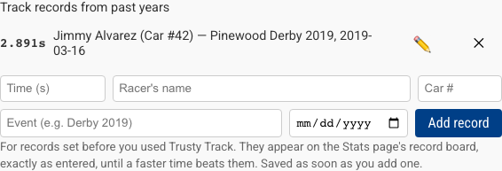
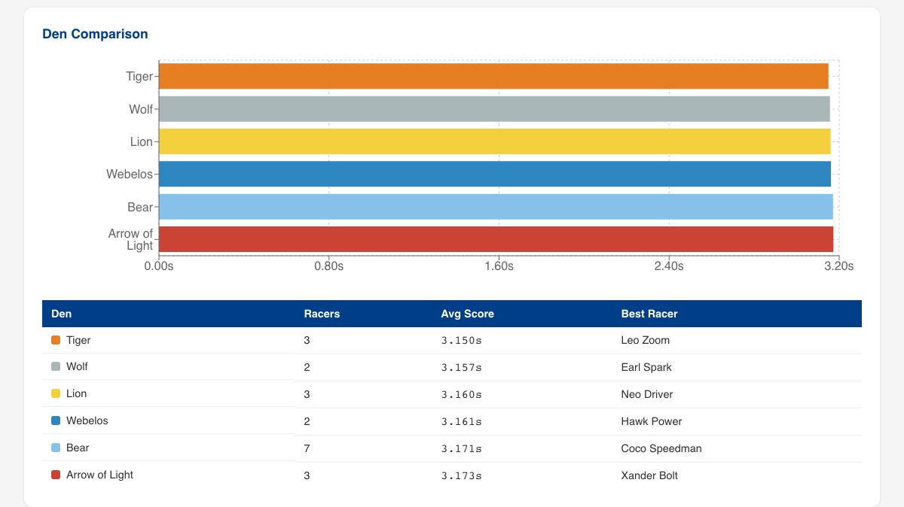
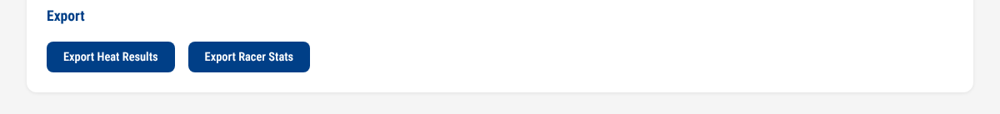
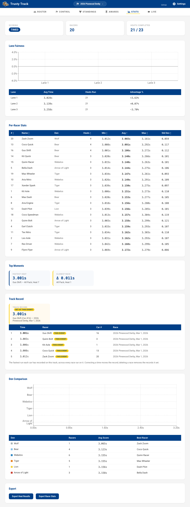

# Race Stats Guide

The Stats page gives you a deeper look at race performance — beyond just the final standings. It shows per-racer statistics, lane fairness analysis, den comparisons, memorable moments from the event, and CSV exports for your records.

> [!NOTE]
> **Prerequisite:** At least one heat must be completed before the Stats page shows data. If no heats have been run yet, the page will display "No heat results recorded yet."

> [!NOTE]
> [Free race](free-race.md) heats never appear here. Practice and exhibition
> runs are excluded from every number on this page.

---

## Navigating to the Stats Page

Click the **Stats** tab in the race navigation bar at the top of any race page. The Stats page is read-only — it shows results that were recorded on the Race Control page.

_Click the Stats tab in the race navigation bar to open the Stats page._

---

## Overview Cards

At the top of the page, three summary cards give you a quick snapshot of the race:

- **Scoring** — the scoring method in use (e.g., "TIMED" for fastest average time).
- **Racers** — the total number of registered racers.
- **Heats Completed** — how many heats have been run out of the total scheduled (e.g., "12 / 16").

_The three overview cards at the top of the Stats page show scoring strategy, racer count, and heat completion progress._

---

## Lane Fairness

Pinewood Derby tracks sometimes have lanes that are slightly faster or slower due to small variations in the track surface or construction. The Lane Fairness section helps you see if any lane has a consistent advantage or disadvantage.

- The **bar chart** shows each lane's performance relative to the overall average. A bar above the centre line (blue) means that lane runs faster than average; a bar below it (gold) means slower than average.
- The **table** below shows each lane's average finish time, how many heats were run in that lane, and the percentage advantage or disadvantage.

A small difference (less than 1%) between lanes is completely normal. A larger difference may be worth noting for future track maintenance.

> [!TIP]
> This section is most meaningful after a full qualifying round, where every racer has run in every lane — which is exactly how Trusty Track's automatic scheduling works.

_The Lane Fairness section. Blue bars rise above the line for faster-than-average lanes; gold bars drop below it for slower ones._

---

## Per-Racer Stats

The Per-Racer Stats table shows every racer's numbers: heats completed,
fastest and slowest time, average, and how consistent their times were.
Every column except **Den** sorts — click its header, and click again to
reverse.

What each column means exactly is in
[Stats and exports](reference/stats-and-exports.md#per-racer-stats).

_The Per-Racer Stats table sorted by average time (the default). Click a sortable column header to re-sort._

---

## Top Moments

The Top Moments section highlights two memorable heats from the event:

- **Fastest Heat** — the single quickest recorded time of the entire event, with the racer's name and which heat it occurred in.
- **Closest Race** — the heat where the margin between the fastest and slowest finisher was smallest (the most exciting race of the day), with the time gap in seconds.

These cards appear automatically once enough heats have been completed.

_The Top Moments section highlights the fastest heat of the day and the closest finish._

---

## Track Record

The Track Record section looks beyond today: the fastest cars this track
has **ever** seen, across every race run on it.

- The card shows the record — the time, who set it, and at which event.
- The table below lists the five fastest cars of all time.
- A record set at **today's** event gets a gold badge. Beating a record
  that has stood since last year is worth announcing.

_The track record card, with the all-time list beneath it._

### Records from before Trusty Track

If your pack has records on paper — "2.89 seconds, Jimmy, 2019" — you can
enter them so the board tells the whole story:

1. Go to **Settings**, and find the track's card under **Tracks**.
2. Under **Track records from past years**, type the time and the racer's
   name — car number, event and date are optional.
3. Click **Add record**. It saves straight away.

_A record from 2019, entered on the track's card in Settings._

An entered record competes exactly as typed: it heads the board until a
faster time actually beats it. The ✏️ corrects a typo and the ✕ removes one.

Exactly what counts toward a record is in
[Stats and exports](reference/stats-and-exports.md#the-track-record).

---

## Den Comparison

The Den Comparison section shows how each den performed as a group — useful for pack leadership who want to recognize standout dens at the awards ceremony.

- The **bar chart** plots each den's average score, with bars colored in the den's assigned color.
- The **table** shows each den's racer count, group average score, and the name of that den's best-performing racer.

_The Den Comparison section. Each bar is colored in the den's assigned color, making it easy to match the chart to the table below._

---

## Exporting Results

Two **Export** buttons at the bottom of the page download race data as CSV
files that open in Excel, Google Sheets, or any spreadsheet:

- **Export Heat Results** — one row for every lane in every completed heat.
  The complete record of the event.
- **Export Racer Stats** — one row per racer with their numbers. For
  awards, records, or sharing with the pack afterwards.

_The Export section at the bottom of the page. Both buttons download CSV files that open in any spreadsheet application._

The final placings export from the **Standings** page instead — **Export
CSV** beside the round selector, holding whatever standings the page is
showing.

The exact columns in all three files are in
[Stats and exports](reference/stats-and-exports.md#the-csv-exports).

---

## Live Updates During the Race

The Stats page updates automatically while the race is in progress. As each heat is completed in Race Control, the charts and tables refresh within a few seconds — no manual refresh needed.

This means you can keep the Stats page open on a separate screen during the race and use it as a running analysis view for pack leadership, while the race operator uses the Race Control page to run heats.

The **Heats Completed** card at the top shows the current progress, so you always know how much of the race remains.

_The Stats page during an in-progress race, with the Heats Completed card showing partial completion. The page refreshes automatically as heats finish._
