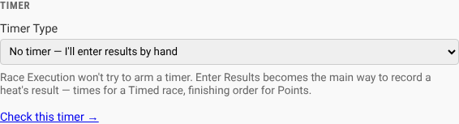
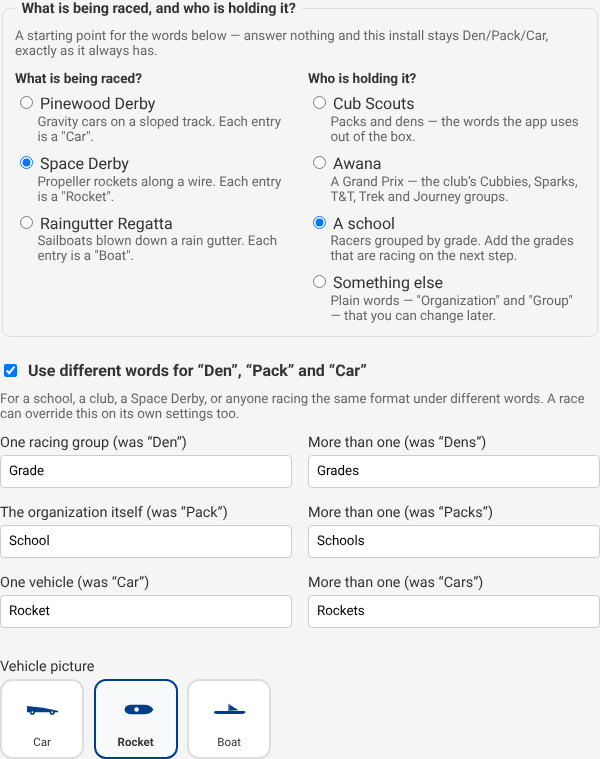

# Race and track settings

Every field on the race form and the track card, and what each one does.

## The race

Set when you create a race (**+ Create New Race** on Home) and editable
afterwards from the Roster page's **Edit Details** button — or, without going
there first, from **Edit race** in a race row's **⋯** menu on Home, or from
the **Edit race** button on Race Control. All three open the same form.

| Field | What it does |
| --- | --- |
| **Event Name** | Names the race everywhere. Must be unique |
| **Date & Time / Location** | Shown on the Home page and printed on pit passes |
| **Scoring** | **Timed**, **Points**, **Cumulative time**, or **Fastest single run** — see [Scoring](scoring.md). Choose before racing starts. Every option shows its one-line description underneath it, not only the one currently picked |
| **Drop worst run(s)** | `0` is off. Drops each racer's worst counted results before scoring — only once everyone who has raced has the same number of runs to drop from, with one to spare; otherwise nothing is dropped and the standings say so. See [Drop the worst run](scoring.md#drop-the-worst-run) |
| **Championship Trophies** | How many cars the wizard puts into the final. About the racing, not the physical trophies — those live on the [Awards](../awards.md) page |
| **Ties** | How a tied score gets settled where it decides something — see [Ties](#ties) below |
| **Check car weights at inspection** | See [the weight check](#the-weight-check) below |
| **Interleave heats across every den** | Off by default; only offered once the race exists, from the edit form on the Roster page. One running order across every den instead of a block per den — see [Running order across groups](running-order.md) |
| **Exclude Grand Finals winners from qualifying standings** | Off by default; only offered once the race exists. Once a championship round has a winner, that car stops counting toward the standings it qualified from, so the pack champion does not also keep their own den's trophy — see [Racing without being ranked](scoring.md#the-grand-finals-winner) |
| **Track / Timer** | Which track this race runs on |
| **Car Numbering** | See [car numbering](#car-numbering) below |
| **Use different words for this race** | Not offered until the race is created — edit it afterwards from the Roster page. See [the words on screen](#the-words-on-screen) below |

**Auto-advance**, on the race screen itself, is also remembered per race:
when on, the screen moves to the next heat ten seconds after results land.

### Ties

Set once, when the race is created, and editable afterwards from the same
place as every other race field. Five choices, in a fieldset next to
Scoring — every option shows its one-line description underneath it, not
only the one currently picked:

| Choice | How it settles a tie |
| --- | --- |
| **Leave it shared** | Not settled. The default: cars keep the shared rank, and a cut takes a provisional pick that stays yours to decide |
| **Fastest single heat** | Whoever's best recorded heat time is lowest |
| **Lowest total time** | Whoever's heats add up to the least total time |
| **Countback** | Most 1st-place finishes; a tie on that goes to most 2nds, and so on |
| **Head-to-head** | Among the tied cars, whoever won more of the heats they actually shared |

Picking a method that needs a recorded time — **Fastest single heat** or
**Lowest total time** — on a Points race running with [no timer](#no-timer)
gets a warning right there in the fieldset: that combination never records a
time to compare, so the method will never fire. Nothing stops you choosing
it anyway; the warning is there so you find out on the form rather than on
race day.

Whichever method is chosen, it settles a tie only where a tie actually
decides something — the last qualifying slot in a championship round, or a
speed award's recipient — and only when the recorded results actually
support an answer. The full rules, including what "cannot settle it" means
and where that shows up, are in
[When two cars tie](scoring.md#when-two-cars-tie).

### The weight check

On by default at 5.0 oz — the near-universal pack rule. When a weight over
the limit is typed at check-in, the box turns red and says so.

- **It is a warning, never a refusal.** The car can still be checked in.
  The inspector at the table decides; the app makes the rule visible at the
  moment it matters.
- **The tolerance is half a hundredth of an ounce.** Desk scales disagree in
  the last decimal place: a car displaying 5.00 always passes a 5.0 limit,
  and one displaying 5.01 never does.
- **A weight of zero means "not weighed"**, not "very light" — no tick, no
  warning.
- Turn the check off entirely if your pack does not weigh cars.

### Car numbering

| Choice | How numbers are handed out |
| --- | --- |
| **Per Den** | **Auto number** fills from each den's own range — 100–199 for the first den, 200–299 for the next. The ranges are on each den in Manage Dens, and can be changed or cleared |
| **Global** | Sequentially from one starting number, den regardless |
| **Manual** | You type every number yourself; **Auto number** leaves the race alone. Duplicates are allowed — which is why the check-in scanner's car number box only matches when exactly one racer holds the number |

## The track

Tracks live in **System Settings** and are shared between races — the track
is hardware in the room, so a venue running two races has the same track in
both.

| Field | What it does |
| --- | --- |
| **Track Name** | Names it in race forms and settings |
| **Lanes** | How many lanes the track has. Schedules are built for this — lowering it mid-event brings existing heats into line, see [turning down a track's lane count](mid-race-changes.md#turning-down-a-tracks-lane-count) |
| **Length (Feet)** | Recorded for reference |
| **Timer Type** | Fake, plugged into this machine, plugged into the laptop running the browser, or no timer at all — see [Timers](timers.md#the-four-timer-types) and [No timer](#no-timer) below |
| **Serial Port** | Almost always blank. Fill it only to force a specific port; it is then used exactly as typed |
| **Timer Model** | Almost always *Detect automatically*. See [the model picker](timers.md#the-timer-model-picker) |
| **This track has a remote start gate** | Enables the on-screen gate release, if the timer supports it — see [the remote start gate](timers.md#the-remote-start-gate) |
| **The timer's cable is wired backwards** | Flips every result so the timer's lane 1 matches the track's highest lane, instead of rewiring the timer or renumbering the track — see [reverse lane numbering](timers.md#reverse-lane-numbering) |
| **Lanes in service** | Untick a lane that has stopped working. Unlike the rest of the card, this **saves the moment you click it** — see [a lane stops working](mid-race-changes.md#a-lane-stops-working) |
| **Track records from past years** | Records from before Trusty Track, entered by hand for the Stats page's record board. Saves as soon as you add one — see [the track record](stats-and-exports.md#the-track-record) |

### No timer

Not every pack owns an electronic timer, and **No timer — I'll enter results
by hand** is for that: choose it and the Race screen stops trying to arm a
device at all. Instead of a "Waiting for Timer…" message, the main button on
each heat is **Enter Results**, opening the same result screen the **Override**
button always has — times for a Timed race, finishing order for a Points
race (see [Scoring](scoring.md#points), which is what points-based scoring is
for).

This is different from the **Fake Timer**: the fake one starts heats and
invents a finishing time a few seconds later, which is meant for a practice
run or trying the software, not for recording a real result. **No timer**
never invents anything — every result is exactly what was typed in.

The [Free Race](../free-race.md) screen follows the same rule, with one
difference: it always asks for finishing order rather than a time, whichever
scoring method the race itself uses — a free heat is exhibition and is never
scored, so the Timed/Points question this section answers for a real heat
does not apply to it.

The **Timer Model**, **Serial Port**, **This track has a remote start
gate** and **The timer's cable is wired backwards** fields disappear once
**No timer** is chosen; none of them mean anything without a device.

_The timer section of a track's card, with **No timer — I'll enter results by hand** chosen from the Timer Type dropdown._

## The organization

**Organization Name** in System Settings — your pack's name, shown in the
header and printed on documents. The **Access** panel on the same page holds
the PINs; see [Roles and permissions](roles-and-permissions.md).

## Names on public screens

The audience displays, the printables, and the standings export can show
less of a racer's name than the roster does — useful for a race whose
standings are posted on a gym wall, or emailed out, where a stranger reading
it has no reason to see a child's full name. Three choices:

| Choice | Shows | For |
| --- | --- | --- |
| Full name | Jordan Mitchell | The default — today's behaviour, unchanged. |
| First name and last initial | Jordan M. | The common choice for a screen the public can see. |
| First name only | Jordan | A pack whose own policy says no surname on a public screen at all. |

**It reaches the projector, the slideshow and the award ceremony; the pit
passes, driver's licences, heat sheet, results sheet and certificates; and
the standings CSV export.** It does not touch the roster, check-in, Race
Control, or the activity log — the people running those screens need the
whole name to find the right child in a queue, and all four sit behind a PIN
when one is set. The printed check-in codes are the one printable left at
full names too, for the same reason: they are scanned at the check-in desk
to identify a racer, not carried around the venue like a pit pass.

**The same choice also covers a racer's own photograph on the audience
displays.** A picture of a child's face beside "Jordan M." is not
anonymised, so picking anything but Full name hides the racer photo there
too — replaced by the same initials placeholder the roster's avatar already
falls back to when no photo has been uploaded. The *car* photo is a
different question and is never hidden. Printables keep the racer photo
regardless of this setting; a pit pass is handed to the checked-in child it
names, not read by a stranger on a wall.

**Set install-wide** in **System Settings → General**, under **Names on
public screens**. **A race can override that default of its own** — tick
**Override names on public screens for this race** on the race's edit form
(not offered on the **+ Create New Race** form, since there is nothing to
override until the race exists) and choose a value, including Full name
itself if the organization default abbreviates and this one race should not.
Unticking the checkbox returns to inheriting the organization's setting.

## The words on screen

Trusty Track is built for Cub Scout Pinewood Derby, and "Den", "Pack" and
"Car" are just the built-in words for three ideas: a group of racers who
race together, the organization holding the event, and what a racer's own
entry is called. A school, an AWANA club, a 4-H group, a Space Derby's
rockets, a Raingutter Regatta's boats — anyone running the same kind of
race — can rename all three, everywhere the app uses them: the roster, the
standings, printouts, and the audience displays.

Three words, each with its own plural, since English plurals do not follow a
rule a computer should be guessing at:

| Word | Default | Replaces |
| --- | --- | --- |
| Racing group | Den / Dens | "Den", **Manage Dens**, **Per Den** numbering, the Den column on the roster, standings and printouts |
| Organization | Pack / Packs | "Pack", "Top Overall (Pack)" |
| Vehicle | Car / Cars | "Car", car numbers on the roster and check-in, "Fastest Car" on the awards screen, and the vehicle word on printouts |

**Set install-wide** in **System Settings → General**, under **Use different
words for "Den", "Pack" and "Car"** — turning it on offers all six boxes,
already filled in with the built-in words so none of them starts out blank.

_Turning on custom terminology offers all six boxes at once — a singular
and a plural for each word — plus the vehicle picture below them._

**A race can override that default of its own** — one venue running a pack
derby in March and a school's own derby in May, on the same install, without
either one showing the other's words. Create the race first with the default
words, then open it from the **Roster** page's edit form and tick **Use
different words for this race**; the checkbox is not offered on the **+
Create New Race** form, because there is nothing to override until the race
exists.

**Unticking the checkbox returns to inheriting** — the organization's own
words if it has set any, the built-in Scouting words otherwise. It does not
leave the fields blank; there is no way to save an empty word.

**The vehicle word has a picture to go with it: a car, a rocket, or a
boat.** The **Vehicle picture** dropdown sits under the vehicle word's two
boxes and is independent of it — renaming "Car" to "Speedster" keeps
whichever picture is already chosen, and picking the rocket picture does not
touch the word. It draws the small line-art mark on the pit pass footer and
on the heat sheet and results sheet's masthead; the certificate does not
carry it. A car until you change it.

**One label stays fixed for everyone: Category**, the field on a racing
group that a Cub Scout rank or a school grade goes in — see
[Adding a New Den](../race-setup.md#adding-a-new-den). It is a detail on one
racing group, not vocabulary a whole screen is built from, so it keeps one
name regardless of the words above.
