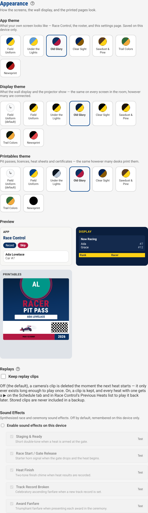

# Themes

How the app, the wall display, and the printed pages look, and how to change
it. Set from **System Settings → Appearance** — for the walkthrough, see
[Getting Started](../getting-started.md#appearance).

## Three screens, three choices

Trusty Track has three surfaces, and each has its own theme:

| Surface | What it covers | Who picks it |
| --- | --- | --- |
| **App** | Your own screen — Race Control, the roster, this settings page | You, on this device |
| **Display** | The wall display and the projector | The operator, for every screen in the room |
| **Printables** | Pit passes, licences, heat sheets, certificates, results sheets | The operator, for every printer |

**App is per device.** It is a preference about the screen in front of you,
saved on this laptop or tablet only — it never touches another screen, and
it never touches a printed page. Two people running the same race can each
have their own laptop looking different.

**Display and Printables are per install**, the same as the rest of
System Settings. That is deliberate: the Displays panel already sends every
wall screen what to show from the operator's own list, and walking to each
screen to set a theme on it individually would defeat the point of that.
Every printer at the event prints the same look for the same reason — a
pack's check-in desk is often more than one laptop, and every pit pass
should look like the same event no matter which one printed it.

**"Field Uniform (default)."** The Display and Printables pickers offer this
first, selected by default. It is not a fourth look of its own — it is Field
Uniform's own Display (or Printables) colours, so an install that has never
opened this page looks exactly as it always has. This option used to be
called "Match App theme," which suggested it would follow whichever theme
your own screen is set to; it never did, on either surface — the App theme
lives only on this device and never reaches a wall display or a printer, so
there is no App picker for either of them to follow, and the option is named
for what it actually shows now.

**Changing Display repaints a wall display or projector that is already
open, live** — no reload needed. It reaches the screen over the same
connection that already tells it what to show, so a theme picked mid-event
takes effect on every open screen within a moment. **Printables is
different**: a printed page is not a live connection, so a theme change
there only affects the next thing you print — nothing to "repaint" on paper
already handed out.

## The seven themes

| Theme | Look | Best for |
| --- | --- | --- |
| **Field Uniform** | Scouting blue and gold — unchanged | The default. Nothing to decide |
| **Under the Lights** | A darker screen for your own laptop, plus the usual projector black | An evening race, or a gym with the lights dimmed once racing starts |
| **Old Glory** | Red, white, and blue | A patriotic-themed derby |
| **Clear Sight** | Bigger, bolder, higher-contrast | A venue with harsh light or a projector fighting daylight, or anyone who wants the screens easier to read |
| **Sawdust & Pine** | Warm, wood-toned | A banquet where the certificates get framed, or a keepsake feel over a spreadsheet one |
| **Trail Colors** | Green and trail-marker orange | A fun day, or a pack that finds navy-and-gold a little stiff for a Saturday morning |
| **Newsprint** | Black ink on white paper, almost nothing else | Tight print budgets — see [the printing note](#printing-and-ink) below |

Each theme also sets its own Display (wall/projector) and Printables
(paper) look — picking a theme on the App picker does not, by itself,
change what the wall or the printer show. Set Display or Printables to it
directly if you want the same theme in the room and on paper too.

Clear Sight is the one theme where every tier of text — down to the
faintest captions and hints, not just headings and body copy — is dark
enough to read easily against its background. Every other theme keeps
its lightest labels a shade paler; a placeholder in an empty field is the
one place any theme, Clear Sight included, keeps that lighter touch on
purpose, so an empty field still looks empty rather than already filled
in.

_A swatch for each theme, and a live preview of all three surfaces below
the pickers — nothing here is saved until **Save Settings** is clicked._

## Printing and ink

Most themes print the pit passes, licences, heat sheets and certificates
**as they appear on screen** — a coloured header band costs about the same
ink whichever theme it is.

Two themes are the exception:

- **Under the Lights** prints **lightened**. A dark screen and a dark
  projector do not argue for a dark pit pass — the paper stays light, with
  a cooler palette so it still reads as "the same event, at night."
- **Newsprint** prints in a **deliberately ink-minimal** way: one ink colour
  instead of two, a thin rule in place of a filled header band, and the
  decorative textures (the chequered band, the security wash, the
  certificate's background pattern) faded to a fraction of their usual
  weight. It is the theme to pick if a pack is printing sixty pit passes on
  a home inkjet that is already running low.

Every theme's printed pages stay legible photocopied in black and white,
and Clear Sight and Newsprint are the two built to survive that
specifically — neither leans on a shade of grey to carry meaning.

## What is not themed

- **Layout, spacing, and rounded corners never change.** A theme changes
  colour, weight, and decoration — never where anything sits on the page or
  how big it is.
- **Timer status colours, the error colour, and medal colours** (second and
  third place) stay the same in every theme — they carry a fixed meaning
  (armed, fault, second place) that a brand palette should not be free to
  recolour.
- **Only Trail Colors' hue changes; per-den colours are untouched.** Each
  den already has its own colour chip on the roster, independent of any
  theme, and no theme pulls den colours into more of the screen than that.
- **No custom or uploaded themes.** All seven are fixed, reviewed, and
  shipped with the app — there is no colour picker for building your own.

## Every screen themes now

Trusty Track's colours come from one shared set of names ("the primary
colour," "the accent colour") instead of being written out fresh on every
screen, and that conversion is finished — every screen in the app, the
wall display, and the printed pages now picks up a theme change.

A few more colours stay fixed, for a different reason than the ones listed
above: they are not standing in for something a theme should be free to
recolour — they are just what the object actually is.

- **A car's avatar** keeps the same colour under every theme, the same way
  a name is spelled the same way twice. It is how you recognise a car at a
  glance across a busy roster.
- **The paintbrush and gavel icons** on the Awards page keep their
  painted-wood brown — a wooden handle is brown no matter which theme is
  picked.
- **The timer diagnostics page's serial-traffic log** is styled like a
  technician's console, light text on a near-black panel, the way any
  developer console is.

If part of a screen still looks unfamiliar after picking a different
theme, it is one of these — not a screen still waiting its turn.
